ST558Project2
================
Alex Selwaeh and Zichang Xiang
7/1/2021

## Introduction Section

The purpose of this project is to create predictive models and automate
R Markdown reports. The data we will use is the number of Bike-sharing
users aggregated on daily basis from the Capital Bikeshare system in
2011 and 2012. In this data set, there are 16 variables that are related
to bike rental counts. The variables we will use include season, year
(yr), mnth, holiday, weekday, workingday, weathersit, hum, atemp, temp,
casual, registered, and count (cnt). To model response counts (cnt), we
will use linear regression models and ensemble tree methods (random
forest method and boosted tree method).

## Data

``` r
#load packages
library(randomForest)
library(corrplot)
library(ggplot2)
library(cowplot)
library(modelr)
library(readr)
library(dplyr)
library(knitr)
library(caret)
library(tidyr)
library(purrr)
library(leaps)
library(MASS)
library(gbm)
```

``` r
#read in data
dayData <- read_csv("day.csv")
dayData
```

    ## # A tibble: 731 x 16
    ##    instant dteday     season    yr  mnth holiday weekday workingday weathersit  temp atemp   hum
    ##      <dbl> <date>      <dbl> <dbl> <dbl>   <dbl>   <dbl>      <dbl>      <dbl> <dbl> <dbl> <dbl>
    ##  1       1 2011-01-01      1     0     1       0       6          0          2 0.344 0.364 0.806
    ##  2       2 2011-01-02      1     0     1       0       0          0          2 0.363 0.354 0.696
    ##  3       3 2011-01-03      1     0     1       0       1          1          1 0.196 0.189 0.437
    ##  4       4 2011-01-04      1     0     1       0       2          1          1 0.2   0.212 0.590
    ##  5       5 2011-01-05      1     0     1       0       3          1          1 0.227 0.229 0.437
    ##  6       6 2011-01-06      1     0     1       0       4          1          1 0.204 0.233 0.518
    ##  7       7 2011-01-07      1     0     1       0       5          1          2 0.197 0.209 0.499
    ##  8       8 2011-01-08      1     0     1       0       6          0          2 0.165 0.162 0.536
    ##  9       9 2011-01-09      1     0     1       0       0          0          1 0.138 0.116 0.434
    ## 10      10 2011-01-10      1     0     1       0       1          1          1 0.151 0.151 0.483
    ## # … with 721 more rows, and 4 more variables: windspeed <dbl>, casual <dbl>, registered <dbl>,
    ## #   cnt <dbl>

``` r
#check for missing values
anyNA(dayData)
```

    ## [1] FALSE

``` r
#create for loop to subset data for each weekday
status <- vector()

for (i in seq_len(nrow(dayData))){
  if(dayData$weekday[i] == 1){
    status[i] <- "Monday"
  } else if (dayData$weekday[i] == 2){
    status[i] <- "Tuesday"
  } else if (dayData$weekday[i] == 3){
    status[i] <- "Wednesday"
  } else if (dayData$weekday[i] == 4){
    status[i] <- "Thursday"
  } else if (dayData$weekday[i] == 5){
    status[i] <- "Friday"
  } else if (dayData$weekday[i] == 6){
    status[i] <- "Saturday"
  } else {
    status[i] <- "Sunday"
  }
}

dayData$status <- status

#data for the day specified in params
paramsData <- dayData %>% filter(status == params$dow)

#Create columns to represent the categorical columns as mentioned in READ.ME
paramsData <- paramsData %>%
  # Add columns to represent the categorical columns as mentioned in READ.ME.
  mutate(SeasonType = ifelse(season == 1, "spring", 
                             ifelse(season == 2, "summer",
                                    ifelse(season == 3, "fall", "winter"))),
         yearType = ifelse(yr == 0, "2011", "2012"), 
         workingdayType = ifelse(workingday == 1, "Working Day", "Non WorkingDay"),
         weathersitType = ifelse(weathersit == 1, "Clear", 
                                 ifelse(weathersit == 2, "Mist", 
                                        ifelse(weathersit == 3, "Light Snow", "HeavyRain"))))

#convert month from numerical to categorical charcter  
paramsData$mnth1 <- as.character(paramsData$mnth)
```

``` r
#split data set into training and test sets
set.seed(1)
train <- sample(1:nrow(paramsData), size = nrow(paramsData)*0.7)
test <- dplyr::setdiff(1:nrow(paramsData), train)

train <- paramsData[train, ]
test <- paramsData[test, ]

#view the data sets
train
```

    ## # A tibble: 73 x 22
    ##    instant dteday     season    yr  mnth holiday weekday workingday weathersit  temp atemp   hum
    ##      <dbl> <date>      <dbl> <dbl> <dbl>   <dbl>   <dbl>      <dbl>      <dbl> <dbl> <dbl> <dbl>
    ##  1     192 2011-07-11      3     0     7       0       1          1          1 0.762 0.730 0.636
    ##  2     269 2011-09-26      4     0     9       0       1          1          2 0.649 0.589 0.848
    ##  3     416 2012-02-20      1     1     2       1       1          0          1 0.28  0.273 0.508
    ##  4     647 2012-10-08      4     1    10       1       1          0          2 0.383 0.388 0.710
    ##  5     143 2011-05-23      2     0     5       0       1          1          2 0.632 0.590 0.81 
    ##  6     626 2012-09-17      3     1     9       0       1          1          2 0.581 0.553 0.735
    ##  7     654 2012-10-15      4     1    10       0       1          1          2 0.562 0.539 0.708
    ##  8     451 2012-03-26      2     1     3       0       1          1          1 0.446 0.439 0.478
    ##  9     430 2012-03-05      1     1     3       0       1          1          1 0.243 0.241 0.506
    ## 10      38 2011-02-07      1     0     2       0       1          1          1 0.272 0.304 0.738
    ## # … with 63 more rows, and 10 more variables: windspeed <dbl>, casual <dbl>, registered <dbl>,
    ## #   cnt <dbl>, status <chr>, SeasonType <chr>, yearType <chr>, workingdayType <chr>,
    ## #   weathersitType <chr>, mnth1 <chr>

``` r
test
```

    ## # A tibble: 32 x 22
    ##    instant dteday     season    yr  mnth holiday weekday workingday weathersit  temp atemp   hum
    ##      <dbl> <date>      <dbl> <dbl> <dbl>   <dbl>   <dbl>      <dbl>      <dbl> <dbl> <dbl> <dbl>
    ##  1       3 2011-01-03      1     0     1       0       1          1          1 0.196 0.189 0.437
    ##  2      17 2011-01-17      1     0     1       1       1          0          2 0.176 0.177 0.538
    ##  3      45 2011-02-14      1     0     2       0       1          1          1 0.415 0.398 0.376
    ##  4      59 2011-02-28      1     0     2       0       1          1          2 0.407 0.400 0.876
    ##  5      66 2011-03-07      1     0     3       0       1          1          1 0.262 0.238 0.551
    ##  6     101 2011-04-11      2     0     4       0       1          1          2 0.596 0.565 0.717
    ##  7     157 2011-06-06      2     0     6       0       1          1          1 0.678 0.622 0.6  
    ##  8     262 2011-09-19      3     0     9       0       1          1          2 0.549 0.530 0.69 
    ##  9     276 2011-10-03      4     0    10       0       1          1          2 0.384 0.392 0.761
    ## 10     283 2011-10-10      4     0    10       1       1          0          1 0.571 0.543 0.734
    ## # … with 22 more rows, and 10 more variables: windspeed <dbl>, casual <dbl>, registered <dbl>,
    ## #   cnt <dbl>, status <chr>, SeasonType <chr>, yearType <chr>, workingdayType <chr>,
    ## #   weathersitType <chr>, mnth1 <chr>

## Summarizations

### Summary Statistics

Summary statistics give us a quick look of our data. For our case, we
can find out the average number of bike rentals per season.

``` r
# Create a table of summary stats.
seasonSummary <- train %>% 
  # Select the seasone and cnt columns.
  dplyr::select(SeasonType, cnt) %>%
  # Group by season
  group_by(SeasonType) %>%
  # Get summary statistics for total users by season.
  summarize("Min." = min(cnt),
            "1st Quartile" = quantile(cnt, 0.25),
            "Median" = quantile(cnt, 0.5),
            "Mean" = mean(cnt),
            "3rd Quartile" = quantile(cnt, 0.75),
            "Max" = max(cnt),
            "Std. Dev." = sd(cnt)
            )

# Display a table of the summary stats.
kable(seasonSummary, 
      caption = paste("Summary Statistics for total users", "By Season"), 
      digits = 2)
```

| SeasonType | Min. | 1st Quartile | Median |    Mean | 3rd Quartile |  Max | Std. Dev. |
|:-----------|-----:|-------------:|-------:|--------:|-------------:|-----:|----------:|
| fall       | 3351 |      4338.00 |   4758 | 5434.52 |      6569.00 | 7525 |   1280.92 |
| spring     |  920 |      1392.25 |   2172 | 2400.25 |      3180.00 | 6153 |   1334.75 |
| summer     | 2028 |      3375.25 |   4186 | 4341.20 |      5561.50 | 6998 |   1358.44 |
| winter     | 2765 |      3853.00 |   4600 | 4692.06 |      5313.75 | 7058 |   1155.93 |

Summary Statistics for total users By Season

#### Contingency Tables

A continuity table shows the relationship between two categorical
variables. In our case, we can determine whether the season and weather
are related, and whether the season and workday are related.

``` r
#create contingency tables
kable(table(train$SeasonType, train$weathersitType))
```

|        | Clear | Light Snow | Mist |
|:-------|------:|-----------:|-----:|
| fall   |    15 |          0 |    6 |
| spring |    11 |          0 |    5 |
| summer |    12 |          0 |    8 |
| winter |    10 |          1 |    5 |

``` r
kable(table(train$SeasonType, train$workingdayType))
```

|        | Non WorkingDay | Working Day |
|:-------|---------------:|------------:|
| fall   |              3 |          18 |
| spring |              4 |          12 |
| summer |              1 |          19 |
| winter |              2 |          14 |

### Plots

#### Correlation Plot

Correlation plot shows the strength of a relationship between two
variables. In our case, we can identify which variables are highly
correlated with one another, especially with the response, the number of
bikes rented.

``` r
#create correlation plot
corr <- cor(train[, -c(1,2,7,17:22)])
head(round(corr, 2))
```

    ##            season    yr  mnth holiday workingday weathersit  temp atemp   hum windspeed casual
    ## season       1.00 -0.07  0.77   -0.08       0.08       0.05  0.43  0.44  0.34     -0.21   0.25
    ## yr          -0.07  1.00 -0.02    0.04      -0.04       0.07 -0.14 -0.14 -0.13      0.15   0.09
    ## mnth         0.77 -0.02  1.00    0.02      -0.02       0.11  0.23  0.26  0.37     -0.30   0.14
    ## holiday     -0.08  0.04  0.02    1.00      -1.00       0.03 -0.03 -0.05  0.06      0.03   0.36
    ## workingday   0.08 -0.04 -0.02   -1.00       1.00      -0.03  0.03  0.05 -0.06     -0.03  -0.36
    ## weathersit   0.05  0.07  0.11    0.03      -0.03       1.00 -0.04 -0.05  0.56     -0.12  -0.01
    ##            registered   cnt
    ## season           0.53  0.52
    ## yr               0.53  0.47
    ## mnth             0.30  0.30
    ## holiday         -0.24 -0.09
    ## workingday       0.24  0.09
    ## weathersit      -0.11 -0.10

``` r
corrplot::corrplot(corr, type = "upper", method = "pie")
```

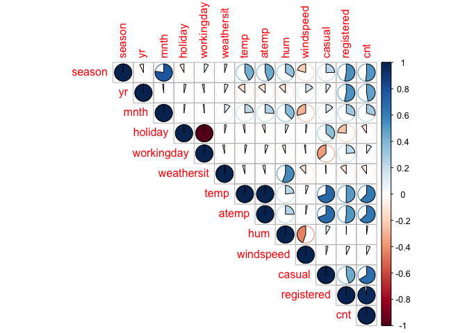<!-- -->

#### Histograms

Histograms are used to summarize distributions of variables. In our
case, we are trying to find out whether the change in each variable has
an impact on the number of bikes rented.

``` r
#referenced from https://drsimonj.svbtle.com/quick-plot-of-all-variables
#reshape the data set
reshape <- train %>% keep(is.numeric) %>% gather()

#plot the density plot
g <- ggplot(reshape, aes(x = value))
g + facet_wrap(~ key, scales = "free") + 
    geom_density()
```

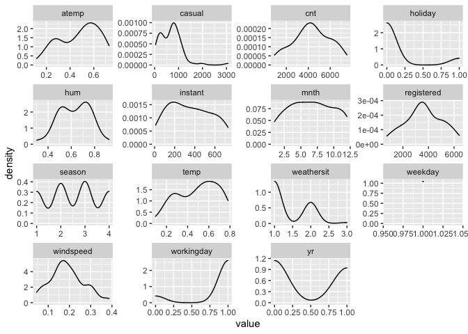<!-- -->

#### Boxplots

Boxplots show the shape of the distribution of each variable. By looking
at the boxplots below, we can see how each variable affects the number
of bikes rented.

``` r
#referenced from https://drsimonj.svbtle.com/quick-plot-of-all-variables
#reshape the data set
reshape <- train %>% keep(is.numeric) %>% gather()

#create boxplots for each variable
g <- ggplot(reshape, aes(x = value))
g + facet_wrap(~ key, scales = "free") + 
    geom_boxplot(aes(x = value))
```

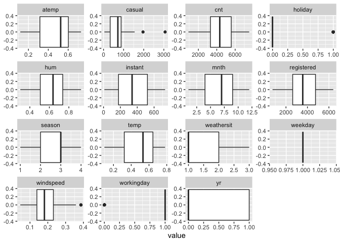<!-- -->

Boxplot with the number of users on the y-axis (wether casual,registered
or total users) and the season on the x-axis - We can inspect the trend
of users across seasons using these plots. Notice that the biggest
contribution towards total number of users comes from the registered
users which is expected. The most active seasons for that Monday is the
fall season and the least active season is the spring.

``` r
#create boxplot plot11
plot11 <- ggplot(train, aes(SeasonType, cnt, color = cnt)) +
          geom_boxplot() + 
          # Jitter the points to add a little more info to the boxplot.
          geom_jitter() + 
          # Add labels to the axes.
          scale_x_discrete("Season") + 
          scale_y_continuous("Total Users") +
          ggtitle("Total Users by Season") + 
          theme(legend.position = "none")
plot11
```

    ## Warning in (function (kind = NULL, normal.kind = NULL, sample.kind = NULL) : non-uniform 'Rounding'
    ## sampler used

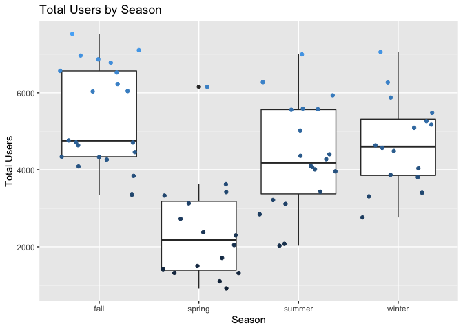<!-- -->

``` r
#create boxplot plot12
plot12 <- ggplot(train, aes(SeasonType, casual, color = cnt)) +
          geom_boxplot() + 
          # Jitter the points to add a little more info to the boxplot.
          geom_jitter() + 
          # Add labels to the axes.
          scale_x_discrete("Season") + 
          scale_y_continuous("Casual Users") +
          ggtitle("Casual Users by Season") + 
          theme(legend.position = "none")
plot12
```

    ## Warning in (function (kind = NULL, normal.kind = NULL, sample.kind = NULL) : non-uniform 'Rounding'
    ## sampler used

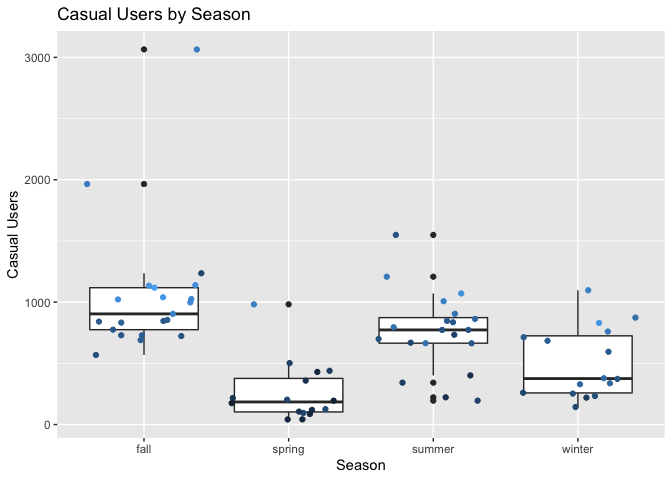<!-- -->

``` r
#create boxplot plot13
plot13 <- ggplot(train, aes(SeasonType, registered, color = cnt)) +
          geom_boxplot() + 
          # Jitter the points to add a little more info to the boxplot.
          geom_jitter() + 
          # Add labels to the axes.
          scale_x_discrete("Season") + 
          scale_y_continuous("Registered Users") +
          ggtitle("Registered Users by Season") + 
          theme(legend.position = "none")
plot13
```

    ## Warning in (function (kind = NULL, normal.kind = NULL, sample.kind = NULL) : non-uniform 'Rounding'
    ## sampler used

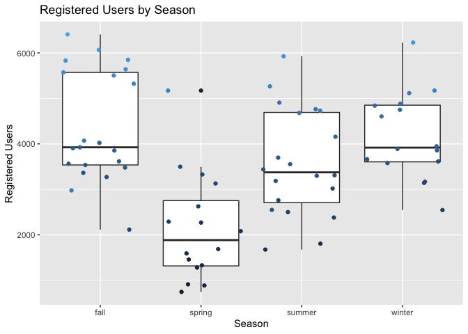<!-- -->

``` r
#combine all three boxplots together
plot_grid(plot13, plot12, plot11, ncol = 3)
```

    ## Warning in (function (kind = NULL, normal.kind = NULL, sample.kind = NULL) : non-uniform 'Rounding'
    ## sampler used

    ## Warning in (function (kind = NULL, normal.kind = NULL, sample.kind = NULL) : non-uniform 'Rounding'
    ## sampler used

    ## Warning in (function (kind = NULL, normal.kind = NULL, sample.kind = NULL) : non-uniform 'Rounding'
    ## sampler used

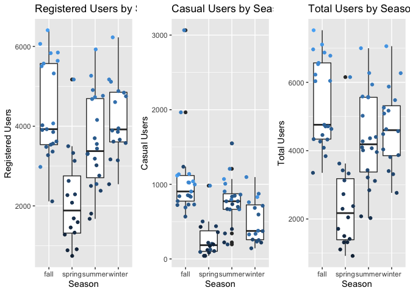<!-- -->

#### Scatter plots

Scatter plot with the total number of users on the y-axis and the
temperature, wind speed, humidity on the x-axis - We can inspect the
trend of total users across these variables and notice that humidity
almost has a slight negative effect on the total number of users. Also
it’s noticeable that the wind speed has a slight negative effect on the
total number of users .

``` r
#create scatter plot plot21
plot21 <- ggplot(train, aes(temp, cnt, color = cnt)) + 
          geom_point(size = 4, alpha = 0.75) + 
          scale_color_gradient(low = "blue", high = "red") + 
          theme(legend.position = "none") + 
          geom_smooth(method = lm, formula = y~x, color = "black") + 
          scale_x_continuous("Temprature") + 
          scale_y_continuous("Total Users") + 
          ggtitle("Temprature. vs. Total Users")
plot21
```

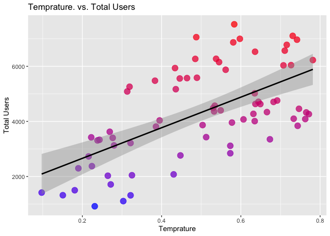<!-- -->

``` r
#create scatterplot plot22
plot22 <- ggplot(train, aes(windspeed, cnt, color = cnt)) + 
          geom_point(size = 4, alpha = 0.75) + 
          scale_color_gradient(low = "blue", high = "red") + 
          theme(legend.position = "none") + 
          geom_smooth(method = lm, formula = y ~ x, color = "black") + 
          scale_x_continuous("Wind Speed") + 
          scale_y_continuous("Total Users") + 
          ggtitle("Wind Speed vs. Total Users")
plot22
```

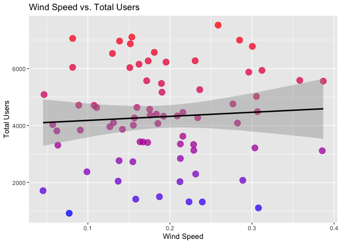<!-- -->

``` r
#create scatterplot plot23
plot23 <- ggplot(train, aes(hum, cnt, color = cnt)) + 
          geom_point(size = 4, alpha = 0.75) + 
          scale_color_gradient(low = "blue", high = "red") + 
          theme(legend.position = "none") + 
          geom_smooth(method = lm, formula = y ~ x, color = "black") + 
          scale_x_continuous("Humidity") + 
          scale_y_continuous("Total Users") + 
          ggtitle("Humidity vs. Total Users")
plot23
```

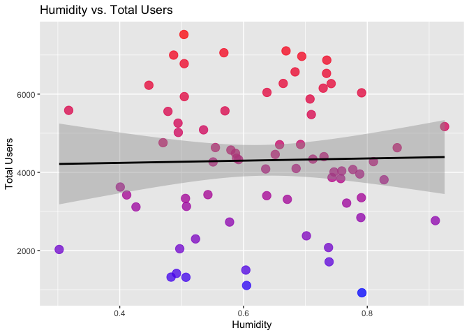<!-- -->

``` r
#combine all three scatterplot together
plot_grid(plot21, plot22, plot23, ncol = 3)
```

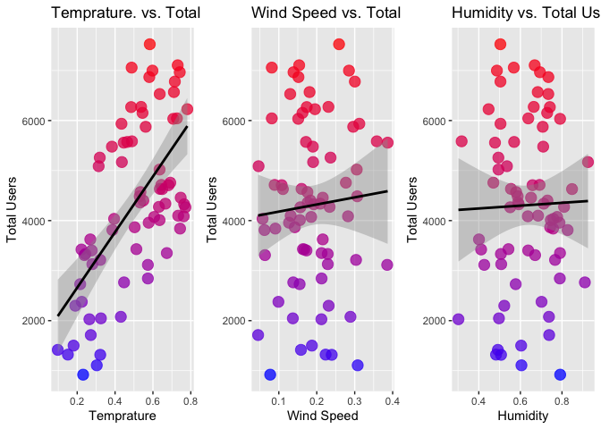<!-- -->

scatterplot with the number of users on the y-axis and the month on the
x-axis, We can inspect the trend of users across months using this plot.

``` r
#create scatterplot plot31
plot31 <- ggplot(paramsData, aes(x = mnth, y = casual)) + 
          geom_point() +
          geom_smooth(method = loess, formula = y ~ x) +
          geom_smooth(method = lm, formula = y ~ x, col = "Red")
plot31
```

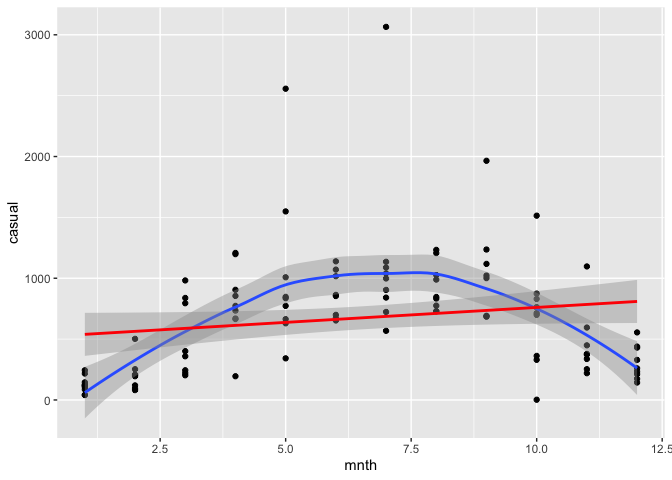<!-- -->

``` r
#create scatterplot plot32
plot32 <- ggplot(paramsData, aes(x = mnth, y = registered)) + 
          geom_point() +
          geom_smooth(method = loess, formula = y ~ x) +
          geom_smooth(method = lm, formula = y ~ x, col = "Red")
plot32
```

<!-- -->

``` r
#create scatterplot plot33
plot33 <- ggplot(paramsData, aes(x = mnth, y = cnt)) + 
          geom_point() +
          geom_smooth(method = loess, formula = y ~ x) +
          geom_smooth(method = lm, formula = y ~ x, col = "Red")
plot33
```

<!-- -->

``` r
#combine three scatterplots together
plot_grid(plot31, plot32, plot33, ncol = 3)
```

<!-- -->

## Modeling

Linear Regression analyzes the relationship(s) between a response
variable and one or more of the predictor variables and their
interactions. It can determine how strong or weak is the relationship
between these variables, it can identify which of the predictor
variables contribute the most to the response and it can help in
predicting future responses. Linear regression could be simple which
includes only one predictor variable in the fitted model, could be
multiple linear regression involving more than one predictor and there
is general linear models where the reponse and predictors could be
qualitative and not only quantitative. Linear regression model fits are
done with lm() function in R, lm() is a linear regression model that
uses a straight line to describe the relationship between variables. It
finds the line of best fit through the given data by searching for the
value of the coefficients which represent the linear regression model
and knows as beta\_0, beta\_1, beta\_2 and responsible for minimizing
the total error of the model (MSE for quantitative response analysis).

### Modeling of the first group member

``` r
#fit model fitlm1
fitlm1 <- train(cnt ~ atemp*season*yr, data = train, 
                method = "lm", 
                preProcess = c("center", "scale"),
                trControl = trainControl(method = "cv", number = 10))
fitlm1
```

    ## Linear Regression 
    ## 
    ## 73 samples
    ##  3 predictor
    ## 
    ## Pre-processing: centered (7), scaled (7) 
    ## Resampling: Cross-Validated (10 fold) 
    ## Summary of sample sizes: 66, 65, 66, 65, 66, 66, ... 
    ## Resampling results:
    ## 
    ##   RMSE      Rsquared   MAE    
    ##   702.6734  0.8355197  555.716
    ## 
    ## Tuning parameter 'intercept' was held constant at a value of TRUE

``` r
#fit model fitlm2
fitlm2 <- train(cnt ~ atemp + yr + season +windspeed+mnth+holiday+weathersit, data = train, 
                method = "lm", 
                preProcess = c("center", "scale"),
                trControl = trainControl(method = "cv", number = 10))
fitlm2
```

    ## Linear Regression 
    ## 
    ## 73 samples
    ##  7 predictor
    ## 
    ## Pre-processing: centered (7), scaled (7) 
    ## Resampling: Cross-Validated (10 fold) 
    ## Summary of sample sizes: 67, 65, 67, 66, 65, 66, ... 
    ## Resampling results:
    ## 
    ##   RMSE      Rsquared   MAE    
    ##   774.0224  0.8017157  600.375
    ## 
    ## Tuning parameter 'intercept' was held constant at a value of TRUE

``` r
#fit model fitlm3
fitlm3 <- train(cnt ~ atemp + yr + season +windspeed+weathersit+mnth, data = train, 
                method = "lm", 
                preProcess = c("center", "scale"),
                trControl = trainControl(method = "cv", number = 10))
fitlm3
```

    ## Linear Regression 
    ## 
    ## 73 samples
    ##  6 predictor
    ## 
    ## Pre-processing: centered (6), scaled (6) 
    ## Resampling: Cross-Validated (10 fold) 
    ## Summary of sample sizes: 65, 67, 66, 66, 65, 65, ... 
    ## Resampling results:
    ## 
    ##   RMSE      Rsquared   MAE     
    ##   744.6701  0.7896346  594.2593
    ## 
    ## Tuning parameter 'intercept' was held constant at a value of TRUE

``` r
#fit model fitlm4
fitlm4 <- train(cnt ~ atemp + yr + I(yr^2), data = train, 
                method = "lm", 
                preProcess = c("center", "scale"),
                trControl = trainControl(method = "cv", number = 10))
fitlm4
```

    ## Linear Regression 
    ## 
    ## 73 samples
    ##  2 predictor
    ## 
    ## Pre-processing: centered (3), scaled (3) 
    ## Resampling: Cross-Validated (10 fold) 
    ## Summary of sample sizes: 65, 66, 66, 65, 66, 67, ... 
    ## Resampling results:
    ## 
    ##   RMSE      Rsquared   MAE     
    ##   892.9421  0.7162163  702.5276
    ## 
    ## Tuning parameter 'intercept' was held constant at a value of TRUE

``` r
#predict results using test set
pred.fitlm1 <- predict(fitlm1, newdata = test)
rmse1<-postResample(pred.fitlm1, obs = test$cnt)


pred.fitlm2 <- predict(fitlm2, newdata = data.frame(test))
rmse2<-postResample(pred.fitlm2, obs = test$cnt)

pred.fitlm3 <- predict(fitlm3, newdata = data.frame(test))
rmse3<-postResample(pred.fitlm3, obs = test$cnt)

pred.fitlm4 <- predict(fitlm4, newdata = data.frame(test))
```

    ## Warning in predict.lm(modelFit, newdata): prediction from a rank-deficient fit may be misleading

``` r
rmse4<-postResample(pred.fitlm4, obs = test$cnt)

#view the result
kable(data.frame(rmse1[1], rmse2[1], rmse3[1],rmse4[1]))
```

|      | rmse1.1. | rmse2.1. | rmse3.1. | rmse4.1. |
|:-----|---------:|---------:|---------:|---------:|
| RMSE | 1213.569 | 1086.118 | 1085.498 | 1242.677 |

Summary for the model fit with the lowest cross validation test
error(RMSE) : fitlm3

``` r
summary(fitlm3)
```

    ## 
    ## Call:
    ## lm(formula = .outcome ~ ., data = dat)
    ## 
    ## Residuals:
    ##      Min       1Q   Median       3Q      Max 
    ## -2466.07  -372.72    53.15   452.59  1485.82 
    ## 
    ## Coefficients:
    ##             Estimate Std. Error t value Pr(>|t|)    
    ## (Intercept)  4307.21      87.45  49.255  < 2e-16 ***
    ## atemp         924.40     100.92   9.160 2.26e-13 ***
    ## yr            980.44      90.51  10.832 2.77e-16 ***
    ## season        742.01     151.81   4.888 6.83e-06 ***
    ## windspeed     -15.30      94.61  -0.162   0.8720    
    ## weathersit   -197.06      89.41  -2.204   0.0310 *  
    ## mnth         -274.41     144.49  -1.899   0.0619 .  
    ## ---
    ## Signif. codes:  0 '***' 0.001 '**' 0.01 '*' 0.05 '.' 0.1 ' ' 1
    ## 
    ## Residual standard error: 747.1 on 66 degrees of freedom
    ## Multiple R-squared:  0.8175, Adjusted R-squared:  0.8009 
    ## F-statistic: 49.28 on 6 and 66 DF,  p-value: < 2.2e-16

A different approach for selecting the best model for prediction
purposes is minimizing test MSE.

``` r
# select multiple random models in addition to the one we picked from the previous study being the first fit(glm1Fit)
glm1Fit <- lm(cnt ~ atemp + yr + season +windspeed+weathersit+mnth, data = train)
glm2Fit <- lm(cnt ~ atemp:yr, data = train)
glm3Fit <- lm(cnt ~ atemp + yr + season, data = train)
glm4Fit <- lm(cnt ~ atemp*yr*season, data = train)
glm5Fit <- lm(cnt ~ atemp+yr+I(yr^2), data = train)

model <- c(("glm1Fit"),("glm2Fit"),("glm3Fit"),("glm4Fit"),("glm5Fit"))

#calculate MSE for both the train and test sets
trainMSE <- c(rmse(glm1Fit, train), rmse(glm2Fit, train), rmse(glm3Fit, train), 
              rmse(glm4Fit, train), rmse(glm4Fit, train))
testMSE <- c(rmse(glm1Fit, test), rmse(glm2Fit, test), rmse(glm3Fit, test), 
             rmse(glm4Fit, test), rmse(glm5Fit, test))
```

    ## Warning in predict.lm(model, data): prediction from a rank-deficient fit may be misleading

``` r
MSEdf <- data.frame(model, trainMSE, testMSE)
MSEdf <- MSEdf %>% arrange(testMSE)
kable(data.frame(MSEdf),caption = "Table showing glm1Fit is the best fit")
```

| model   |  trainMSE |  testMSE |
|:--------|----------:|---------:|
| glm1Fit |  710.4196 | 1085.498 |
| glm3Fit |  759.5517 | 1185.210 |
| glm4Fit |  707.0346 | 1213.569 |
| glm5Fit |  707.0346 | 1242.677 |
| glm2Fit | 1234.9812 | 1530.050 |

Table showing glm1Fit is the best fit

Knowing that we can’t fully trust test MSE values in order to decide on
a model, we will go a step further in developing AIC,BIC and Rsquare
Criterias. Using the function from module 9

``` r
compareFitStats <- function(newfit1, newfit2,newfit3,newfit4,newfit5){
    require(MuMIn)
    fitStats <- data.frame(fitStat = c("Adj R Square", "AIC", "AICc", "BIC"),
        col1 = round(c(summary(newfit1)$adj.r.squared, AIC(newfit1), 
                                    MuMIn::AICc(newfit1), BIC(newfit1)), 3),
            col2 = round(c(summary(newfit2)$adj.r.squared, AIC(newfit2), 
                                    MuMIn::AICc(newfit2), BIC(newfit2)), 3),
                col3 = round(c(summary(newfit3)$adj.r.squared, AIC(newfit3), 
                                    MuMIn::AICc(newfit3), BIC(newfit3)), 3),
                    col4 = round(c(summary(newfit4)$adj.r.squared, AIC(newfit4), 
                                    MuMIn::AICc(newfit4), BIC(newfit4)), 3),
                        col5 = round(c(summary(newfit5)$adj.r.squared, AIC(newfit5), 
                                    MuMIn::AICc(newfit5), BIC(newfit5)),3))
    #put names on returned df
    calls <- as.list(match.call())
    calls[[1]] <- NULL
    names(fitStats)[2:6] <- unlist(calls)
    fitStats
}

kable(data.frame(compareFitStats(glm1Fit,glm2Fit,glm3Fit,glm4Fit,glm5Fit)),caption = "Table showing Rsquared,AIC,AICc and BIC criteria")
```

| fitStat      |  glm1Fit |  glm2Fit |  glm3Fit |  glm4Fit |  glm5Fit |
|:-------------|---------:|---------:|---------:|---------:|---------:|
| Adj R Square |    0.801 |    0.441 |    0.782 |    0.800 |    0.711 |
| AIC          | 1181.780 | 1252.511 | 1185.543 | 1183.083 | 1205.394 |
| AICc         | 1184.030 | 1252.859 | 1186.439 | 1185.940 | 1205.982 |
| BIC          | 1200.104 | 1259.383 | 1196.996 | 1203.697 | 1214.556 |

Table showing Rsquared,AIC,AICc and BIC criteria

Again, the calculated criterias shows that glm1Fit (which is the same as
fitlm3 model) which represents the 6 predictors , is the best model fit
selected.

An extra step to prove that our choice of glm1Fit as the best fit, here
I decided to use the method explained in section 6.5.3 of the book:
Choosing Among Models Using the Validation Set Approach (test Dataset)
and Cross-Validation.

``` r
# we apply regsubsets() to the training set in order to perform best subset selection.
library(leaps)
regfit.best = regsubsets (cnt ~ temp + yr + season + windspeed + mnth + holiday + weathersit + atemp,
                        data = train)
summary(regfit.best)
```

    ## Subset selection object
    ## Call: regsubsets.formula(cnt ~ temp + yr + season + windspeed + mnth + 
    ##     holiday + weathersit + atemp, data = train)
    ## 8 Variables  (and intercept)
    ##            Forced in Forced out
    ## temp           FALSE      FALSE
    ## yr             FALSE      FALSE
    ## season         FALSE      FALSE
    ## windspeed      FALSE      FALSE
    ## mnth           FALSE      FALSE
    ## holiday        FALSE      FALSE
    ## weathersit     FALSE      FALSE
    ## atemp          FALSE      FALSE
    ## 1 subsets of each size up to 8
    ## Selection Algorithm: exhaustive
    ##          temp yr  season windspeed mnth holiday weathersit atemp
    ## 1  ( 1 ) " "  " " " "    " "       " "  " "     " "        "*"  
    ## 2  ( 1 ) " "  "*" " "    " "       " "  " "     " "        "*"  
    ## 3  ( 1 ) " "  "*" "*"    " "       " "  " "     " "        "*"  
    ## 4  ( 1 ) " "  "*" "*"    " "       " "  " "     "*"        "*"  
    ## 5  ( 1 ) " "  "*" "*"    " "       "*"  " "     "*"        "*"  
    ## 6  ( 1 ) " "  "*" "*"    " "       "*"  "*"     "*"        "*"  
    ## 7  ( 1 ) "*"  "*" "*"    " "       "*"  "*"     "*"        "*"  
    ## 8  ( 1 ) "*"  "*" "*"    "*"       "*"  "*"     "*"        "*"

``` r
test.mat = model.matrix(cnt ~ temp + yr + season + windspeed + mnth + holiday + weathersit + atemp,
                        data = test)

val.errors = rep(NA, 8)
for(i in 1:8)
{
    coefi = coef(regfit.best, id=i)
    pred = test.mat[,names(coefi)]%*%coefi
    val.errors[i] = mean((test$cnt - pred)^2)
}

val.errors
```

    ## [1] 2116445 1544246 1404722 1133989 1195584 1193542 1213817 1212941

``` r
which.min(val.errors)
```

    ## [1] 4

Displaying the Selected model with the calculted regression
coefficients.

``` r
coef(regfit.best ,6)
```

    ## (Intercept)          yr      season        mnth     holiday  weathersit       atemp 
    ##    102.7610   1955.2075    677.7648    -74.0402   -225.5658   -380.2146   5569.8269

Also another extra verification step by doing the Partial least squares
method.

``` r
library(pls)
set.seed(222)
 pls.fit=plsr(cnt~ atemp + yr + season +windspeed+mnth+weathersit, data=train, scale=TRUE ,
validation ="CV")  

summary (pls.fit)
```

    ## Data:    X dimension: 73 6 
    ##  Y dimension: 73 1
    ## Fit method: kernelpls
    ## Number of components considered: 6
    ## 
    ## VALIDATION: RMSEP
    ## Cross-validated using 10 random segments.
    ##        (Intercept)  1 comps  2 comps  3 comps  4 comps  5 comps  6 comps
    ## CV            1686     1013    838.7    790.0    781.7    775.7    776.9
    ## adjCV         1686     1010    833.3    786.3    777.9    772.2    773.3
    ## 
    ## TRAINING: % variance explained
    ##      1 comps  2 comps  3 comps  4 comps  5 comps  6 comps
    ## X      28.51    51.60    63.20    72.19    85.63   100.00
    ## cnt    67.14    79.22    81.22    81.64    81.75    81.75

``` r
validationplot(pls.fit ,val.type="MSEP")
```

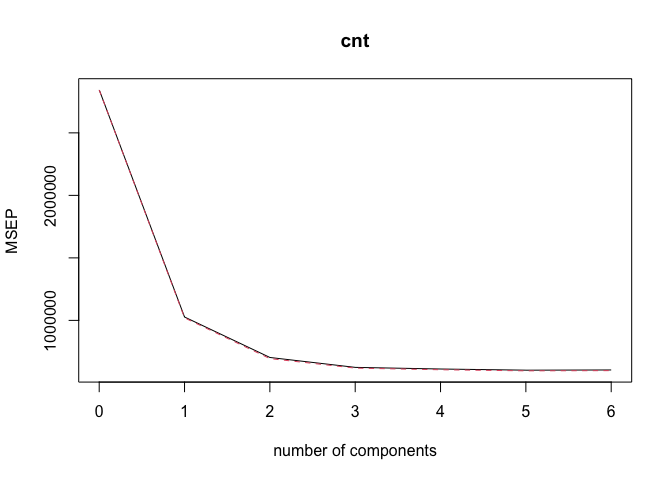<!-- -->

The lowest cross-validation error occurs when only M = 4.We now evaluate
the corresponding test MSE.

``` r
pls.pred=predict (pls.fit ,test,ncomp =4)
mean((pls.pred -test$cnt)^2)
```

    ## [1] 1130263

``` r
MSE.val2 <- sqrt(mean((pls.pred -test$cnt)^2))
MSE.val2
```

    ## [1] 1063.138

We noticed that PLS resulted in a similar value to the previous methods
and approaches used.

#### Random Forest

Random forest is a tree-based method for regression or classification
which involves producing multiple trees known as decision trees to yield
a single adequate prediction. ISLR book mentions about decision trees
“When building these decision trees, each time a split in a tree is
considered, a random sample of m predictors is chosen as split
candidates from the full set of p predictors. The split is allowed to
use only one of those m predictors. A fresh sample of m predictors is
taken at each split.”

``` r
#fit a random tree model
rfTree <- train(cnt ~ atemp + yr + season +windspeed+weathersit+mnth, 
                data = train, 
                method = "rf",
                trControl = trainControl(method = "repeatedcv", number = 10, repeats = 5),
                preProcess = c("center", "scale"))
```

    ## Warning in (function (kind = NULL, normal.kind = NULL, sample.kind = NULL) : non-uniform 'Rounding'
    ## sampler used

``` r
rfTree
```

    ## Random Forest 
    ## 
    ## 73 samples
    ##  6 predictor
    ## 
    ## Pre-processing: centered (6), scaled (6) 
    ## Resampling: Cross-Validated (10 fold, repeated 5 times) 
    ## Summary of sample sizes: 65, 66, 65, 66, 66, 65, ... 
    ## Resampling results across tuning parameters:
    ## 
    ##   mtry  RMSE      Rsquared   MAE     
    ##   2     862.5318  0.7576146  656.9425
    ##   4     833.4981  0.7730106  636.3370
    ##   6     841.5017  0.7692683  634.0315
    ## 
    ## RMSE was used to select the optimal model using the smallest value.
    ## The final value used for the model was mtry = 4.

Perform prediction on our test data set

``` r
#predict using the test set
rfPred <- predict(rfTree, newdata = test)
rfresult <- postResample(rfPred, test$cnt)
rfresult
```

    ##        RMSE    Rsquared         MAE 
    ## 1114.555811    0.706541  607.243999

### Modeling of the second group member

To select a model, we use the `stepAIC()` function. In the `stepAIC()`
function, we first specify the model with only main effects and the data
set to be used. Then we specify the most complex model and the most
simple model as upper and lower respectively in the scope.

``` r
#creat new data sets trainNew and testNew
trainNew <- train[, c(3:5, 9:13, 16)]
trainNew
```

    ## # A tibble: 73 x 9
    ##    season    yr  mnth weathersit  temp atemp   hum windspeed   cnt
    ##     <dbl> <dbl> <dbl>      <dbl> <dbl> <dbl> <dbl>     <dbl> <dbl>
    ##  1      3     0     7          1 0.762 0.730 0.636    0.282   4086
    ##  2      4     0     9          2 0.649 0.589 0.848    0.111   4630
    ##  3      1     1     2          1 0.28  0.273 0.508    0.229   3129
    ##  4      4     1    10          2 0.383 0.388 0.710    0.190   5478
    ##  5      2     0     5          2 0.632 0.590 0.81     0.234   4274
    ##  6      3     1     9          2 0.581 0.553 0.735    0.152   6869
    ##  7      4     1    10          2 0.562 0.539 0.708    0.296   5875
    ##  8      2     1     3          1 0.446 0.439 0.478    0.387   5558
    ##  9      1     1     3          1 0.243 0.241 0.506    0.229   3333
    ## 10      1     0     2          1 0.272 0.304 0.738    0.0454  1712
    ## # … with 63 more rows

``` r
testNew <- test[, c(3:5, 9:13, 16)]
testNew
```

    ## # A tibble: 32 x 9
    ##    season    yr  mnth weathersit  temp atemp   hum windspeed   cnt
    ##     <dbl> <dbl> <dbl>      <dbl> <dbl> <dbl> <dbl>     <dbl> <dbl>
    ##  1      1     0     1          1 0.196 0.189 0.437    0.248   1349
    ##  2      1     0     1          2 0.176 0.177 0.538    0.194   1000
    ##  3      1     0     2          1 0.415 0.398 0.376    0.418   1913
    ##  4      1     0     2          2 0.407 0.400 0.876    0.290   1446
    ##  5      1     0     3          1 0.262 0.238 0.551    0.341   1872
    ##  6      2     0     4          2 0.596 0.565 0.717    0.324   3348
    ##  7      2     0     6          1 0.678 0.622 0.6      0.122   4548
    ##  8      3     0     9          2 0.549 0.530 0.69     0.152   4539
    ##  9      4     0    10          2 0.384 0.392 0.761    0.0833  3570
    ## 10      4     0    10          1 0.571 0.543 0.734    0.0423  5117
    ## # … with 22 more rows

``` r
#select model
model <- MASS::stepAIC(lm(cnt ~ ., data = trainNew), 
                  scope=list(upper = ~ .^2 + I(season)^2 + I(yr)^2 + I(mnth)^2 +
                               I(weathersit)^2 + I(temp)^2 + I(atemp)^2 + I(hum)^2 + I(windspeed)^2, 
                             lower = ~1), trace = FALSE)
```

The model selected is below, because it has the smallest AIC.

``` r
#view the selected model
model$call
```

    ## lm(formula = cnt ~ season + yr + mnth + weathersit + temp + atemp + 
    ##     hum + windspeed + temp:atemp + yr:atemp + weathersit:hum + 
    ##     yr:weathersit + weathersit:windspeed + hum:windspeed + season:atemp + 
    ##     mnth:temp + mnth:weathersit + yr:windspeed, data = trainNew)

The linear regression model is fitted using the `train()` function.
First, we must give the model and data set we use. Next, we provide the
method we use, which is “lm”. Then, we use the `preProcess()` function
to standardize the data. Finally, we specify the type of
cross-validation we wish to perform. In our case, we would like to
perform repeated cross-validation with 10 folds for 5 times.

``` r
#fit model
set.seed(1)
fit <- train(model$terms, 
             data = trainNew,
             method = "lm",
             preProcess = c("center", "scale"),
             trControl = trainControl(method = "repeatedcv", number = 10, repeats = 5)
             )
```

    ## Warning in (function (kind = NULL, normal.kind = NULL, sample.kind = NULL) : non-uniform 'Rounding'
    ## sampler used

``` r
#view the results
kable(fit$results)
```

| intercept |     RMSE | Rsquared |      MAE |   RMSESD | RsquaredSD |    MAESD |
|:----------|---------:|---------:|---------:|---------:|-----------:|---------:|
| TRUE      | 613.2825 | 0.876286 | 495.7512 | 182.5733 |  0.1128864 | 122.3617 |

``` r
#check the fit
lmPred <- predict(fit, newdata = testNew)
lmFit <- postResample(lmPred, obs = testNew$cnt)

#calculate root MSE
lmRMSE <- lmFit[1]
kable(lmRMSE)
```

|      |        x |
|:-----|---------:|
| RMSE | 724.9791 |

We use the train() function to fit the boosted tree model in the similar
way we fit the linear regression model. First, we must give the model
and data set we use. Next, we provide the method we use, which is “gbm”.
Then, we use the `preProcess()` function to standardize the data.
Finally, we specify the type of cross-validation we wish to perform. In
our case, we would like to perform repeated cross-validation with 10
folds for 5 times.

``` r
#fit boosted tree model
set.seed(1)
boostFit <- train(model$terms, 
                  data = trainNew, 
                  method = "gbm", 
                  preProcess = c("center", "scale"),
                  trControl = trainControl(method = "repeatedcv", number = 10, repeats = 5))
```

    ## Warning in (function (kind = NULL, normal.kind = NULL, sample.kind = NULL) : non-uniform 'Rounding'
    ## sampler used

``` r
#view the results
boostFit$results
```

    ##   shrinkage interaction.depth n.minobsinnode n.trees     RMSE  Rsquared      MAE   RMSESD
    ## 1       0.1                 1             10      50 700.1466 0.8329942 554.8204 251.9891
    ## 4       0.1                 2             10      50 681.0214 0.8362609 546.2018 265.6694
    ## 7       0.1                 3             10      50 703.5064 0.8342147 558.1464 261.5318
    ## 2       0.1                 1             10     100 670.7945 0.8364762 523.1054 259.7076
    ## 5       0.1                 2             10     100 662.5384 0.8390647 519.1595 284.2445
    ## 8       0.1                 3             10     100 681.9405 0.8378108 531.5471 275.1563
    ## 3       0.1                 1             10     150 671.8800 0.8342237 516.5222 268.0047
    ## 6       0.1                 2             10     150 663.4825 0.8385763 520.2404 281.2043
    ## 9       0.1                 3             10     150 681.7687 0.8337107 523.9467 292.9440
    ##   RsquaredSD    MAESD
    ## 1  0.1881379 165.2752
    ## 4  0.1887988 174.3923
    ## 7  0.1787961 158.1905
    ## 2  0.1839035 168.2230
    ## 5  0.1913601 184.0881
    ## 8  0.1815947 173.0153
    ## 3  0.1873591 170.7775
    ## 6  0.1925061 183.3382
    ## 9  0.1878216 187.9403

``` r
#view the best model
boostFit$bestTune
```

    ##   n.trees interaction.depth shrinkage n.minobsinnode
    ## 5     100                 2       0.1             10

``` r
#predict cnt and calculate RMSE
boostPred <- predict(boostFit, newdata = testNew)
result <- postResample(boostPred, testNew$cnt)
boostRMSE <- result[1]
kable(boostRMSE)
```

|      |        x |
|:-----|---------:|
| RMSE | 1098.287 |

### Comparison of all four models and Conclusion

By comparing the RMSE from all four models, we choose the winner below,
because it has the lowest RMSE.

``` r
#combine RMSE from four models
results <- data.frame(MSEdf[1,3], rfresult[1], boostRMSE,rfresult[1])
colnames(results) <- c("lmFit_1stMember", "lmFit_2ndMember", "Boost Tree","Random Forest")
#view the result
kable(results)
```

|      | lmFit\_1stMember | lmFit\_2ndMember | Boost Tree | Random Forest |
|:-----|-----------------:|-----------------:|-----------:|--------------:|
| RMSE |         1085.498 |         1114.556 |   1098.287 |      1114.556 |

``` r
#choose a winner
results <- results %>% gather() %>% arrange(value)
winner <- results[1, ]
kable(winner)
```

| key              |    value |
|:-----------------|---------:|
| lmFit\_1stMember | 1085.498 |
