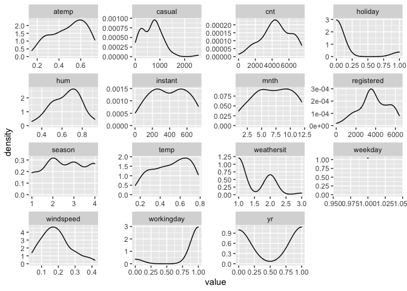
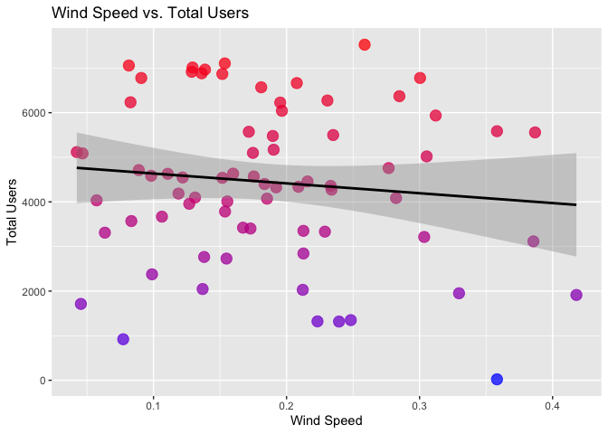
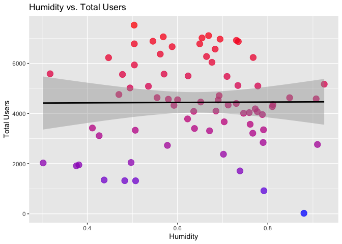
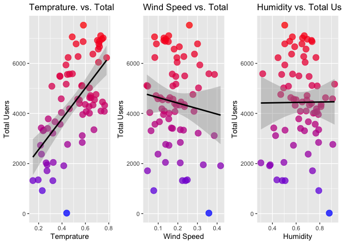

ST558Project2
================
Alex Selwaeh and Zichang Xiang
7/1/2021

## Introduction Section

The purpose of this project is to create predictive models and automate
R Markdown reports. The data we will use is the number of Bike-sharing
users aggregated on daily basis from the Capital Bikeshare system in
2011 and 2012. In this data set, there are 16 variables that are related
to bike rental counts. The variables we will use include season, year
(yr), mnth, holiday, weekday, workingday, weathersit, hum, atemp, temp,
casual, registered, and count (cnt). To model response counts (cnt), we
will use linear regression models and ensemble tree methods (random
forest method and boosted tree method).

## Data

``` r
#load packages
library(corrplot)
library(ggplot2)
library(cowplot)
library(modelr)
library(readr)
library(dplyr)
library(knitr)
library(caret)
library(tidyr)
library(purrr)
library(MASS)
library(gbm)
```

``` r
#read in data
dayData <- read_csv("day.csv")
dayData
```

    ## # A tibble: 731 x 16
    ##    instant dteday     season    yr  mnth holiday weekday workingday weathersit  temp atemp   hum windspeed
    ##      <dbl> <date>      <dbl> <dbl> <dbl>   <dbl>   <dbl>      <dbl>      <dbl> <dbl> <dbl> <dbl>     <dbl>
    ##  1       1 2011-01-01      1     0     1       0       6          0          2 0.344 0.364 0.806    0.160 
    ##  2       2 2011-01-02      1     0     1       0       0          0          2 0.363 0.354 0.696    0.249 
    ##  3       3 2011-01-03      1     0     1       0       1          1          1 0.196 0.189 0.437    0.248 
    ##  4       4 2011-01-04      1     0     1       0       2          1          1 0.2   0.212 0.590    0.160 
    ##  5       5 2011-01-05      1     0     1       0       3          1          1 0.227 0.229 0.437    0.187 
    ##  6       6 2011-01-06      1     0     1       0       4          1          1 0.204 0.233 0.518    0.0896
    ##  7       7 2011-01-07      1     0     1       0       5          1          2 0.197 0.209 0.499    0.169 
    ##  8       8 2011-01-08      1     0     1       0       6          0          2 0.165 0.162 0.536    0.267 
    ##  9       9 2011-01-09      1     0     1       0       0          0          1 0.138 0.116 0.434    0.362 
    ## 10      10 2011-01-10      1     0     1       0       1          1          1 0.151 0.151 0.483    0.223 
    ## # … with 721 more rows, and 3 more variables: casual <dbl>, registered <dbl>, cnt <dbl>

``` r
#check for missing values
anyNA(dayData)
```

    ## [1] FALSE

``` r
#create for loop to subset data for each weekday
status <- vector()

for (i in seq_len(nrow(dayData))){
  if(dayData$weekday[i] == 1){
    status[i] <- "Monday"
  } else if (dayData$weekday[i] == 2){
    status[i] <- "Tuesday"
  } else if (dayData$weekday[i] == 3){
    status[i] <- "Wednesday"
  } else if (dayData$weekday[i] == 4){
    status[i] <- "Thursday"
  } else if (dayData$weekday[i] == 5){
    status[i] <- "Friday"
  } else if (dayData$weekday[i] == 6){
    status[i] <- "Saturday"
  } else {
    status[i] <- "Sunday"
  }
}

dayData$status <- status

#data for Monday
paramsData <- dayData %>% filter(status == params$dow)

#Create columns to represent the categorical columns as mentioned in READ.ME
paramsData <- paramsData %>%
  # Add columns to represent the categorical columns as mentioned in READ.ME.
  mutate(SeasonType = ifelse(season == 1, "spring", 
                             ifelse(season == 2, "summer",
                                    ifelse(season == 3, "fall", "winter"))),
         yearType = ifelse(yr == 0, "2011", "2012"), 
         workingdayType = ifelse(workingday == 1, "Working Day", "Non WorkingDay"),
         weathersitType = ifelse(weathersit == 1, "Clear", 
                                 ifelse(weathersit == 2, "Mist", 
                                        ifelse(weathersit == 3, "Light Snow", "HeavyRain"))))

#convert month from numerical to categorical charcter  
paramsData$mnth1 <- as.character(paramsData$mnth)
```

``` r
#split data set into training and test sets
set.seed(1)
train <- sample(1:nrow(paramsData), size = nrow(paramsData)*0.7)
test <- dplyr::setdiff(1:nrow(paramsData), train)

train <- paramsData[train, ]
test <- paramsData[test, ]

#view the data sets
train
```

    ## # A tibble: 73 x 22
    ##    instant dteday     season    yr  mnth holiday weekday workingday weathersit  temp atemp   hum windspeed
    ##      <dbl> <date>      <dbl> <dbl> <dbl>   <dbl>   <dbl>      <dbl>      <dbl> <dbl> <dbl> <dbl>     <dbl>
    ##  1     472 2012-04-16      2     1     4       1       1          0          1 0.664 0.615 0.562     0.285
    ##  2     269 2011-09-26      4     0     9       0       1          1          2 0.649 0.589 0.848     0.111
    ##  3       3 2011-01-03      1     0     1       0       1          1          1 0.196 0.189 0.437     0.248
    ##  4     234 2011-08-22      3     0     8       0       1          1          1 0.692 0.638 0.47      0.277
    ##  5     605 2012-08-27      3     1     8       0       1          1          1 0.703 0.655 0.730     0.129
    ##  6     297 2011-10-24      4     0    10       0       1          1          1 0.463 0.457 0.772     0.119
    ##  7      94 2011-04-04      2     0     4       0       1          1          1 0.573 0.543 0.426     0.386
    ##  8     570 2012-07-23      3     1     7       0       1          1          1 0.742 0.690 0.694     0.139
    ##  9     409 2012-02-13      1     1     2       0       1          1          1 0.222 0.228 0.411     0.167
    ## 10     353 2011-12-19      4     0    12       0       1          1          1 0.277 0.281 0.638     0.173
    ## # … with 63 more rows, and 9 more variables: casual <dbl>, registered <dbl>, cnt <dbl>, status <chr>,
    ## #   SeasonType <chr>, yearType <chr>, workingdayType <chr>, weathersitType <chr>, mnth1 <chr>

``` r
test
```

    ## # A tibble: 32 x 22
    ##    instant dteday     season    yr  mnth holiday weekday workingday weathersit   temp atemp   hum windspeed
    ##      <dbl> <date>      <dbl> <dbl> <dbl>   <dbl>   <dbl>      <dbl>      <dbl>  <dbl> <dbl> <dbl>     <dbl>
    ##  1      17 2011-01-17      1     0     1       1       1          0          2 0.176  0.177 0.538     0.194
    ##  2      24 2011-01-24      1     0     1       0       1          1          1 0.0974 0.118 0.492     0.158
    ##  3      31 2011-01-31      1     0     1       0       1          1          2 0.181  0.186 0.604     0.187
    ##  4      52 2011-02-21      1     0     2       1       1          0          2 0.303  0.284 0.605     0.308
    ##  5      59 2011-02-28      1     0     2       0       1          1          2 0.407  0.400 0.876     0.290
    ##  6      66 2011-03-07      1     0     3       0       1          1          1 0.262  0.238 0.551     0.341
    ##  7      80 2011-03-21      2     0     3       0       1          1          2 0.430  0.410 0.737     0.289
    ##  8     101 2011-04-11      2     0     4       0       1          1          2 0.596  0.565 0.717     0.324
    ##  9     108 2011-04-18      2     0     4       0       1          1          1 0.512  0.503 0.542     0.164
    ## 10     129 2011-05-09      2     0     5       0       1          1          1 0.532  0.525 0.589     0.176
    ## # … with 22 more rows, and 9 more variables: casual <dbl>, registered <dbl>, cnt <dbl>, status <chr>,
    ## #   SeasonType <chr>, yearType <chr>, workingdayType <chr>, weathersitType <chr>, mnth1 <chr>

## Summarizations

### Summary Statistics

Summary statistics give us a quick look of our data. For our case, we
can find out the average number of bike rentals per season.

``` r
# Create a table of summary stats.
seasonSummary <- train %>% 
  # Select the seasone and cnt columns.
  dplyr::select(SeasonType, cnt) %>%
  # Group by season
  group_by(SeasonType) %>%
  # Get summary statistics for total users by season.
  summarize("Min." = min(cnt),
            "1st Quartile" = quantile(cnt, 0.25),
            "Median" = quantile(cnt, 0.5),
            "Mean" = mean(cnt),
            "3rd Quartile" = quantile(cnt, 0.75),
            "Max" = max(cnt),
            "Std. Dev." = sd(cnt)
            )

# Display a table of the summary stats.
kable(seasonSummary, 
      caption = paste("Summary Statistics for total users", "By Season"), 
      digits = 2)
```

| SeasonType | Min. | 1st Quartile | Median |    Mean | 3rd Quartile |  Max | Std. Dev. |
|:-----------|-----:|-------------:|-------:|--------:|-------------:|-----:|----------:|
| fall       | 3351 |      4498.50 | 6227.0 | 5687.16 |      6900.00 | 7525 |   1350.44 |
| spring     |  920 |      1349.00 | 1951.0 | 2167.15 |      2729.00 | 3784 |    908.48 |
| summer     | 2028 |      4025.75 | 4474.5 | 4683.68 |      5581.75 | 6664 |   1243.81 |
| winter     |   22 |      3619.50 | 4585.0 | 4482.47 |      5324.00 | 7058 |   1588.90 |

Summary Statistics for total users By Season

#### Contingency Tables

A continuity table shows the relationship between two categorical
variables. In our case, we can determine whether the season and weather
are related, and whether the season and workday are related.

``` r
#create contingency tables
kable(table(train$SeasonType, train$weathersitType))
```

|        | Clear | Light Snow | Mist |
|:-------|------:|-----------:|-----:|
| fall   |    14 |          0 |    5 |
| spring |    10 |          0 |    3 |
| summer |    12 |          0 |   10 |
| winter |    10 |          2 |    7 |

``` r
kable(table(train$SeasonType, train$workingdayType))
```

|        | Non WorkingDay | Working Day |
|:-------|---------------:|------------:|
| fall   |              1 |          18 |
| spring |              2 |          11 |
| summer |              3 |          19 |
| winter |              2 |          17 |

### Plots

#### Correlation Plot

Correlation plot shows the strength of a relationship between two
variables. In our case, we can identify which variables are highly
correlated with one another, especially with the response, the number of
bikes rented.

``` r
#create correlation plot
corr <- cor(train[, -c(1,2,7,17:22)])
head(round(corr, 2))
```

    ##            season    yr  mnth holiday workingday weathersit  temp atemp   hum windspeed casual registered   cnt
    ## season       1.00 -0.05  0.77   -0.08       0.08       0.16  0.27  0.30  0.42     -0.34   0.14       0.44  0.41
    ## yr          -0.05  1.00 -0.03   -0.01       0.01       0.25 -0.04 -0.03 -0.02      0.10   0.12       0.49  0.44
    ## mnth         0.77 -0.03  1.00    0.00       0.00       0.24  0.08  0.12  0.45     -0.44   0.03       0.22  0.20
    ## holiday     -0.08 -0.01  0.00    1.00      -1.00      -0.10  0.07  0.05 -0.03      0.07   0.42      -0.18 -0.05
    ## workingday   0.08  0.01  0.00   -1.00       1.00       0.10 -0.07 -0.05  0.03     -0.07  -0.42       0.18  0.05
    ## weathersit   0.16  0.25  0.24   -0.10       0.10       1.00 -0.04 -0.02  0.58     -0.05  -0.17      -0.06 -0.10

``` r
corrplot(corr, type = "upper", method = "pie")
```

<!-- -->

#### Histograms

Histograms are used to summarize distributions of variables. In our
case, we are trying to find out whether the change in each variable has
an impact on the number of bikes rented.

``` r
#referenced from https://drsimonj.svbtle.com/quick-plot-of-all-variables
#reshape the data set
reshape <- train %>% keep(is.numeric) %>% gather()

#plot the density plot
g <- ggplot(reshape, aes(x = value))
g + facet_wrap(~ key, scales = "free") + 
    geom_density()
```

<!-- -->

#### Boxplots

Boxplots show the shape of the distribution of each variable. By looking
at the boxplots below, we can see how each variable affects the number
of bikes rented.

``` r
#referenced from https://drsimonj.svbtle.com/quick-plot-of-all-variables
#reshape the data set
reshape <- train %>% keep(is.numeric) %>% gather()

#create boxplots for each variable
g <- ggplot(reshape, aes(x = value))
g + facet_wrap(~ key, scales = "free") + 
    geom_boxplot(aes(x = value))
```

<!-- -->

Boxplot with the number of users on the y-axis (wether casual,registered
or total users) and the season on the x-axis - We can inspect the trend
of users across seasons using these plots. Notice that the biggest
contribution towards total number of users comes from the registered
users which is expected. The most active seasons for that Monday is the
fall season and the least active season is the spring.

``` r
#create boxplot plot11
plot11 <- ggplot(train, aes(SeasonType, cnt, color = cnt)) +
          geom_boxplot() + 
          # Jitter the points to add a little more info to the boxplot.
          geom_jitter() + 
          # Add labels to the axes.
          scale_x_discrete("Season") + 
          scale_y_continuous("Total Users") +
          ggtitle("Total Users by Season") + 
          theme(legend.position = "none")
plot11
```

<!-- -->

``` r
#create boxplot plot12
plot12 <- ggplot(train, aes(SeasonType, casual, color = cnt)) +
          geom_boxplot() + 
          # Jitter the points to add a little more info to the boxplot.
          geom_jitter() + 
          # Add labels to the axes.
          scale_x_discrete("Season") + 
          scale_y_continuous("Casual Users") +
          ggtitle("Casual Users by Season") + 
          theme(legend.position = "none")
plot12
```

<!-- -->

``` r
#create boxplot plot13
plot13 <- ggplot(train, aes(SeasonType, registered, color = cnt)) +
          geom_boxplot() + 
          # Jitter the points to add a little more info to the boxplot.
          geom_jitter() + 
          # Add labels to the axes.
          scale_x_discrete("Season") + 
          scale_y_continuous("Registered Users") +
          ggtitle("Registered Users by Season") + 
          theme(legend.position = "none")
plot13
```

<!-- -->

``` r
#combine all three boxplots together
plot_grid(plot13, plot12, plot11, ncol = 3)
```

<!-- -->

#### Scatter plots

Scatter plot with the total number of users on the y-axis and the
temperature, wind speed, humidity on the x-axis - We can inspect the
trend of total users across these variables and notice that humidity
almost has a negligible effect on total number of users. Also it’s
noticeable that the wind speed has a negative effect on the total number
of users where as the wind speed increases, the number of users will
decrease.

``` r
#create scatter plot plot21
plot21 <- ggplot(train, aes(temp, cnt, color = cnt)) + 
          geom_point(size = 4, alpha = 0.75) + 
          scale_color_gradient(low = "blue", high = "red") + 
          theme(legend.position = "none") + 
          geom_smooth(method = lm, formula = y~x, color = "black") + 
          scale_x_continuous("Temprature") + 
          scale_y_continuous("Total Users") + 
          ggtitle("Temprature. vs. Total Users")
plot21
```

<!-- -->

``` r
#create scatterplot plot22
plot22 <- ggplot(train, aes(windspeed, cnt, color = cnt)) + 
          geom_point(size = 4, alpha = 0.75) + 
          scale_color_gradient(low = "blue", high = "red") + 
          theme(legend.position = "none") + 
          geom_smooth(method = lm, formula = y ~ x, color = "black") + 
          scale_x_continuous("Wind Speed") + 
          scale_y_continuous("Total Users") + 
          ggtitle("Wind Speed vs. Total Users")
plot22
```

<!-- -->

``` r
#create scatterplot plot23
plot23 <- ggplot(train, aes(hum, cnt, color = cnt)) + 
          geom_point(size = 4, alpha = 0.75) + 
          scale_color_gradient(low = "blue", high = "red") + 
          theme(legend.position = "none") + 
          geom_smooth(method = lm, formula = y ~ x, color = "black") + 
          scale_x_continuous("Humidity") + 
          scale_y_continuous("Total Users") + 
          ggtitle("Humidity vs. Total Users")
plot23
```

<!-- -->

``` r
#combine all three scatterplot together
plot_grid(plot21, plot22, plot23, ncol = 3)
```

<!-- -->

scatterplot with the number of users on the y-axis and the month on the
x-axis, We can inspect the trend of users across months using this plot.

``` r
#create scatterplot plot31
plot31 <- ggplot(paramsData, aes(x = mnth, y = casual)) + 
          geom_point() +
          geom_smooth(method = loess, formula = y ~ x) +
          geom_smooth(method = lm, formula = y ~ x, col = "Red")
plot31
```

<!-- -->

``` r
#create scatterplot plot32
plot32 <- ggplot(paramsData, aes(x = mnth, y = registered)) + 
          geom_point() +
          geom_smooth(method = loess, formula = y ~ x) +
          geom_smooth(method = lm, formula = y ~ x, col = "Red")
plot32
```

<!-- -->

``` r
#create scatterplot plot33
plot33 <- ggplot(paramsData, aes(x = mnth, y = cnt)) + 
          geom_point() +
          geom_smooth(method = loess, formula = y ~ x) +
          geom_smooth(method = lm, formula = y ~ x, col = "Red")
plot33
```

<!-- -->

``` r
#combine three scatterplots together
plot_grid(plot31, plot32, plot33, ncol = 3)
```

<!-- -->

## Modeling

### Modeling of the first group member

``` r
# select models
fit1 <- lm(cnt ~ windspeed + hum + atemp + temp + weathersit + workingday + holiday + mnth + yr + season, data = train)
fit1
```

    ## 
    ## Call:
    ## lm(formula = cnt ~ windspeed + hum + atemp + temp + weathersit + 
    ##     workingday + holiday + mnth + yr + season, data = train)
    ## 
    ## Coefficients:
    ## (Intercept)    windspeed          hum        atemp         temp   weathersit   workingday      holiday  
    ##     1916.54     -4597.45     -3052.73     11295.49     -3832.89      -358.77       226.16           NA  
    ##        mnth           yr       season  
    ##      -58.71      1795.84       598.79

``` r
# use anova table to choose the significant variables and reduce the model selection
anova(fit1)
```

    ## Analysis of Variance Table
    ## 
    ## Response: cnt
    ##            Df    Sum Sq   Mean Sq  F value    Pr(>F)    
    ## windspeed   1   2667465   2667465   3.6641  0.060139 .  
    ## hum         1    573618    573618   0.7879  0.378098    
    ## atemp       1 100009703 100009703 137.3778 < 2.2e-16 ***
    ## temp        1   5012199   5012199   6.8850  0.010892 *  
    ## weathersit  1   1152728   1152728   1.5834  0.212910    
    ## workingday  1    357470    357470   0.4910  0.486045    
    ## mnth        1   2110258   2110258   2.8987  0.093578 .  
    ## yr          1  50700007  50700007  69.6438 8.896e-12 ***
    ## season      1  10262883  10262883  14.0976  0.000381 ***
    ## Residuals  63  45863378    727990                       
    ## ---
    ## Signif. codes:  0 '***' 0.001 '**' 0.01 '*' 0.05 '.' 0.1 ' ' 1

``` r
# anova reveals that season,yr,temp and atemp has a p-value of significance, therefore we will choose only these 4 variables in our analysis.
summary(fit1)
```

    ## 
    ## Call:
    ## lm(formula = cnt ~ windspeed + hum + atemp + temp + weathersit + 
    ##     workingday + holiday + mnth + yr + season, data = train)
    ## 
    ## Residuals:
    ##     Min      1Q  Median      3Q     Max 
    ## -3591.8  -313.5    67.0   391.5  1342.1 
    ## 
    ## Coefficients: (1 not defined because of singularities)
    ##             Estimate Std. Error t value Pr(>|t|)    
    ## (Intercept)  1916.54     828.35   2.314 0.023960 *  
    ## windspeed   -4597.45    1499.28  -3.066 0.003190 ** 
    ## hum         -3052.73    1158.01  -2.636 0.010544 *  
    ## atemp       11295.49    9577.91   1.179 0.242702    
    ## temp        -3832.89    8290.13  -0.462 0.645427    
    ## weathersit   -358.77     263.43  -1.362 0.178080    
    ## workingday    226.16     332.08   0.681 0.498355    
    ## holiday           NA         NA      NA       NA    
    ## mnth          -58.71      51.78  -1.134 0.261144    
    ## yr           1795.84     213.73   8.402 7.08e-12 ***
    ## season        598.79     159.48   3.755 0.000381 ***
    ## ---
    ## Signif. codes:  0 '***' 0.001 '**' 0.01 '*' 0.05 '.' 0.1 ' ' 1
    ## 
    ## Residual standard error: 853.2 on 63 degrees of freedom
    ## Multiple R-squared:  0.7903, Adjusted R-squared:  0.7603 
    ## F-statistic: 26.38 on 9 and 63 DF,  p-value: < 2.2e-16

``` r
# start reducing fit1 by choosing the most significant variables based on p-value less than 10% considered highly significant
fit2 <- lm(cnt ~ season+yr+temp+atemp+windspeed+mnth , data = train)
fit2
```

    ## 
    ## Call:
    ## lm(formula = cnt ~ season + yr + temp + atemp + windspeed + mnth, 
    ##     data = train)
    ## 
    ## Coefficients:
    ## (Intercept)       season           yr         temp        atemp    windspeed         mnth  
    ##       289.4        597.5       1697.6       2131.6       4032.8      -3207.3       -104.8

``` r
anova(fit2)
```

    ## Analysis of Variance Table
    ## 
    ## Response: cnt
    ##           Df   Sum Sq  Mean Sq F value    Pr(>F)    
    ## season     1 36676291 36676291 38.1331 4.600e-08 ***
    ## yr         1 46873413 46873413 48.7352 1.750e-09 ***
    ## temp       1 65335634 65335634 67.9308 9.768e-12 ***
    ## atemp      1   415755   415755  0.4323   0.51316    
    ## windspeed  1  2767377  2767377  2.8773   0.09455 .  
    ## mnth       1  3162618  3162618  3.2882   0.07432 .  
    ## Residuals 66 63478621   961797                      
    ## ---
    ## Signif. codes:  0 '***' 0.001 '**' 0.01 '*' 0.05 '.' 0.1 ' ' 1

``` r
summary(fit2)
```

    ## 
    ## Call:
    ## lm(formula = cnt ~ season + yr + temp + atemp + windspeed + mnth, 
    ##     data = train)
    ## 
    ## Residuals:
    ##     Min      1Q  Median      3Q     Max 
    ## -4868.1  -243.0   105.7   497.4  1993.8 
    ## 
    ## Coefficients:
    ##             Estimate Std. Error t value Pr(>|t|)    
    ## (Intercept)   289.44     713.45   0.406  0.68628    
    ## season        597.48     180.94   3.302  0.00155 ** 
    ## yr           1697.64     233.24   7.279 5.16e-10 ***
    ## temp         2131.65    9163.76   0.233  0.81678    
    ## atemp        4032.81   10555.25   0.382  0.70364    
    ## windspeed   -3207.25    1536.07  -2.088  0.04066 *  
    ## mnth         -104.80      57.79  -1.813  0.07432 .  
    ## ---
    ## Signif. codes:  0 '***' 0.001 '**' 0.01 '*' 0.05 '.' 0.1 ' ' 1
    ## 
    ## Residual standard error: 980.7 on 66 degrees of freedom
    ## Multiple R-squared:  0.7098, Adjusted R-squared:  0.6834 
    ## F-statistic:  26.9 on 6 and 66 DF,  p-value: 5.731e-16

``` r
# Since in fit2 the anova revealed that atemp is not as highly significant as the rest of the variables in fit2, therefore reduce more
#also note that temp and atemp are highly correlated predictors causing multicollinearity therefore it's safe to drop atemp
fit3 <- lm(cnt ~ season+yr+temp+windspeed+mnth , data = train)
fit3
```

    ## 
    ## Call:
    ## lm(formula = cnt ~ season + yr + temp + windspeed + mnth, data = train)
    ## 
    ## Coefficients:
    ## (Intercept)       season           yr         temp    windspeed         mnth  
    ##       458.4        608.8       1708.7       5622.7      -3330.8       -103.0

``` r
anova(fit3)
```

    ## Analysis of Variance Table
    ## 
    ## Response: cnt
    ##           Df   Sum Sq  Mean Sq F value    Pr(>F)    
    ## season     1 36676291 36676291 38.6254 3.738e-08 ***
    ## yr         1 46873413 46873413 49.3645 1.361e-09 ***
    ## temp       1 65335634 65335634 68.8078 7.072e-12 ***
    ## windspeed  1  3130622  3130622  3.2970   0.07388 .  
    ## mnth       1  3074730  3074730  3.2381   0.07645 .  
    ## Residuals 67 63619019   949538                      
    ## ---
    ## Signif. codes:  0 '***' 0.001 '**' 0.01 '*' 0.05 '.' 0.1 ' ' 1

``` r
# the data shows that we are interested in the following variables
#temp,yr,season, windspeed,mnth and cnt as the response
```

``` r
#Explore the full chosen data correlations
corrData <- train %>% dplyr::select(cnt,season,yr,temp,windspeed,mnth)
GGally::ggpairs(corrData)
```

<!-- -->

``` r
#Correlation data table shows that wind speed and nth have the lowest correlation when compared with temperature, year and season. Therefore, we will reduce our variables to temp,yr,season.
#Now start exploring among these 5 variables for the best fit model
glm1Fit <- lm(cnt ~ season+yr+temp, data = train)
glm2Fit <- lm(cnt ~ temp:yr, data = train)
glm3Fit <- lm(cnt ~ temp:season, data = train)
glm4Fit <- lm(cnt ~ temp*yr*season, data = train)
glm5Fit <- lm(cnt ~ temp+yr+I(yr^2), data = train)

model <- c(("glm1Fit"),("glm2Fit"),("glm3Fit"),("glm4Fit"),("glm5Fit"))
  
trainMSE <- c(rmse(glm1Fit, train),
rmse(glm2Fit, train),
rmse(glm3Fit, train),
rmse(glm4Fit, train),
rmse(glm4Fit, train)
)
testMSE <- c(rmse(glm1Fit, test),
rmse(glm2Fit, test),
rmse(glm3Fit, test),
rmse(glm4Fit, test),
rmse(glm5Fit, test)
)
```

    ## Warning in predict.lm(model, data): prediction from a rank-deficient fit may be misleading

``` r
MSEdf <- data.frame(model, trainMSE, testMSE)
MSEdf <- MSEdf %>% arrange(testMSE)
MSEdf
```

    ##     model  trainMSE  testMSE
    ## 1 glm4Fit  951.2962  729.678
    ## 2 glm1Fit  978.0073  737.591
    ## 3 glm5Fit  951.2962  869.179
    ## 4 glm2Fit 1320.1827 1323.047
    ## 5 glm3Fit 1345.0642 1360.929

``` r
# therefore, this is the chosen model glm4Fit
#glm4Fit <- lm(cnt ~ temp*yr*season, data = train)
#might explore more on top 3 fits which are glm4Fit,glm1it,glm5Fit
```

### Modeling of the second group member

To select a model, we use the `stepAIC()` function. In the `stepAIC()`
function, we first specify the model with only main effects and the data
set to be used. Then we specify the most complex model and the most
simple model as upper and lower respectively in the scope.

``` r
#creat new data sets trainNew and testNew
trainNew <- train[, c(3:5, 9:13, 16)]
trainNew
```

    ## # A tibble: 73 x 9
    ##    season    yr  mnth weathersit  temp atemp   hum windspeed   cnt
    ##     <dbl> <dbl> <dbl>      <dbl> <dbl> <dbl> <dbl>     <dbl> <dbl>
    ##  1      2     1     4          1 0.664 0.615 0.562     0.285  6370
    ##  2      4     0     9          2 0.649 0.589 0.848     0.111  4630
    ##  3      1     0     1          1 0.196 0.189 0.437     0.248  1349
    ##  4      3     0     8          1 0.692 0.638 0.47      0.277  4758
    ##  5      3     1     8          1 0.703 0.655 0.730     0.129  6917
    ##  6      4     0    10          1 0.463 0.457 0.772     0.119  4187
    ##  7      2     0     4          1 0.573 0.543 0.426     0.386  3115
    ##  8      3     1     7          1 0.742 0.690 0.694     0.139  6966
    ##  9      1     1     2          1 0.222 0.228 0.411     0.167  3422
    ## 10      4     0    12          1 0.277 0.281 0.638     0.173  3403
    ## # … with 63 more rows

``` r
testNew <- test[, c(3:5, 9:13, 16)]
testNew
```

    ## # A tibble: 32 x 9
    ##    season    yr  mnth weathersit   temp atemp   hum windspeed   cnt
    ##     <dbl> <dbl> <dbl>      <dbl>  <dbl> <dbl> <dbl>     <dbl> <dbl>
    ##  1      1     0     1          2 0.176  0.177 0.538     0.194  1000
    ##  2      1     0     1          1 0.0974 0.118 0.492     0.158  1416
    ##  3      1     0     1          2 0.181  0.186 0.604     0.187  1501
    ##  4      1     0     2          2 0.303  0.284 0.605     0.308  1107
    ##  5      1     0     2          2 0.407  0.400 0.876     0.290  1446
    ##  6      1     0     3          1 0.262  0.238 0.551     0.341  1872
    ##  7      2     0     3          2 0.430  0.410 0.737     0.289  2077
    ##  8      2     0     4          2 0.596  0.565 0.717     0.324  3348
    ##  9      2     0     4          1 0.512  0.503 0.542     0.164  3429
    ## 10      2     0     5          1 0.532  0.525 0.589     0.176  4362
    ## # … with 22 more rows

``` r
#select model
model <- MASS::stepAIC(lm(cnt ~ ., data = trainNew), 
                  scope=list(upper = ~ .^2 + I(season)^2 + I(yr)^2 + I(mnth)^2 +
                               I(weathersit)^2 + I(temp)^2 + I(atemp)^2 + I(hum)^2 + I(windspeed)^2, 
                             lower = ~1))
```

    ## Start:  AIC=993.14
    ## cnt ~ season + yr + mnth + weathersit + temp + atemp + hum + 
    ##     windspeed
    ## 
    ##                        Df Sum of Sq      RSS     AIC
    ## + weathersit:hum        1   8728746 37472265  979.85
    ## + weathersit:windspeed  1   6835778 39365232  983.45
    ## + temp:atemp            1   5605295 40595715  985.70
    ## + season:windspeed      1   3715849 42485161  989.02
    ## + yr:weathersit         1   3086935 43114076  990.09
    ## + weathersit:temp       1   2776383 43424628  990.61
    ## + season:atemp          1   2634730 43566281  990.85
    ## + season:temp           1   2465602 43735408  991.13
    ## + weathersit:atemp      1   2311239 43889772  991.39
    ## - temp                  1    250308 46451318  991.53
    ## + hum:windspeed         1   2190192 44010819  991.59
    ## + yr:hum                1   2138544 44062466  991.68
    ## + mnth:weathersit       1   1612635 44588376  992.54
    ## + season:weathersit     1   1390652 44810359  992.91
    ## - mnth                  1   1141783 47342793  992.92
    ## - weathersit            1   1182888 47383899  992.98
    ## - atemp                 1   1247762 47448772  993.08
    ## <none>                              46201011  993.14
    ## + mnth:hum              1   1081440 45119570  993.41
    ## + mnth:windspeed        1    907394 45293617  993.69
    ## + mnth:atemp            1    633798 45567213  994.13
    ## + yr:atemp              1    584441 45616570  994.21
    ## + temp:windspeed        1    572230 45628781  994.23
    ## + yr:temp               1    549616 45651395  994.26
    ## + atemp:windspeed       1    529557 45671454  994.30
    ## + mnth:temp             1    481671 45719339  994.37
    ## + season:hum            1    217528 45983483  994.79
    ## + temp:hum              1    204778 45996233  994.81
    ## + season:mnth           1     86868 46114143  995.00
    ## + yr:windspeed          1     70720 46130290  995.03
    ## + yr:mnth               1     50161 46150850  995.06
    ## + atemp:hum             1     41628 46159382  995.07
    ## + season:yr             1      9712 46191299  995.12
    ## - hum                   1   5454122 51655132  999.28
    ## - windspeed             1   7157820 53358831 1001.65
    ## - season                1  10975260 57176271 1006.70
    ## - yr                    1  51136440 97337451 1045.54
    ## 
    ## Step:  AIC=979.85
    ## cnt ~ season + yr + mnth + weathersit + temp + atemp + hum + 
    ##     windspeed + weathersit:hum
    ## 
    ##                        Df Sum of Sq      RSS     AIC
    ## + yr:weathersit         1   9044838 28427427  961.69
    ## + weathersit:windspeed  1   6859953 30612311  967.09
    ## + temp:atemp            1   5021961 32450304  971.35
    ## + season:windspeed      1   3155356 34316909  975.43
    ## + hum:windspeed         1   2668893 34803372  976.46
    ## + weathersit:temp       1   1943723 35528542  977.96
    ## - temp                  1    108438 37580703  978.06
    ## + weathersit:atemp      1   1816873 35655392  978.22
    ## + yr:hum                1   1808707 35663558  978.24
    ## - atemp                 1    769966 38242231  979.34
    ## + season:atemp          1   1240156 36232108  979.39
    ## + season:temp           1   1171715 36300550  979.53
    ## <none>                              37472265  979.85
    ## + mnth:windspeed        1    918238 36554027  980.04
    ## + yr:atemp              1    801892 36670373  980.27
    ## + yr:temp               1    710372 36761893  980.45
    ## - windspeed             1   1512893 38985158  980.74
    ## + temp:windspeed        1    522230 36950035  980.83
    ## - mnth                  1   1584861 39057126  980.88
    ## + atemp:windspeed       1    457590 37014674  980.95
    ## + season:hum            1    455417 37016848  980.96
    ## + temp:hum              1    145858 37326407  981.57
    ## + season:yr             1    122705 37349560  981.61
    ## + mnth:hum              1    106290 37365974  981.64
    ## + season:weathersit     1    104753 37367512  981.65
    ## + season:mnth           1     83966 37388299  981.69
    ## + atemp:hum             1     53137 37419128  981.75
    ## + yr:windspeed          1     49999 37422266  981.75
    ## + mnth:atemp            1     19636 37452628  981.81
    ## + yr:mnth               1     10867 37461398  981.83
    ## + mnth:temp             1     10203 37462062  981.83
    ## + mnth:weathersit       1      4366 37467899  981.84
    ## - weathersit:hum        1   8728746 46201011  993.14
    ## - season                1  15006715 52478980 1002.44
    ## - yr                    1  44001536 81473801 1034.55
    ## 
    ## Step:  AIC=961.69
    ## cnt ~ season + yr + mnth + weathersit + temp + atemp + hum + 
    ##     windspeed + weathersit:hum + yr:weathersit
    ## 
    ##                        Df Sum of Sq      RSS    AIC
    ## + temp:atemp            1   3350798 25076628 954.53
    ## + weathersit:windspeed  1   2435184 25992243 957.15
    ## - windspeed             1    130022 28557448 960.02
    ## - temp                  1    186198 28613625 960.16
    ## + season:yr             1   1224015 27203412 960.47
    ## + yr:atemp              1   1181793 27245633 960.59
    ## + weathersit:temp       1   1096276 27331150 960.81
    ## + weathersit:atemp      1   1093729 27333698 960.82
    ## + season:atemp          1    984899 27442528 961.11
    ## + yr:temp               1    972299 27455127 961.15
    ## + season:temp           1    930783 27496644 961.26
    ## + season:windspeed      1    866686 27560740 961.43
    ## + hum:windspeed         1    847972 27579454 961.47
    ## <none>                              28427427 961.69
    ## - mnth                  1    834566 29261993 961.80
    ## - atemp                 1    851993 29279420 961.84
    ## + yr:hum                1    578592 27848834 962.18
    ## + yr:mnth               1    569965 27857462 962.21
    ## + temp:windspeed        1    538926 27888500 962.29
    ## + atemp:windspeed       1    428090 27999337 962.58
    ## + season:hum            1    411159 28016268 962.62
    ## + mnth:hum              1    160545 28266882 963.27
    ## + season:weathersit     1    140579 28286847 963.32
    ## + season:mnth           1    135306 28292120 963.34
    ## + mnth:windspeed        1     46660 28380767 963.57
    ## + atemp:hum             1     18933 28408494 963.64
    ## + mnth:temp             1     18047 28409379 963.64
    ## + mnth:atemp            1     11311 28416116 963.66
    ## + yr:windspeed          1      4030 28423397 963.68
    ## + mnth:weathersit       1      1909 28425518 963.68
    ## + temp:hum              1      1795 28425632 963.68
    ## - yr:weathersit         1   9044838 37472265 979.85
    ## - season                1  14234020 42661446 989.32
    ## - weathersit:hum        1  14686649 43114076 990.09
    ## 
    ## Step:  AIC=954.53
    ## cnt ~ season + yr + mnth + weathersit + temp + atemp + hum + 
    ##     windspeed + weathersit:hum + yr:weathersit + temp:atemp
    ## 
    ##                        Df Sum of Sq      RSS    AIC
    ## + weathersit:windspeed  1   2525540 22551088 948.78
    ## + yr:atemp              1   1547719 23528909 951.88
    ## + yr:temp               1   1347541 23729087 952.50
    ## + season:yr             1    893351 24183277 953.88
    ## + yr:hum                1    776014 24300614 954.24
    ## + yr:mnth               1    742294 24334335 954.34
    ## + weathersit:temp       1    702446 24374183 954.46
    ## + weathersit:atemp      1    701832 24374796 954.46
    ## <none>                              25076628 954.53
    ## - mnth                  1    703616 25780245 954.55
    ## - windspeed             1    881092 25957720 955.05
    ## + season:hum            1    281282 24795346 955.71
    ## + mnth:atemp            1    229983 24846646 955.86
    ## + hum:windspeed         1    229506 24847123 955.86
    ## + mnth:temp             1    215932 24860697 955.90
    ## + season:mnth           1    195412 24881216 955.96
    ## + mnth:hum              1    178759 24897869 956.01
    ## + yr:windspeed          1    158941 24917688 956.07
    ## + season:windspeed      1    148421 24928207 956.10
    ## + season:temp           1    131240 24945388 956.15
    ## + season:atemp          1    125986 24950642 956.16
    ## + season:weathersit     1    118814 24957814 956.18
    ## + mnth:weathersit       1     52571 25024058 956.38
    ## + temp:windspeed        1     36531 25040097 956.42
    ## + mnth:windspeed        1     11434 25065194 956.50
    ## + atemp:windspeed       1      9326 25067303 956.50
    ## + atemp:hum             1      8493 25068136 956.51
    ## + temp:hum              1      1161 25075467 956.53
    ## - temp:atemp            1   3350798 28427427 961.69
    ## - yr:weathersit         1   7373676 32450304 971.35
    ## - season                1  10369234 35445862 977.79
    ## - weathersit:hum        1  13302889 38379517 983.60
    ## 
    ## Step:  AIC=948.78
    ## cnt ~ season + yr + mnth + weathersit + temp + atemp + hum + 
    ##     windspeed + weathersit:hum + yr:weathersit + temp:atemp + 
    ##     weathersit:windspeed
    ## 
    ##                        Df Sum of Sq      RSS    AIC
    ## + yr:atemp              1   1669517 20881571 945.17
    ## + yr:temp               1   1498173 21052915 945.76
    ## + season:yr             1   1383627 21167461 946.16
    ## + weathersit:temp       1   1099524 21451564 947.13
    ## + weathersit:atemp      1   1058917 21492172 947.27
    ## + hum:windspeed         1    844108 21706980 948.00
    ## + yr:mnth               1    744469 21806619 948.33
    ## + mnth:windspeed        1    631778 21919310 948.71
    ## <none>                              22551088 948.78
    ## + yr:hum                1    414031 22137057 949.43
    ## + season:temp           1    344820 22206268 949.66
    ## + season:atemp          1    325583 22225505 949.72
    ## + mnth:temp             1    187086 22364002 950.17
    ## + mnth:atemp            1    185816 22365272 950.18
    ## - mnth                  1   1083196 23634285 950.21
    ## + temp:windspeed        1    155271 22395817 950.28
    ## + season:weathersit     1    106733 22444355 950.43
    ## + season:mnth           1    100785 22450303 950.45
    ## + atemp:windspeed       1     78974 22472114 950.52
    ## + season:hum            1     64603 22486485 950.57
    ## + temp:hum              1     38753 22512335 950.66
    ## + mnth:hum              1     34765 22516324 950.67
    ## + season:windspeed      1     28029 22523059 950.69
    ## + atemp:hum             1     14230 22536858 950.73
    ## + yr:windspeed          1      6137 22544951 950.76
    ## + mnth:weathersit       1      3988 22547100 950.77
    ## - weathersit:windspeed  1   2525540 25076628 954.53
    ## - temp:atemp            1   3441154 25992243 957.15
    ## - yr:weathersit         1   3512839 26063927 957.35
    ## - weathersit:hum        1  11337339 33888427 976.51
    ## - season                1  11992194 34543282 977.91
    ## 
    ## Step:  AIC=945.17
    ## cnt ~ season + yr + mnth + weathersit + temp + atemp + hum + 
    ##     windspeed + weathersit:hum + yr:weathersit + temp:atemp + 
    ##     weathersit:windspeed + yr:atemp
    ## 
    ##                        Df Sum of Sq      RSS    AIC
    ## + hum:windspeed         1   1217116 19664455 942.78
    ## + season:yr             1    671713 20209859 944.78
    ## + mnth:windspeed        1    656094 20225477 944.84
    ## + yr:temp               1    650868 20230703 944.85
    ## <none>                              20881571 945.17
    ## + yr:mnth               1    492771 20388800 945.42
    ## - mnth                  1    751889 21633461 945.75
    ## + weathersit:temp       1    367210 20514361 945.87
    ## + mnth:temp             1    365817 20515754 945.88
    ## + mnth:atemp            1    365816 20515755 945.88
    ## + weathersit:atemp      1    324153 20557418 946.02
    ## + season:windspeed      1    132746 20748825 946.70
    ## + season:mnth           1    120834 20760737 946.74
    ## + season:temp           1    112831 20768740 946.77
    ## + season:atemp          1     97111 20784460 946.83
    ## + temp:windspeed        1     84678 20796893 946.87
    ## + yr:hum                1     76774 20804797 946.90
    ## + mnth:hum              1     43952 20837619 947.01
    ## + season:weathersit     1     38600 20842971 947.03
    ## + atemp:windspeed       1     25434 20856137 947.08
    ## + season:hum            1     22850 20858721 947.09
    ## + temp:hum              1     21318 20860253 947.09
    ## + atemp:hum             1      1608 20879963 947.16
    ## + yr:windspeed          1       100 20881471 947.17
    ## + mnth:weathersit       1        66 20881505 947.17
    ## - yr:atemp              1   1669517 22551088 948.78
    ## - weathersit:windspeed  1   2647338 23528909 951.88
    ## - yr:weathersit         1   3679830 24561401 955.01
    ## - temp:atemp            1   3829339 24710910 955.46
    ## - season                1  10165765 31047336 972.12
    ## - weathersit:hum        1  11754189 32635760 975.76
    ## 
    ## Step:  AIC=942.78
    ## cnt ~ season + yr + mnth + weathersit + temp + atemp + hum + 
    ##     windspeed + weathersit:hum + yr:weathersit + temp:atemp + 
    ##     weathersit:windspeed + yr:atemp + hum:windspeed
    ## 
    ##                        Df Sum of Sq      RSS    AIC
    ## + yr:mnth               1    620920 19043535 942.44
    ## + season:yr             1    569234 19095221 942.64
    ## <none>                              19664455 942.78
    ## + yr:temp               1    466547 19197908 943.03
    ## + mnth:atemp            1    392742 19271713 943.31
    ## + mnth:temp             1    380610 19283846 943.36
    ## + weathersit:temp       1    365961 19298495 943.41
    ## + season:mnth           1    348468 19315987 943.48
    ## + weathersit:atemp      1    316569 19347886 943.60
    ## + season:hum            1    272378 19392077 943.76
    ## - mnth                  1    824118 20488573 943.78
    ## + temp:windspeed        1    157060 19507395 944.20
    ## + mnth:windspeed        1    137421 19527034 944.27
    ## + mnth:hum              1    111167 19553288 944.37
    ## + atemp:windspeed       1     85592 19578864 944.46
    ## + season:temp           1     65607 19598849 944.54
    ## + season:atemp          1     55522 19608933 944.58
    ## + season:weathersit     1     46234 19618221 944.61
    ## + mnth:weathersit       1     32192 19632264 944.66
    ## + yr:windspeed          1     20637 19643818 944.71
    ## + yr:hum                1      5981 19658474 944.76
    ## + atemp:hum             1      5951 19658505 944.76
    ## + season:windspeed      1      1788 19662667 944.78
    ## + temp:hum              1        55 19664401 944.78
    ## - hum:windspeed         1   1217116 20881571 945.17
    ## - yr:atemp              1   2042524 21706980 948.00
    ## - yr:weathersit         1   3238308 22902763 951.91
    ## - weathersit:windspeed  1   3713807 23378262 953.41
    ## - temp:atemp            1   4951867 24616322 957.18
    ## - season                1  10270767 29935222 971.46
    ## - weathersit:hum        1  10717228 30381683 972.54
    ## 
    ## Step:  AIC=942.44
    ## cnt ~ season + yr + mnth + weathersit + temp + atemp + hum + 
    ##     windspeed + weathersit:hum + yr:weathersit + temp:atemp + 
    ##     weathersit:windspeed + yr:atemp + hum:windspeed + yr:mnth
    ## 
    ##                        Df Sum of Sq      RSS    AIC
    ## <none>                              19043535 942.44
    ## + weathersit:temp       1    471552 18571983 942.61
    ## - yr:mnth               1    620920 19664455 942.78
    ## + weathersit:atemp      1    417857 18625679 942.82
    ## + yr:windspeed          1    339541 18703994 943.13
    ## + mnth:temp             1    334075 18709461 943.15
    ## + mnth:atemp            1    318749 18724786 943.21
    ## + season:hum            1    277750 18765786 943.37
    ## + season:mnth           1    265342 18778193 943.42
    ## + mnth:windspeed        1    191515 18852021 943.70
    ## + yr:temp               1    178619 18864916 943.75
    ## + temp:windspeed        1    121151 18922385 943.97
    ## + season:temp           1    103299 18940237 944.04
    ## + season:atemp          1     99873 18943662 944.06
    ## + yr:hum                1     59143 18984392 944.21
    ## + atemp:windspeed       1     55797 18987738 944.23
    ## + season:yr             1     40046 19003490 944.29
    ## + atemp:hum             1     34463 19009073 944.31
    ## + mnth:weathersit       1     31825 19011710 944.32
    ## + mnth:hum              1     30788 19012748 944.32
    ## + temp:hum              1      8559 19034976 944.41
    ## + season:weathersit     1      6298 19037238 944.42
    ## + season:windspeed      1       262 19043274 944.44
    ## - hum:windspeed         1   1345265 20388800 945.42
    ## - yr:atemp              1   1758326 20801861 946.89
    ## - yr:weathersit         1   3743488 22787023 953.54
    ## - weathersit:windspeed  1   3863372 22906907 953.92
    ## - temp:atemp            1   5179959 24223494 958.00
    ## - season                1  10744276 29787811 973.10
    ## - weathersit:hum        1  11182231 30225767 974.16

The model selected is below, because it has the smallest AIC.

``` r
#view the selected model
model$terms
```

    ## cnt ~ season + yr + mnth + weathersit + temp + atemp + hum + 
    ##     windspeed + weathersit:hum + yr:weathersit + temp:atemp + 
    ##     weathersit:windspeed + yr:atemp + hum:windspeed + yr:mnth
    ## attr(,"variables")
    ## list(cnt, season, yr, mnth, weathersit, temp, atemp, hum, windspeed)
    ## attr(,"factors")
    ##            season yr mnth weathersit temp atemp hum windspeed weathersit:hum yr:weathersit temp:atemp
    ## cnt             0  0    0          0    0     0   0         0              0             0          0
    ## season          1  0    0          0    0     0   0         0              0             0          0
    ## yr              0  1    0          0    0     0   0         0              0             1          0
    ## mnth            0  0    1          0    0     0   0         0              0             0          0
    ## weathersit      0  0    0          1    0     0   0         0              1             1          0
    ## temp            0  0    0          0    1     0   0         0              0             0          1
    ## atemp           0  0    0          0    0     1   0         0              0             0          1
    ## hum             0  0    0          0    0     0   1         0              1             0          0
    ## windspeed       0  0    0          0    0     0   0         1              0             0          0
    ##            weathersit:windspeed yr:atemp hum:windspeed yr:mnth
    ## cnt                           0        0             0       0
    ## season                        0        0             0       0
    ## yr                            0        1             0       1
    ## mnth                          0        0             0       1
    ## weathersit                    1        0             0       0
    ## temp                          0        0             0       0
    ## atemp                         0        1             0       0
    ## hum                           0        0             1       0
    ## windspeed                     1        0             1       0
    ## attr(,"term.labels")
    ##  [1] "season"               "yr"                   "mnth"                 "weathersit"          
    ##  [5] "temp"                 "atemp"                "hum"                  "windspeed"           
    ##  [9] "weathersit:hum"       "yr:weathersit"        "temp:atemp"           "weathersit:windspeed"
    ## [13] "yr:atemp"             "hum:windspeed"        "yr:mnth"             
    ## attr(,"order")
    ##  [1] 1 1 1 1 1 1 1 1 2 2 2 2 2 2 2
    ## attr(,"intercept")
    ## [1] 1
    ## attr(,"response")
    ## [1] 1
    ## attr(,".Environment")
    ## <environment: R_GlobalEnv>
    ## attr(,"predvars")
    ## list(cnt, season, yr, mnth, weathersit, temp, atemp, hum, windspeed)
    ## attr(,"dataClasses")
    ##        cnt     season         yr       mnth weathersit       temp      atemp        hum  windspeed 
    ##  "numeric"  "numeric"  "numeric"  "numeric"  "numeric"  "numeric"  "numeric"  "numeric"  "numeric"

The linear regression model is fitted using the `train()` function.
First, we must give the model and data set we use. Next, we provide the
method we use, which is “lm”. Then, we use the `preProcess()` function
to standardize the data. Finally, we specify the type of
cross-validation we wish to perform. In our case, we would like to
perform repeated cross-validation with 10 folds for 5 times.

``` r
#fit model
set.seed(1)
fit <- train(model$terms, 
             data = trainNew,
             method = "lm",
             preProcess = c("center", "scale"),
             trControl = trainControl(method = "repeatedcv", number = 10, repeats = 5)
             )

#view the results
kable(fit$results)
```

| intercept |     RMSE |  Rsquared |     MAE |   RMSESD | RsquaredSD |    MAESD |
|:----------|---------:|----------:|--------:|---------:|-----------:|---------:|
| TRUE      | 683.4063 | 0.8722891 | 537.335 | 235.3607 |  0.0917432 | 157.6982 |

``` r
#check the fit
lmPred <- predict(fit, newdata = testNew)
lmFit <- postResample(lmPred, obs = testNew$cnt)

#calculate root MSE
lmRMSE <- lmFit[1]
kable(lmRMSE)
```

|      |       x |
|:-----|--------:|
| RMSE | 709.973 |

We use the train() function to fit the boosted tree model in the same
way we fit the linear regression model, except our method changes to
“gbm”.

``` r
#fit boosted tree model
set.seed(1)
boostFit <- train(model$terms, 
                  data = trainNew, 
                  method = "gbm", 
                  preProcess = c("center", "scale"),
                  trControl = trainControl(method = "repeatedcv", number = 10, repeats = 5))
```

``` r
#view the results
boostFit$results
```

    ##   shrinkage interaction.depth n.minobsinnode n.trees     RMSE  Rsquared      MAE   RMSESD RsquaredSD    MAESD
    ## 1       0.1                 1             10      50 912.2637 0.7378497 684.1297 446.5677  0.2587229 224.2656
    ## 4       0.1                 2             10      50 879.9940 0.7595910 652.3180 441.9955  0.2450926 221.0103
    ## 7       0.1                 3             10      50 866.3255 0.7684013 651.9270 447.2262  0.2451848 229.1818
    ## 2       0.1                 1             10     100 887.9132 0.7518005 669.7582 435.1349  0.2385512 237.5668
    ## 5       0.1                 2             10     100 852.4101 0.7794766 634.4291 410.0075  0.2239005 200.1347
    ## 8       0.1                 3             10     100 840.6831 0.7853809 635.5263 428.6992  0.2309777 226.5660
    ## 3       0.1                 1             10     150 877.2737 0.7611037 659.8948 424.7059  0.2308826 231.3147
    ## 6       0.1                 2             10     150 852.9313 0.7828080 643.7193 401.3665  0.2152767 199.0860
    ## 9       0.1                 3             10     150 832.2198 0.7903601 635.6595 416.9405  0.2183332 228.4250

``` r
#view the best model
boostFit$bestTune
```

    ##   n.trees interaction.depth shrinkage n.minobsinnode
    ## 9     150                 3       0.1             10

``` r
#predict cnt and calculate RMSE
boostPred <- predict(boostFit, newdata = testNew)
result <- postResample(boostPred, testNew$cnt)
boostRMSE <- result[1]
kable(boostRMSE)
```

|      |        x |
|:-----|---------:|
| RMSE | 668.0509 |

### Comparison of all four models

``` r
#combine RMSE from four models
results <- data.frame(MSEdf[1,3], lmRMSE, boostRMSE)
#create colnames for each models
colnames(results) <- c("lmFit_1stMember", "lmFit_2ndMember", "Boost Tree")
#view the results
kable(results)
```

|      | lmFit\_1stMember | lmFit\_2ndMember | Boost Tree |
|:-----|-----------------:|-----------------:|-----------:|
| RMSE |          729.678 |          709.973 |   668.0509 |
