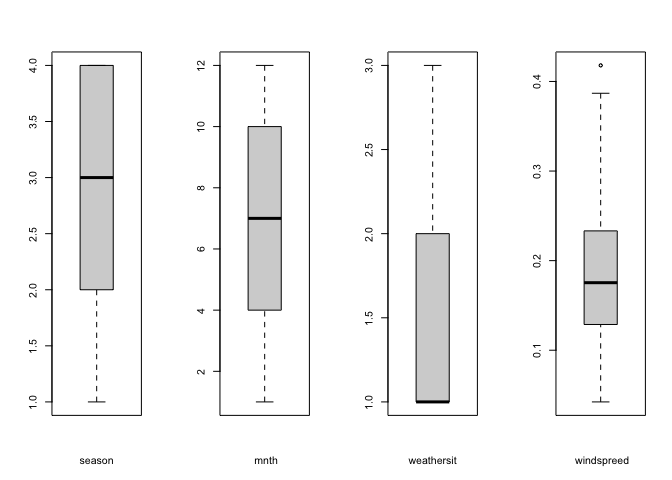

Project2
================
Alex/Zichang
7/11/2021

-   [Introduction Section](#introduction-section)
-   [Data](#data)
-   [Summarizations](#summarizations)
    -   [Summary Statistics](#summary-statistics)
    -   [Plots](#plots)
-   [Modeling](#modeling)
    -   [Modeling of the first group
        member](#modeling-of-the-first-group-member)
    -   [Modeling of the second group
        member](#modeling-of-the-second-group-member)
    -   [Comparison of all four models and
        Conclusion](#comparison-of-all-four-models-and-conclusion)

## Introduction Section

The purpose of this project is to create predictive models and automate
R Markdown reports. The data we will use is the number of Bike-sharing
users aggregated on daily basis from the Capital Bikeshare system in
2011 and 2012. In this data set, there are 16 variables that are related
to bike rental counts. The variables we will use include season, year
(yr), mnth, holiday, weekday, workingday, weathersit, hum, atemp, temp,
casual, registered, and count (cnt). To model response counts (cnt), we
will use linear regression models and ensemble tree methods (random
forest method and boosted tree method).

## Data

``` r
#load packages
library(corrplot)
library(ggplot2)
library(cowplot)
library(modelr)
library(readr)
library(dplyr)
library(knitr)
library(caret)
library(tidyr)
library(purrr)
library(gbm)
library(randomForest)
library(leaps)
```

``` r
#read in data
dayData <- read_csv("day.csv")
dayData
```

    ## # A tibble: 731 x 16
    ##    instant dteday     season    yr  mnth holiday weekday workingday weathersit
    ##      <dbl> <date>      <dbl> <dbl> <dbl>   <dbl>   <dbl>      <dbl>      <dbl>
    ##  1       1 2011-01-01      1     0     1       0       6          0          2
    ##  2       2 2011-01-02      1     0     1       0       0          0          2
    ##  3       3 2011-01-03      1     0     1       0       1          1          1
    ##  4       4 2011-01-04      1     0     1       0       2          1          1
    ##  5       5 2011-01-05      1     0     1       0       3          1          1
    ##  6       6 2011-01-06      1     0     1       0       4          1          1
    ##  7       7 2011-01-07      1     0     1       0       5          1          2
    ##  8       8 2011-01-08      1     0     1       0       6          0          2
    ##  9       9 2011-01-09      1     0     1       0       0          0          1
    ## 10      10 2011-01-10      1     0     1       0       1          1          1
    ## # … with 721 more rows, and 7 more variables: temp <dbl>, atemp <dbl>,
    ## #   hum <dbl>, windspeed <dbl>, casual <dbl>, registered <dbl>, cnt <dbl>

``` r
#check for missing values
anyNA(dayData)
```

    ## [1] FALSE

``` r
#create for loop to subset data for each weekday
status<-vector()

for (i in seq_len(nrow(dayData))){
  if(dayData$weekday[i] == 1){
    status[i] <- "Monday"
  } else if (dayData$weekday[i] == 2){
    status[i] <- "Tuesday"
  } else if (dayData$weekday[i] == 3){
    status[i] <- "Wednesday"
  } else if (dayData$weekday[i] == 4){
    status[i] <- "Thursday"
  } else if (dayData$weekday[i] == 5){
    status[i] <- "Friday"
  } else if (dayData$weekday[i] == 6){
    status[i] <- "Saturday"
  } else {
    status[i] <- "Sunday"
  }
}

dayData$status <- status
#data for the day specified in params
dayData1 <- dayData
paramsData <- dayData %>% filter(status == params$dow)

#Create columns to represent the categorical columns as mentioned in READ.ME
paramsData <- paramsData %>%
  # Add columns to represent the categorical columns as mentioned in READ.ME.
  mutate(SeasonType = ifelse(season == 1, "spring", ifelse(season == 2, "summer", ifelse(season == 3, "fall", "winter"))), yearType= ifelse(yr == 0, "2011", "2012"), workingdayType= ifelse(workingday == 1, "Working Day", "Non WorkingDay"),weathersitType= ifelse(weathersit == 1, "Clear", ifelse(weathersit == 2, "Mist", ifelse(weathersit == 3, "Light Snow", "HeavyRain"))))

#convert month from numerical to categorical charcter  
paramsData$mnth1 <- as.character(paramsData$mnth)
```

``` r
#split data set into training and test sets
set.seed(1)
train <- sample(1:nrow(paramsData), size = nrow(paramsData)*0.7)
test <- dplyr::setdiff(1:nrow(paramsData), train)

train <- paramsData[train, ]
test <- paramsData[test, ]

train
```

    ## # A tibble: 73 x 22
    ##    instant dteday     season    yr  mnth holiday weekday workingday weathersit
    ##      <dbl> <date>      <dbl> <dbl> <dbl>   <dbl>   <dbl>      <dbl>      <dbl>
    ##  1     472 2012-04-16      2     1     4       1       1          0          1
    ##  2     269 2011-09-26      4     0     9       0       1          1          2
    ##  3       3 2011-01-03      1     0     1       0       1          1          1
    ##  4     234 2011-08-22      3     0     8       0       1          1          1
    ##  5     605 2012-08-27      3     1     8       0       1          1          1
    ##  6     297 2011-10-24      4     0    10       0       1          1          1
    ##  7      94 2011-04-04      2     0     4       0       1          1          1
    ##  8     570 2012-07-23      3     1     7       0       1          1          1
    ##  9     409 2012-02-13      1     1     2       0       1          1          1
    ## 10     353 2011-12-19      4     0    12       0       1          1          1
    ## # … with 63 more rows, and 13 more variables: temp <dbl>, atemp <dbl>,
    ## #   hum <dbl>, windspeed <dbl>, casual <dbl>, registered <dbl>, cnt <dbl>,
    ## #   status <chr>, SeasonType <chr>, yearType <chr>, workingdayType <chr>,
    ## #   weathersitType <chr>, mnth1 <chr>

``` r
test
```

    ## # A tibble: 32 x 22
    ##    instant dteday     season    yr  mnth holiday weekday workingday weathersit
    ##      <dbl> <date>      <dbl> <dbl> <dbl>   <dbl>   <dbl>      <dbl>      <dbl>
    ##  1      17 2011-01-17      1     0     1       1       1          0          2
    ##  2      24 2011-01-24      1     0     1       0       1          1          1
    ##  3      31 2011-01-31      1     0     1       0       1          1          2
    ##  4      52 2011-02-21      1     0     2       1       1          0          2
    ##  5      59 2011-02-28      1     0     2       0       1          1          2
    ##  6      66 2011-03-07      1     0     3       0       1          1          1
    ##  7      80 2011-03-21      2     0     3       0       1          1          2
    ##  8     101 2011-04-11      2     0     4       0       1          1          2
    ##  9     108 2011-04-18      2     0     4       0       1          1          1
    ## 10     129 2011-05-09      2     0     5       0       1          1          1
    ## # … with 22 more rows, and 13 more variables: temp <dbl>, atemp <dbl>,
    ## #   hum <dbl>, windspeed <dbl>, casual <dbl>, registered <dbl>, cnt <dbl>,
    ## #   status <chr>, SeasonType <chr>, yearType <chr>, workingdayType <chr>,
    ## #   weathersitType <chr>, mnth1 <chr>

## Summarizations

### Summary Statistics

Summary statistics give us a quick look of our data. For our case, we
can find out the average number of bike rentals per season.

``` r
# Create a table of summary stats.
seasonSummary <- train %>% 
  # Select the seasone and cnt columns.
  select(SeasonType, cnt) %>%
  # Group by season
  group_by(SeasonType) %>%
  # Get summary statistics for total users by season.
  summarize("Min." = min(cnt),
            "1st Quartile" = quantile(cnt, 0.25),
            "Median" = quantile(cnt, 0.5),
            "Mean" = mean(cnt),
            "3rd Quartile" = quantile(cnt, 0.75),
            "Max" = max(cnt),
            "Std. Dev." = sd(cnt)
            )

# Display a table of the summary stats.
knitr::kable(seasonSummary, 
             caption=paste("Summary Statistics for total users",
                           "By Season"),
             digits=2)
```

| SeasonType | Min. | 1st Quartile | Median |    Mean | 3rd Quartile |  Max | Std. Dev. |
|:-----------|-----:|-------------:|-------:|--------:|-------------:|-----:|----------:|
| fall       | 3351 |      4498.50 | 6227.0 | 5687.16 |      6900.00 | 7525 |   1350.44 |
| spring     |  920 |      1349.00 | 1951.0 | 2167.15 |      2729.00 | 3784 |    908.48 |
| summer     | 2028 |      4025.75 | 4474.5 | 4683.68 |      5581.75 | 6664 |   1243.81 |
| winter     |   22 |      3619.50 | 4585.0 | 4482.47 |      5324.00 | 7058 |   1588.90 |

Summary Statistics for total users By Season

#### Contingency Tables

A continuity table shows the relationship between two categorical
variables. In our case, we can determine whether the season and weather
are related, and whether the season and workday are related.

``` r
#create contingency tables
kable(table(train$SeasonType, train$weathersitType))
```

|        | Clear | Light Snow | Mist |
|:-------|------:|-----------:|-----:|
| fall   |    14 |          0 |    5 |
| spring |    10 |          0 |    3 |
| summer |    12 |          0 |   10 |
| winter |    10 |          2 |    7 |

``` r
kable(table(train$SeasonType, train$workingdayType))
```

|        | Non WorkingDay | Working Day |
|:-------|---------------:|------------:|
| fall   |              1 |          18 |
| spring |              2 |          11 |
| summer |              3 |          19 |
| winter |              2 |          17 |

### Plots

#### Correlation Plot

Correlation plot shows the strength of a relationship between two
variables. In our case, we can identify which variables are highly
correlated with one another, especially with the response, the number of
bikes rented.

``` r
#create correlation plot
corr <- cor(train[, -c(1,2,7,17:22)])
head(round(corr, 2))
```

    ##            season    yr  mnth holiday workingday weathersit  temp atemp   hum
    ## season       1.00 -0.05  0.77   -0.08       0.08       0.16  0.27  0.30  0.42
    ## yr          -0.05  1.00 -0.03   -0.01       0.01       0.25 -0.04 -0.03 -0.02
    ## mnth         0.77 -0.03  1.00    0.00       0.00       0.24  0.08  0.12  0.45
    ## holiday     -0.08 -0.01  0.00    1.00      -1.00      -0.10  0.07  0.05 -0.03
    ## workingday   0.08  0.01  0.00   -1.00       1.00       0.10 -0.07 -0.05  0.03
    ## weathersit   0.16  0.25  0.24   -0.10       0.10       1.00 -0.04 -0.02  0.58
    ##            windspeed casual registered   cnt
    ## season         -0.34   0.14       0.44  0.41
    ## yr              0.10   0.12       0.49  0.44
    ## mnth           -0.44   0.03       0.22  0.20
    ## holiday         0.07   0.42      -0.18 -0.05
    ## workingday     -0.07  -0.42       0.18  0.05
    ## weathersit     -0.05  -0.17      -0.06 -0.10

``` r
corrplot::corrplot(corr, type = "upper", method = "pie")
```

<!-- -->

#### Histograms

Histograms are used to summarize distributions of variables. In our
case, we are trying to find out whether the change in each variable has
an impact on the number of bikes rented.

``` r
#create boxplots for selected variables (referenced from https://drsimonj.svbtle.com/quick-plot-of-all-variables)
#reshape the data set
reshape <- train %>% keep(is.numeric) %>% gather() 
#plot the density plot
g <- ggplot(reshape, aes(x = value))
g + facet_wrap(~ key, scales = "free") + geom_density()
```

<!-- -->

#### Boxplots

Boxplots show the shape of the distribution of each variable. By looking
at the boxplots below, we can see how each variable affects the number
of bikes rented.

``` r
#create boxplot for each variables
attach(train)
par(mfrow = c(1,4))
boxplot(season, xlab = "season")
boxplot(mnth, xlab =" mnth")
boxplot(weathersit, xlab = "weathersit")
boxplot(windspeed, xlab = " windspreed")
```

<!-- -->

``` r
boxplot(yr, xlab = "yr")
boxplot(temp, xlab = "temp")
boxplot(atemp, xlab = "atemp")

#remove outliers
train <- train[!abs(train$windspeed)>0.4, ]
```

<!-- -->

Boxplot with the number of users on the y-axis (wether casual,registered
or total users) and the season on the x-axis - We can inspect the trend
of users across seasons using these plots. Notice that the biggest
contribution towards total number of users comes from the registered
users which is expected. The most active seasons for that Monday is the
fall season and the least active season is the spring.

``` r
#create boxplots
plot11 <- ggplot(train, aes(SeasonType,
                                   cnt,
                                   color=cnt)) +
  geom_boxplot() + 
  # Jitter the points to add a little more info to the boxplot.
  geom_jitter() + 
  # Add labels to the axes.
  scale_x_discrete("Season") + scale_y_continuous("Total Users") +
  ggtitle("Total Users by Season") + theme(legend.position="none")
plot11
```

<!-- -->

``` r
plot12 <- ggplot(train, aes(SeasonType,
                                   casual,
                                   color=cnt)) +
  geom_boxplot() + 
  # Jitter the points to add a little more info to the boxplot.
  geom_jitter() + 
  # Add labels to the axes.
  scale_x_discrete("Season") + scale_y_continuous("Casual Users") +
  ggtitle("Casual Users by Season") + theme(legend.position="none")
plot12
```

<!-- -->

``` r
plot13 <- ggplot(train, aes(SeasonType,
                                   registered,
                                   color=cnt)) +
  geom_boxplot() + 
  # Jitter the points to add a little more info to the boxplot.
  geom_jitter() + 
  # Add labels to the axes.
  scale_x_discrete("Season") + scale_y_continuous("Registered Users") +
  ggtitle("Registered Users by Season") + theme(legend.position="none")
plot13
```

<!-- -->

``` r
plot_grid(plot13, plot12,plot11, ncol=3)
```

<!-- -->

#### Scatter plots

Scatter plot with the total number of users on the y-axis and the
temperature, wind speed, humidity on the x-axis - We can inspect the
trend of total users across these variables and notice that humidity
almost has a slight negative effect on the total number of users. Also
it’s noticeable that the wind speed has a slight negative effect on the
total number of users .

``` r
#create scatter plots
plot21 <- ggplot(train, aes(temp,
                                   cnt,
                                   color=cnt)) + 
  geom_point(size=4, alpha=0.75) + scale_color_gradient(low="blue", high="red") + 
  theme(legend.position="none") + geom_smooth(method=lm, formula=y~x, color="black") + 
  scale_x_continuous("Temprature") + 
  scale_y_continuous("Total Users") + 
  ggtitle("Temprature. vs. Total Users")
plot21
```

<!-- -->

``` r
plot22 <- ggplot(train, aes(windspeed,
                                   cnt,
                                   color=cnt)) + 
  geom_point(size=4, alpha=0.75) + scale_color_gradient(low="blue", high="red") + 
  theme(legend.position="none") + geom_smooth(method=lm, formula=y~x, color="black") + 
  scale_x_continuous("Wind Speed") + 
  scale_y_continuous("Total Users") + 
  ggtitle("Wind Speed vs. Total Users")
plot22
```

<!-- -->

``` r
plot23 <- ggplot(train, aes(hum,
                                   cnt,
                                   color=cnt)) + 
  geom_point(size=4, alpha=0.75) + scale_color_gradient(low="blue", high="red") + 
  theme(legend.position="none") + geom_smooth(method=lm, formula=y~x, color="black") + 
  scale_x_continuous("Humidity") + 
  scale_y_continuous("Total Users") + 
  ggtitle("Humidity vs. Total Users")
plot23
```

<!-- -->

``` r
plot_grid(plot21, plot22, plot23,ncol=3)
```

<!-- -->

scatterplot with the number of users on the y-axis and the month on the
x-axis, We can inspect the trend of users across months using this plot.

``` r
plot31 <- ggplot(paramsData, aes(x = mnth, y = casual)) + geom_point() +
    geom_smooth() +
    geom_smooth(method = lm, col = "Red")
plot32 <- ggplot(paramsData, aes(x = mnth, y = registered)) + geom_point() +
    geom_smooth() +
    geom_smooth(method = lm, col = "Red")
plot33 <- ggplot(paramsData, aes(x = mnth, y = cnt)) + geom_point() +
    geom_smooth() +
    geom_smooth(method = lm, col = "Red")
plot_grid(plot31, plot32, plot33,ncol=3)
```

    ## `geom_smooth()` using method = 'loess' and formula 'y ~ x'

    ## `geom_smooth()` using formula 'y ~ x'

    ## `geom_smooth()` using method = 'loess' and formula 'y ~ x'

    ## `geom_smooth()` using formula 'y ~ x'

    ## `geom_smooth()` using method = 'loess' and formula 'y ~ x'

    ## `geom_smooth()` using formula 'y ~ x'

<!-- -->

## Modeling

Linear Regression analyzes the relationship(s) between a response
variable and one or more of the predictor variables and their
interactions. It can determine how strong or weak is the relationship
between these variables, it can identify which of the predictor
variables contribute the most to the response and it can help in
predicting future responses. Linear regression could be simple which
includes only one predictor variable in the fitted model, could be
multiple linear regression involving more than one predictor and there
is general linear models where the reponse and predictors could be
qualitative and not only quantitative. Linear regression model fits are
done with lm() function in R, lm() is a linear regression model that
uses a straight line to describe the relationship between variables. It
finds the line of best fit through the given data by searching for the
value of the coefficients which represent the linear regression model
and knows as beta\_0, beta\_1, beta\_2 and responsible for minimizing
the total error of the model (MSE for quantitative response analysis).

### Modeling of the first group member

``` r
#fit model fitlm1
fitlm1 <- train(cnt ~ atemp*season*yr, data = train, 
                method = "lm", 
                preProcess = c("center", "scale"),
                trControl = trainControl(method = "cv", number = 10))
fitlm1
```

    ## Linear Regression 
    ## 
    ## 72 samples
    ##  3 predictor
    ## 
    ## Pre-processing: centered (7), scaled (7) 
    ## Resampling: Cross-Validated (10 fold) 
    ## Summary of sample sizes: 65, 66, 64, 64, 66, 64, ... 
    ## Resampling results:
    ## 
    ##   RMSE      Rsquared   MAE     
    ##   939.6105  0.6631997  667.0441
    ## 
    ## Tuning parameter 'intercept' was held constant at a value of TRUE

``` r
#fit model fitlm2
fitlm2 <- train(cnt ~ atemp + yr + season +windspeed+mnth+holiday+weathersit, data = train, 
                method = "lm", 
                preProcess = c("center", "scale"),
                trControl = trainControl(method = "cv", number = 10))
fitlm2
```

    ## Linear Regression 
    ## 
    ## 72 samples
    ##  7 predictor
    ## 
    ## Pre-processing: centered (7), scaled (7) 
    ## Resampling: Cross-Validated (10 fold) 
    ## Summary of sample sizes: 65, 64, 64, 65, 66, 66, ... 
    ## Resampling results:
    ## 
    ##   RMSE      Rsquared   MAE     
    ##   925.6337  0.7470762  675.8955
    ## 
    ## Tuning parameter 'intercept' was held constant at a value of TRUE

``` r
#fit model fitlm3
fitlm3 <- train(cnt ~ atemp + yr + season +windspeed+weathersit+mnth, data = train, 
                method = "lm", 
                preProcess = c("center", "scale"),
                trControl = trainControl(method = "cv", number = 10))
fitlm3
```

    ## Linear Regression 
    ## 
    ## 72 samples
    ##  6 predictor
    ## 
    ## Pre-processing: centered (6), scaled (6) 
    ## Resampling: Cross-Validated (10 fold) 
    ## Summary of sample sizes: 64, 66, 64, 66, 65, 65, ... 
    ## Resampling results:
    ## 
    ##   RMSE      Rsquared   MAE     
    ##   884.6905  0.7217538  641.3818
    ## 
    ## Tuning parameter 'intercept' was held constant at a value of TRUE

``` r
#fit model fitlm4
fitlm4 <- train(cnt ~ atemp + yr + I(yr^2), data = train, 
                method = "lm", 
                preProcess = c("center", "scale"),
                trControl = trainControl(method = "cv", number = 10))
fitlm4
```

    ## Linear Regression 
    ## 
    ## 72 samples
    ##  2 predictor
    ## 
    ## Pre-processing: centered (3), scaled (3) 
    ## Resampling: Cross-Validated (10 fold) 
    ## Summary of sample sizes: 65, 65, 64, 65, 65, 64, ... 
    ## Resampling results:
    ## 
    ##   RMSE      Rsquared   MAE     
    ##   1012.104  0.6575821  786.7434
    ## 
    ## Tuning parameter 'intercept' was held constant at a value of TRUE

&lt;&lt;&lt;&lt;&lt;&lt;&lt; HEAD

``` r
#predict results using test set
pred.fitlm1 <- predict(fitlm1, newdata = test)
rmse1<-postResample(pred.fitlm1, obs = test$cnt)


pred.fitlm2 <- predict(fitlm2, newdata = data.frame(test))
rmse2<-postResample(pred.fitlm2, obs = test$cnt)

pred.fitlm3 <- predict(fitlm3, newdata = data.frame(test))
rmse3<-postResample(pred.fitlm3, obs = test$cnt)

pred.fitlm4 <- predict(fitlm4, newdata = data.frame(test))
```

    ## Warning in predict.lm(modelFit, newdata): prediction from a rank-deficient fit
    ## may be misleading

``` r
rmse4<-postResample(pred.fitlm4, obs = test$cnt)

#view the result
kable(data.frame(rmse1[1], rmse2[1], rmse3[1],rmse4[1]))
```

|      | rmse1.1. | rmse2.1. | rmse3.1. | rmse4.1. |
|:-----|---------:|---------:|---------:|---------:|
| RMSE | 739.3265 | 746.4473 | 733.9749 | 851.2562 |

Summary for the model fit with the lowest cross validation test
error(RMSE) : fitlm3

``` r
summary(fitlm3)
```

    ## 
    ## Call:
    ## lm(formula = .outcome ~ ., data = dat)
    ## 
    ## Residuals:
    ##     Min      1Q  Median      3Q     Max 
    ## -3871.9  -303.7     5.2   448.2  1485.1 
    ## 
    ## Coefficients:
    ##             Estimate Std. Error t value Pr(>|t|)    
    ## (Intercept)   4479.5      105.1  42.638  < 2e-16 ***
    ## atemp          990.2      113.9   8.691 1.74e-12 ***
    ## yr             957.4      110.7   8.647 2.08e-12 ***
    ## season         610.0      171.9   3.549 0.000725 ***
    ## windspeed     -238.5      118.7  -2.008 0.048770 *  
    ## weathersit    -436.4      112.9  -3.865 0.000259 ***
    ## mnth          -217.5      174.4  -1.248 0.216641    
    ## ---
    ## Signif. codes:  0 '***' 0.001 '**' 0.01 '*' 0.05 '.' 0.1 ' ' 1
    ## 
    ## Residual standard error: 891.5 on 65 degrees of freedom
    ## Multiple R-squared:  0.7566, Adjusted R-squared:  0.7341 
    ## F-statistic: 33.67 on 6 and 65 DF,  p-value: < 2.2e-16

A different approach for selecting the best model for prediction
purposes is minimizing test MSE.

``` r
# select multiple random models in addition to the one we picked from the previous study being the first fit(glm1Fit)
glm1Fit <- lm(cnt ~ atemp + yr + season +windspeed+weathersit+mnth, data = train)
glm2Fit <- lm(cnt ~ atemp:yr, data = train)
glm3Fit <- lm(cnt ~ atemp + yr + season, data = train)
glm4Fit <- lm(cnt ~ atemp*yr*season, data = train)
glm5Fit <- lm(cnt ~ atemp+yr+I(yr^2), data = train)

model <- c(("glm1Fit"),("glm2Fit"),("glm3Fit"),("glm4Fit"),("glm5Fit"))

#calculate MSE for both the train and test sets
trainMSE <- c(rmse(glm1Fit, train), rmse(glm2Fit, train), rmse(glm3Fit, train), 
              rmse(glm4Fit, train), rmse(glm4Fit, train))
testMSE <- c(rmse(glm1Fit, test), rmse(glm2Fit, test), rmse(glm3Fit, test), 
             rmse(glm4Fit, test), rmse(glm5Fit, test))
```

    ## Warning in predict.lm(model, data): prediction from a rank-deficient fit may be
    ## misleading

``` r
MSEdf <- data.frame(model, trainMSE, testMSE)
MSEdf <- MSEdf %>% arrange(testMSE)
kable(data.frame(MSEdf),caption = "Table showing glm1Fit is the best fit")
```

| model   |  trainMSE |   testMSE |
|:--------|----------:|----------:|
| glm1Fit |  847.0083 |  733.9749 |
| glm3Fit |  980.5203 |  735.5470 |
| glm4Fit |  950.8767 |  739.3265 |
| glm5Fit |  950.8767 |  851.2562 |
| glm2Fit | 1330.5374 | 1336.5710 |

Table showing glm1Fit is the best fit

Knowing that we can’t fully trust test MSE values in order to decide on
a model, we will go a step further in developing AIC,BIC and Rsquare
Criterias. Using the function from module 9

``` r
compareFitStats <- function(newfit1, newfit2,newfit3,newfit4,newfit5){
    require(MuMIn)
    fitStats <- data.frame(fitStat = c("Adj R Square", "AIC", "AICc", "BIC"),
        col1 = round(c(summary(newfit1)$adj.r.squared, AIC(newfit1), 
                                    MuMIn::AICc(newfit1), BIC(newfit1)), 3),
            col2 = round(c(summary(newfit2)$adj.r.squared, AIC(newfit2), 
                                    MuMIn::AICc(newfit2), BIC(newfit2)), 3),
                col3 = round(c(summary(newfit3)$adj.r.squared, AIC(newfit3), 
                                    MuMIn::AICc(newfit3), BIC(newfit3)), 3),
                    col4 = round(c(summary(newfit4)$adj.r.squared, AIC(newfit4), 
                                    MuMIn::AICc(newfit4), BIC(newfit4)), 3),
                        col5 = round(c(summary(newfit5)$adj.r.squared, AIC(newfit5), 
                                    MuMIn::AICc(newfit5), BIC(newfit5)),3))
    #put names on returned df
    calls <- as.list(match.call())
    calls[[1]] <- NULL
    names(fitStats)[2:6] <- unlist(calls)
    fitStats
}

kable(data.frame(compareFitStats(glm1Fit,glm2Fit,glm3Fit,glm4Fit,glm5Fit)),caption = "Table showing Rsquared,AIC,AICc and BIC criteria")
```

    ## Loading required package: MuMIn

    ## 
    ## Attaching package: 'MuMIn'

    ## The following object is masked from 'package:randomForest':
    ## 
    ##     importance

| fitStat      |  glm1Fit |  glm2Fit |  glm3Fit |  glm4Fit |  glm5Fit |
|:-------------|---------:|---------:|---------:|---------:|---------:|
| Adj R Square |    0.734 |    0.391 |    0.659 |    0.660 |    0.603 |
| AIC          | 1191.133 | 1246.168 | 1206.211 | 1209.791 | 1216.249 |
| AICc         | 1193.419 | 1246.521 | 1207.120 | 1212.694 | 1216.846 |
| BIC          | 1209.347 | 1252.998 | 1217.594 | 1230.280 | 1225.355 |

Table showing Rsquared,AIC,AICc and BIC criteria

Again, the calculated criterias shows that glm1Fit (which is the same as
fitlm3 model) which represents the 6 predictors , is the best model fit
selected.

An extra step to prove that our choice of glm1Fit as the best fit, here
I decided to use the method explained in section 6.5.3 of the book:
Choosing Among Models Using the Validation Set Approach (test Dataset)
and Cross-Validation.

&lt;&lt;&lt;&lt;&lt;&lt;&lt; HEAD

``` r
# we apply regsubsets() to the training set in order to perform best subset selection.
library(leaps)
regfit.best = regsubsets (cnt ~ temp + yr + season + windspeed + mnth + holiday + weathersit + atemp,
                        data = train)
summary(regfit.best)
```

    ## Subset selection object
    ## Call: regsubsets.formula(cnt ~ temp + yr + season + windspeed + mnth + 
    ##     holiday + weathersit + atemp, data = train)
    ## 8 Variables  (and intercept)
    ##            Forced in Forced out
    ## temp           FALSE      FALSE
    ## yr             FALSE      FALSE
    ## season         FALSE      FALSE
    ## windspeed      FALSE      FALSE
    ## mnth           FALSE      FALSE
    ## holiday        FALSE      FALSE
    ## weathersit     FALSE      FALSE
    ## atemp          FALSE      FALSE
    ## 1 subsets of each size up to 8
    ## Selection Algorithm: exhaustive
    ##          temp yr  season windspeed mnth holiday weathersit atemp
    ## 1  ( 1 ) " "  " " " "    " "       " "  " "     " "        "*"  
    ## 2  ( 1 ) " "  "*" " "    " "       " "  " "     " "        "*"  
    ## 3  ( 1 ) " "  "*" "*"    " "       " "  " "     " "        "*"  
    ## 4  ( 1 ) " "  "*" "*"    " "       " "  " "     "*"        "*"  
    ## 5  ( 1 ) " "  "*" "*"    "*"       " "  " "     "*"        "*"  
    ## 6  ( 1 ) " "  "*" "*"    "*"       "*"  " "     "*"        "*"  
    ## 7  ( 1 ) " "  "*" "*"    "*"       "*"  "*"     "*"        "*"  
    ## 8  ( 1 ) "*"  "*" "*"    "*"       "*"  "*"     "*"        "*"

``` r
test.mat = model.matrix(cnt ~ temp + yr + season + windspeed + mnth + holiday + weathersit + atemp,
                        data = test)

val.errors = rep(NA, 7)
for(i in 1:7)
{
    coefi = coef(regfit.best, id=i)
    pred = test.mat[,names(coefi)]%*%coefi
    val.errors[i] = mean((test$cnt - pred)^2)
}

val.errors
```

    ## [1] 1775721.0  724637.1  541029.4  549180.4  569000.5  538719.1  557183.6

``` r
which.min(val.errors)
```

    ## [1] 6

Displaying the Selected model with the calculted regression
coefficients.

``` r
coef(regfit.best ,6)
```

    ## (Intercept)          yr      season   windspeed        mnth  weathersit 
    ##   962.19848  1904.40174   578.73250 -2862.69671   -66.50325  -796.46581 
    ##       atemp 
    ##  6354.63385

Also another extra verification step by doing the Partial least squares
method.

``` r
library(pls)
```

    ## 
    ## Attaching package: 'pls'

    ## The following object is masked from 'package:MuMIn':
    ## 
    ##     stdize

    ## The following object is masked from 'package:caret':
    ## 
    ##     R2

    ## The following object is masked from 'package:corrplot':
    ## 
    ##     corrplot

    ## The following object is masked from 'package:stats':
    ## 
    ##     loadings

``` r
set.seed(222)
 pls.fit=plsr(cnt~ atemp + yr + season +windspeed+mnth+weathersit, data=train, scale=TRUE ,
validation ="CV")  

validationplot(pls.fit ,val.type="MSEP")
```

<!-- -->

The lowest cross-validation error occurs when only M = 4.We now evaluate
the corresponding test MSE.

``` r
pls.pred=predict (pls.fit ,test,ncomp =4)
mean((pls.pred -test$cnt)^2)
```

    ## [1] 537479.4

``` r
MSE.val2 <- sqrt(mean((pls.pred -test$cnt)^2))
MSE.val2
```

    ## [1] 733.1299

We noticed that PLS resulted in a similar value to the previous methods
and approaches used.

#### Random Forest

Random forest is a tree-based method for regression or classification
which involves producing multiple trees known as decision trees to yield
a single adequate prediction. ISLR book mentions about decision trees
“When building these decision trees, each time a split in a tree is
considered, a random sample of m predictors is chosen as split
candidates from the full set of p predictors. The split is allowed to
use only one of those m predictors. A fresh sample of m predictors is
taken at each split.”

``` r
#fit a random tree model
rfTree <- train(cnt ~ atemp + yr + season +windspeed+weathersit+mnth, 
                data = train, 
                method = "rf",
                trControl = trainControl(method = "repeatedcv", number = 10, repeats = 5),
                preProcess = c("center", "scale"))
rfTree
```

    ## Random Forest 
    ## 
    ## 72 samples
    ##  6 predictor
    ## 
    ## Pre-processing: centered (6), scaled (6) 
    ## Resampling: Cross-Validated (10 fold, repeated 5 times) 
    ## Summary of sample sizes: 66, 64, 64, 64, 66, 66, ... 
    ## Resampling results across tuning parameters:
    ## 
    ##   mtry  RMSE       Rsquared   MAE     
    ##   2      956.5801  0.7184666  707.9049
    ##   4      956.7261  0.7177955  700.9231
    ##   6     1015.8193  0.6898336  749.2492
    ## 
    ## RMSE was used to select the optimal model using the smallest value.
    ## The final value used for the model was mtry = 2.

Perform prediction on our test data set

``` r
#predict using the test set
rfPred <- predict(rfTree, newdata = test)
rfresult <- postResample(rfPred, test$cnt)
rfresult
```

    ##        RMSE    Rsquared         MAE 
    ## 849.4430164   0.8099526 676.2077337

### Modeling of the second group member

To select a model, we use the `stepAIC()` function. In the `stepAIC()`
function, we first specify the model with only main effects and the data
set to be used. Then we specify the most complex model and the most
simple model as upper and lower respectively in the scope.

``` r
#creat new data sets trainNew and testNew
trainNew <- train[, c(3:5, 9:13, 16)]
trainNew
```

    ## # A tibble: 72 x 9
    ##    season    yr  mnth weathersit  temp atemp   hum windspeed   cnt
    ##     <dbl> <dbl> <dbl>      <dbl> <dbl> <dbl> <dbl>     <dbl> <dbl>
    ##  1      2     1     4          1 0.664 0.615 0.562     0.285  6370
    ##  2      4     0     9          2 0.649 0.589 0.848     0.111  4630
    ##  3      1     0     1          1 0.196 0.189 0.437     0.248  1349
    ##  4      3     0     8          1 0.692 0.638 0.47      0.277  4758
    ##  5      3     1     8          1 0.703 0.655 0.730     0.129  6917
    ##  6      4     0    10          1 0.463 0.457 0.772     0.119  4187
    ##  7      2     0     4          1 0.573 0.543 0.426     0.386  3115
    ##  8      3     1     7          1 0.742 0.690 0.694     0.139  6966
    ##  9      1     1     2          1 0.222 0.228 0.411     0.167  3422
    ## 10      4     0    12          1 0.277 0.281 0.638     0.173  3403
    ## # … with 62 more rows

``` r
testNew <- test[, c(3:5, 9:13, 16)]
testNew
```

    ## # A tibble: 32 x 9
    ##    season    yr  mnth weathersit   temp atemp   hum windspeed   cnt
    ##     <dbl> <dbl> <dbl>      <dbl>  <dbl> <dbl> <dbl>     <dbl> <dbl>
    ##  1      1     0     1          2 0.176  0.177 0.538     0.194  1000
    ##  2      1     0     1          1 0.0974 0.118 0.492     0.158  1416
    ##  3      1     0     1          2 0.181  0.186 0.604     0.187  1501
    ##  4      1     0     2          2 0.303  0.284 0.605     0.308  1107
    ##  5      1     0     2          2 0.407  0.400 0.876     0.290  1446
    ##  6      1     0     3          1 0.262  0.238 0.551     0.341  1872
    ##  7      2     0     3          2 0.430  0.410 0.737     0.289  2077
    ##  8      2     0     4          2 0.596  0.565 0.717     0.324  3348
    ##  9      2     0     4          1 0.512  0.503 0.542     0.164  3429
    ## 10      2     0     5          1 0.532  0.525 0.589     0.176  4362
    ## # … with 22 more rows

``` r
#select model
model <- MASS::stepAIC(lm(cnt ~ ., data = trainNew), 
                  scope=list(upper = ~ .^2 + I(season)^2 + I(yr)^2 + I(mnth)^2 +
                               I(weathersit)^2 + I(temp)^2 + I(atemp)^2 + I(hum)^2 + I(windspeed)^2, 
                             lower = ~1), trace = FALSE)
```

The model selected is below, because it has the smallest AIC.

``` r
#view the selected model
model$call
```

    ## lm(formula = cnt ~ season + yr + mnth + weathersit + temp + atemp + 
    ##     hum + windspeed + weathersit:hum + yr:weathersit + temp:atemp + 
    ##     weathersit:windspeed + yr:atemp + season:yr + hum:windspeed, 
    ##     data = trainNew)

The linear regression model is fitted using the `train()` function.
First, we must give the model and data set we use. Next, we provide the
method we use, which is “lm”. Then, we use the `preProcess()` function
to standardize the data. Finally, we specify the type of
cross-validation we wish to perform. In our case, we would like to
perform repeated cross-validation with 10 folds for 5 times.

``` r
#fit model
set.seed(1)
fit <- train(model$terms, 
             data = trainNew,
             method = "lm",
             preProcess = c("center", "scale"),
             trControl = trainControl(method = "repeatedcv", number = 10, repeats = 5)
             )

#view the results
kable(fit$results)
```

| intercept |     RMSE |  Rsquared |      MAE |   RMSESD | RsquaredSD |    MAESD |
|:----------|---------:|----------:|---------:|---------:|-----------:|---------:|
| TRUE      | 690.1747 | 0.8576366 | 537.0458 | 263.4838 |  0.0980007 | 175.2241 |

``` r
#check the fit
lmPred <- predict(fit, newdata = testNew)
lmFit <- postResample(lmPred, obs = testNew$cnt)

#calculate root MSE
lmRMSE <- lmFit[1]
kable(lmRMSE)
```

|      |        x |
|:-----|---------:|
| RMSE | 694.2376 |

We use the train() function to fit the boosted tree model in the similar
way we fit the linear regression model. First, we must give the model
and data set we use. Next, we provide the method we use, which is “gbm”.
Then, we use the `preProcess()` function to standardize the data.
Finally, we specify the type of cross-validation we wish to perform. In
our case, we would like to perform repeated cross-validation with 10
folds for 5 times.

``` r
#fit boosted tree model
set.seed(1)
boostFit <- train(model$terms, 
                  data = trainNew, 
                  method = "gbm", 
                  preProcess = c("center", "scale"),
                  trControl = trainControl(method = "repeatedcv", number = 10, repeats = 5))
```

``` r
#view the results
boostFit$results
```

    ##   shrinkage interaction.depth n.minobsinnode n.trees     RMSE  Rsquared
    ## 1       0.1                 1             10      50 884.7510 0.7534144
    ## 4       0.1                 2             10      50 871.2006 0.7642280
    ## 7       0.1                 3             10      50 868.1637 0.7611684
    ## 2       0.1                 1             10     100 869.5942 0.7571665
    ## 5       0.1                 2             10     100 856.8148 0.7707728
    ## 8       0.1                 3             10     100 837.2805 0.7781091
    ## 3       0.1                 1             10     150 865.3346 0.7595031
    ## 6       0.1                 2             10     150 847.9520 0.7734672
    ## 9       0.1                 3             10     150 833.0969 0.7791986
    ##        MAE   RMSESD RsquaredSD    MAESD
    ## 1 668.1359 494.0703  0.2426892 266.4430
    ## 4 655.7283 477.7479  0.2288968 260.2708
    ## 7 652.6782 480.7757  0.2357198 271.5196
    ## 2 653.0503 472.8158  0.2256735 256.1463
    ## 5 642.9804 465.5025  0.2130184 268.9695
    ## 8 627.1167 457.0098  0.2135315 260.9982
    ## 3 655.5824 469.5460  0.2210449 258.2630
    ## 6 638.9888 465.6426  0.2136052 268.9818
    ## 9 626.7872 452.8655  0.2051844 265.2310

``` r
#view the best model
boostFit$bestTune
```

    ##   n.trees interaction.depth shrinkage n.minobsinnode
    ## 9     150                 3       0.1             10

``` r
#predict cnt and calculate RMSE
boostPred <- predict(boostFit, newdata = testNew)
result <- postResample(boostPred, testNew$cnt)
boostRMSE <- result[1]
kable(boostRMSE)
```

|      |        x |
|:-----|---------:|
| RMSE | 698.6171 |

### Comparison of all four models and Conclusion

By comparing the RMSE from all four models, we choose the winner below,
because it has the lowest RMSE.

``` r
#combine RMSE from four models
results <- data.frame(MSEdf[1,3], rfresult[1], boostRMSE,rfresult[1])
colnames(results) <- c("lmFit_1stMember", "lmFit_2ndMember", "Boost Tree","Random Forest")
#view the result
kable(results)
```

|      | lmFit\_1stMember | lmFit\_2ndMember | Boost Tree | Random Forest |
|:-----|-----------------:|-----------------:|-----------:|--------------:|
| RMSE |         733.9749 |          849.443 |   698.6171 |       849.443 |

``` r
#choose a winner
results <- results %>% gather() %>% arrange(value)
winner <- results[1, ]
kable(winner)
```

| key        |    value |
|:-----------|---------:|
| Boost Tree | 698.6171 |
