Project2
================
Alex/Zichang
7/11/2021

-   [Introduction Section](#introduction-section)
-   [Data](#data)
-   [Summarizations](#summarizations)
    -   [Summary Statistics](#summary-statistics)
    -   [Plots](#plots)
-   [Modeling](#modeling)
    -   [Modeling of the first group
        member](#modeling-of-the-first-group-member)

## Introduction Section

The purpose of this project is to create predictive models and automate
R Markdown reports. The data we will use is the number of Bike-sharing
users aggregated on daily basis from the Capital Bikeshare system in
2011 and 2012. In this data set, there are 16 variables that are related
to bike rental counts. The variables we will use include season, year
(yr), mnth, holiday, weekday, workingday, weathersit, hum, atemp, temp,
casual, registered, and count (cnt). To model response counts (cnt), we
will use linear regression models and ensemble tree methods (random
forest method and boosted tree method).

## Data

``` r
#load packages
library(corrplot)
library(ggplot2)
library(cowplot)
library(modelr)
library(readr)
library(dplyr)
library(knitr)
library(caret)
library(tidyr)
library(purrr)
library(gbm)
library(randomForest)
library(leaps)
```

``` r
#read in data
dayData <- read_csv("day.csv")
dayData

#check for missing values
anyNA(dayData)
```

    ## [1] FALSE

``` r
#create for loop to subset data for each weekday
status<-vector()

for (i in seq_len(nrow(dayData))){
  if(dayData$weekday[i] == 1){
    status[i] <- "Monday"
  } else if (dayData$weekday[i] == 2){
    status[i] <- "Tuesday"
  } else if (dayData$weekday[i] == 3){
    status[i] <- "Wednesday"
  } else if (dayData$weekday[i] == 4){
    status[i] <- "Thursday"
  } else if (dayData$weekday[i] == 5){
    status[i] <- "Friday"
  } else if (dayData$weekday[i] == 6){
    status[i] <- "Saturday"
  } else {
    status[i] <- "Sunday"
  }
}

dayData$status <- status
#data for the day specified in params
dayData1 <- dayData
paramsData <- dayData %>% filter(status == params$dow)

#Create columns to represent the categorical columns as mentioned in READ.ME
paramsData <- paramsData %>%
  # Add columns to represent the categorical columns as mentioned in READ.ME.
  mutate(SeasonType = ifelse(season == 1, "spring", ifelse(season == 2, "summer", ifelse(season == 3, "fall", "winter"))), yearType= ifelse(yr == 0, "2011", "2012"), workingdayType= ifelse(workingday == 1, "Working Day", "Non WorkingDay"),weathersitType= ifelse(weathersit == 1, "Clear", ifelse(weathersit == 2, "Mist", ifelse(weathersit == 3, "Light Snow", "HeavyRain"))))

#convert month from numerical to categorical charcter  
paramsData$mnth1 <- as.character(paramsData$mnth)
```

``` r
#split data set into training and test sets
set.seed(1)
train <- sample(1:nrow(paramsData), size = nrow(paramsData)*0.7)
test <- dplyr::setdiff(1:nrow(paramsData), train)

train <- paramsData[train, ]
test <- paramsData[test, ]

train
test
```

## Summarizations

### Summary Statistics

Summary statistics give us a quick look of our data. For our case, we
can find out the average number of bike rentals per season.

``` r
# Create a table of summary stats.
seasonSummary <- train %>% 
  # Select the seasone and cnt columns.
  select(SeasonType, cnt) %>%
  # Group by season
  group_by(SeasonType) %>%
  # Get summary statistics for total users by season.
  summarize("Min." = min(cnt),
            "1st Quartile" = quantile(cnt, 0.25),
            "Median" = quantile(cnt, 0.5),
            "Mean" = mean(cnt),
            "3rd Quartile" = quantile(cnt, 0.75),
            "Max" = max(cnt),
            "Std. Dev." = sd(cnt)
            )

# Display a table of the summary stats.
knitr::kable(seasonSummary, 
             caption=paste("Summary Statistics for total users",
                           "By Season"),
             digits=2)
```

| SeasonType | Min. | 1st Quartile | Median |    Mean | 3rd Quartile |  Max | Std. Dev. |
|:-----------|-----:|-------------:|-------:|--------:|-------------:|-----:|----------:|
| fall       | 1115 |       4497.5 | 5345.0 | 5439.16 |       6176.0 | 8714 |   1577.91 |
| spring     |  959 |       1011.0 | 1749.0 | 2055.92 |       2485.0 | 4521 |   1169.57 |
| summer     | 2252 |       4354.5 | 5573.5 | 5572.95 |       6876.5 | 8294 |   1747.30 |
| winter     |  627 |       3426.5 | 5191.0 | 4901.00 |       5605.5 | 8555 |   2173.67 |

Summary Statistics for total users By Season

#### Contingency Tables

A continuity table shows the relationship between two categorical
variables. In our case, we can determine whether the season and weather
are related, and whether the season and workday are related.

``` r
#create contingency tables
kable(table(train$SeasonType, train$weathersitType))
```

|        | Clear | Light Snow | Mist |
|:-------|------:|-----------:|-----:|
| fall   |    11 |          1 |    7 |
| spring |     6 |          1 |    6 |
| summer |    15 |          0 |    7 |
| winter |    12 |          1 |    6 |

``` r
kable(table(train$SeasonType, train$workingdayType))
```

|        | Non WorkingDay |
|:-------|---------------:|
| fall   |             19 |
| spring |             13 |
| summer |             22 |
| winter |             19 |

### Plots

#### Correlation Plot

Correlation plot shows the strength of a relationship between two
variables. In our case, we can identify which variables are highly
correlated with one another, especially with the response, the number of
bikes rented.

``` r
#create correlation plot
#corr <- cor(train[, -c(1,2,7,17:22)])
#head(round(corr, 2))
#corrplot(corr, type = "upper", method = "pie")
```

Let’s examine the correlations among the quantitative variables, create
correlation plot excluding qualitative variables. It’s apparent how temp
and atemp are strongly correlated and this will cause multicollineariy,
therefore we can safely drop one of the two varaibles. Also, for same
reasoning we will drop registered and casual since they are directly
related to the contribution of cnt. The only quanitative variable to
include in the linear regression analysis will be “atemp”.

#### Histograms

Histograms are used to summarize distributions of variables. In our
case, we are trying to find out whether the change in each variable has
an impact on the number of bikes rented.

``` r
#create boxplots for selected variables (referenced from https://drsimonj.svbtle.com/quick-plot-of-all-variables)
#reshape the data set
reshape <- train %>% keep(is.numeric) %>% gather() 
#plot the density plot
g <- ggplot(reshape, aes(x = value))
g + facet_wrap(~ key, scales = "free") + geom_density()
```

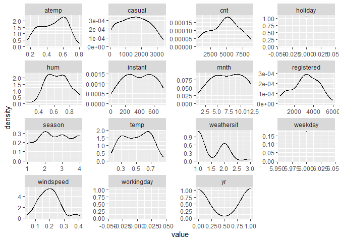<!-- -->

#### Boxplots

Boxplots show the shape of the distribution of each variable. By looking
at the boxplots below, we can see how each variable affects the number
of bikes rented.

``` r
#create boxplot for each variables
attach(train)
par(mfrow = c(1,4))
boxplot(season, xlab = "season")
boxplot(mnth, xlab =" mnth")
boxplot(weathersit, xlab = "weathersit")
boxplot(windspeed, xlab = " windspreed")
```

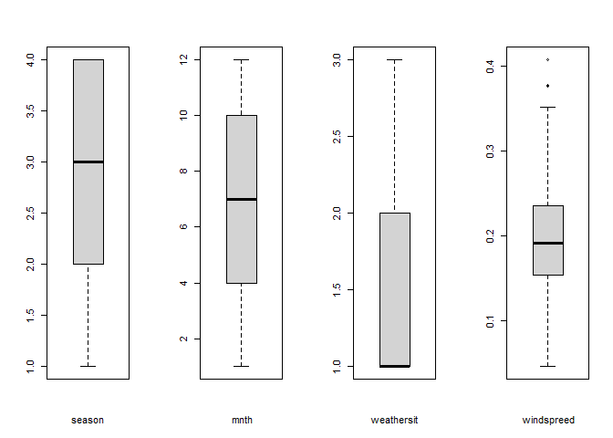<!-- -->

``` r
boxplot(yr, xlab = "yr")
boxplot(temp, xlab = "temp")
boxplot(atemp, xlab = "atemp")

#remove outliers
train <- train[!abs(train$windspeed)>0.4, ]
```

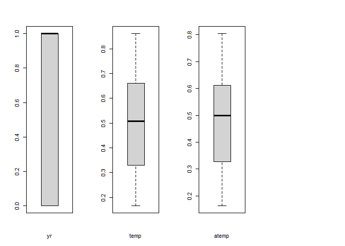<!-- -->

Boxplot with the number of users on the y-axis (wether casual,registered
or total users) and the season on the x-axis - We can inspect the trend
of users across seasons using these plots. Notice that the biggest
contribution towards total number of users comes from the registered
users which is expected. The most active seasons for that Saturday is
the fall season and the least active season is the spring.

``` r
#create boxplots
plot11 <- ggplot(train, aes(SeasonType,
                                   cnt,
                                   color=cnt)) +
  geom_boxplot() + 
  # Jitter the points to add a little more info to the boxplot.
  geom_jitter() + 
  # Add labels to the axes.
  scale_x_discrete("Season") + scale_y_continuous("Total Users") +
  ggtitle("Total Users by Season") + theme(legend.position="none")
plot11
```

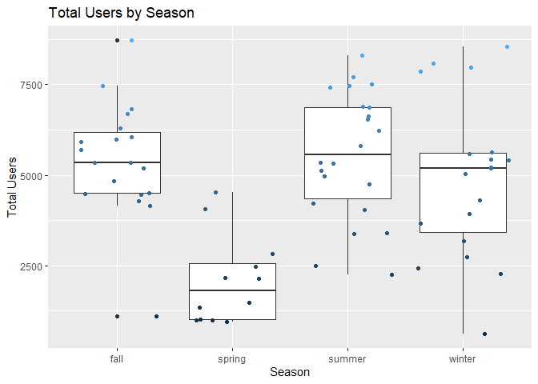<!-- -->

``` r
plot12 <- ggplot(train, aes(SeasonType,
                                   casual,
                                   color=cnt)) +
  geom_boxplot() + 
  # Jitter the points to add a little more info to the boxplot.
  geom_jitter() + 
  # Add labels to the axes.
  scale_x_discrete("Season") + scale_y_continuous("Casual Users") +
  ggtitle("Casual Users by Season") + theme(legend.position="none")
plot12
```

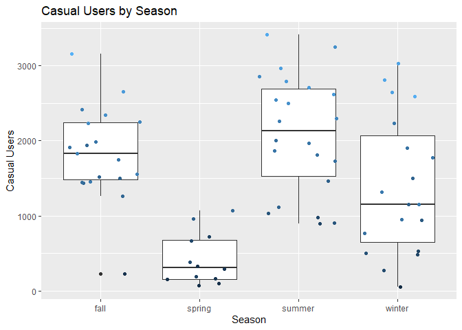<!-- -->

``` r
plot13 <- ggplot(train, aes(SeasonType,
                                   registered,
                                   color=cnt)) +
  geom_boxplot() + 
  # Jitter the points to add a little more info to the boxplot.
  geom_jitter() + 
  # Add labels to the axes.
  scale_x_discrete("Season") + scale_y_continuous("Registered Users") +
  ggtitle("Registered Users by Season") + theme(legend.position="none")
plot13
```

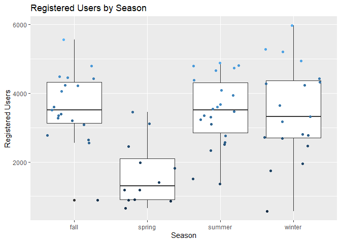<!-- -->

``` r
plot_grid(plot13, plot12,plot11, ncol=3)
```

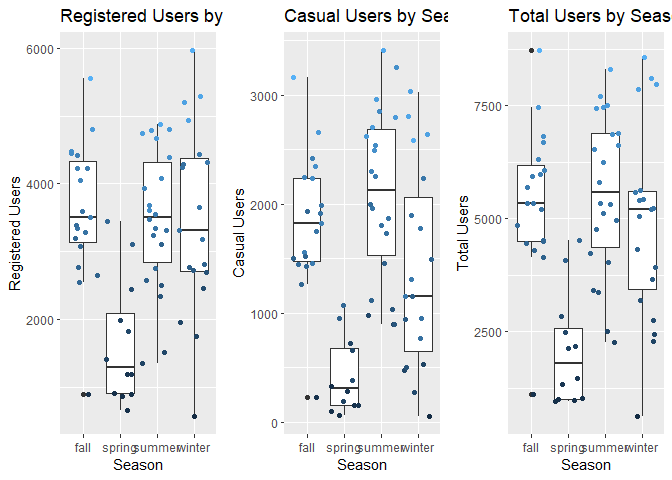<!-- -->

#### Scatter plots

Scatter plot with the total number of users on the y-axis and the
temperature, wind speed, humidity on the x-axis - We can inspect the
trend of total users across these variables and notice that humidity
almost has a slight negative effect on the total number of users. Also
it’s noticeable that the wind speed has a slight negative effect on the
total number of users .

``` r
#create scatter plots
plot21 <- ggplot(train, aes(temp,
                                   cnt,
                                   color=cnt)) + 
  geom_point(size=4, alpha=0.75) + scale_color_gradient(low="blue", high="red") + 
  theme(legend.position="none") + geom_smooth(method=lm, formula=y~x, color="black") + 
  scale_x_continuous("Temprature") + 
  scale_y_continuous("Total Users") + 
  ggtitle("Temprature. vs. Total Users")
plot21
```

<!-- -->

``` r
plot22 <- ggplot(train, aes(windspeed,
                                   cnt,
                                   color=cnt)) + 
  geom_point(size=4, alpha=0.75) + scale_color_gradient(low="blue", high="red") + 
  theme(legend.position="none") + geom_smooth(method=lm, formula=y~x, color="black") + 
  scale_x_continuous("Wind Speed") + 
  scale_y_continuous("Total Users") + 
  ggtitle("Wind Speed vs. Total Users")
plot22
```

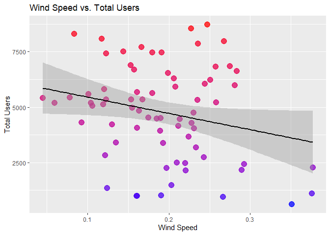<!-- -->

``` r
plot23 <- ggplot(train, aes(hum,
                                   cnt,
                                   color=cnt)) + 
  geom_point(size=4, alpha=0.75) + scale_color_gradient(low="blue", high="red") + 
  theme(legend.position="none") + geom_smooth(method=lm, formula=y~x, color="black") + 
  scale_x_continuous("Humidity") + 
  scale_y_continuous("Total Users") + 
  ggtitle("Humidity vs. Total Users")
plot23
```

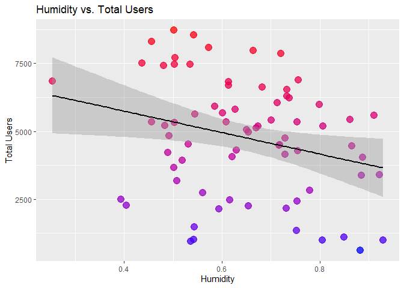<!-- -->

``` r
plot_grid(plot21, plot22, plot23,ncol=3)
```

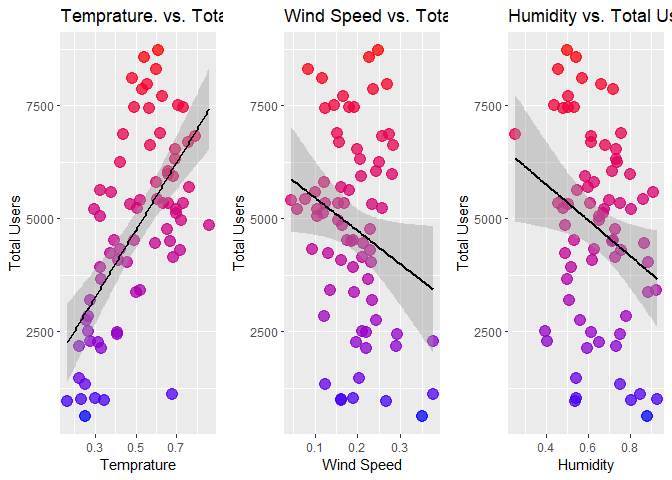<!-- -->

scatterplot with the number of users on the y-axis and the month on the
x-axis, We can inspect the trend of users across months using this plot.

``` r
plot31 <- ggplot(paramsData, aes(x = mnth, y = casual)) + geom_point() +
    geom_smooth() +
    geom_smooth(method = lm, col = "Red")
plot32 <- ggplot(paramsData, aes(x = mnth, y = registered)) + geom_point() +
    geom_smooth() +
    geom_smooth(method = lm, col = "Red")
plot33 <- ggplot(paramsData, aes(x = mnth, y = cnt)) + geom_point() +
    geom_smooth() +
    geom_smooth(method = lm, col = "Red")
plot_grid(plot31, plot32, plot33,ncol=3)
```

    ## `geom_smooth()` using method = 'loess' and formula 'y ~ x'

    ## `geom_smooth()` using formula 'y ~ x'

    ## `geom_smooth()` using method = 'loess' and formula 'y ~ x'

    ## `geom_smooth()` using formula 'y ~ x'

    ## `geom_smooth()` using method = 'loess' and formula 'y ~ x'

    ## `geom_smooth()` using formula 'y ~ x'

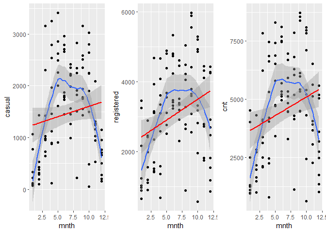<!-- -->

## Modeling

Linear Regression analyzes the relationship(s) between a response
variable and one or more of the predictor variables and their
interactions. It can determine how strong or weak is the relationship
between these variables, it can identify which of the predictor
variables contribute the most to the response and it can help in
predicting future responses. Linear regression could be simple which
includes only one predictor variable in the fitted model, could be
multiple linear regression involving more than one predictor and there
is general linear models where the reponse and predictors could be
qualitative and not only quantitative. Linear regression model fits are
done with lm() function in R, lm() is a linear regression model that
uses a straight line to describe the relationship between variables. It
finds the line of best fit through the given data by searching for the
value of the coefficients which represent the linear regression model
and knows as beta\_0, beta\_1, beta\_2 and responsible for minimizing
the total error of the model (MSE for quantitative response analysis).

### Modeling of the first group member

``` r
fitlm1 <- train(cnt ~ atemp*season*yr, data = train, 
                method = "lm", 
                preProcess = c("center", "scale"),
                trControl = trainControl(method = "cv", number = 10))
fitlm1
```

    ## Linear Regression 
    ## 
    ## 72 samples
    ##  3 predictor
    ## 
    ## Pre-processing: centered (7), scaled (7) 
    ## Resampling: Cross-Validated (10 fold) 
    ## Summary of sample sizes: 65, 66, 64, 64, 66, 64, ... 
    ## Resampling results:
    ## 
    ##   RMSE      Rsquared   MAE     
    ##   1309.068  0.7122972  1013.988
    ## 
    ## Tuning parameter 'intercept' was held constant at a value of TRUE

``` r
fitlm2 <- train(cnt ~ atemp + yr + season +windspeed+mnth+holiday+weathersit, data = train, 
                method = "lm", 
                preProcess = c("center", "scale"),
                trControl = trainControl(method = "cv", number = 10))
```

    ## Warning in preProcess.default(thresh = 0.95, k = 5, freqCut = 19, uniqueCut = 10, : These variables have zero
    ## variances: holiday

    ## Warning in predict.lm(modelFit, newdata): prediction from a rank-deficient fit may be misleading

    ## Warning in preProcess.default(thresh = 0.95, k = 5, freqCut = 19, uniqueCut = 10, : These variables have zero
    ## variances: holiday

    ## Warning in predict.lm(modelFit, newdata): prediction from a rank-deficient fit may be misleading

    ## Warning in preProcess.default(thresh = 0.95, k = 5, freqCut = 19, uniqueCut = 10, : These variables have zero
    ## variances: holiday

    ## Warning in predict.lm(modelFit, newdata): prediction from a rank-deficient fit may be misleading

    ## Warning in preProcess.default(thresh = 0.95, k = 5, freqCut = 19, uniqueCut = 10, : These variables have zero
    ## variances: holiday

    ## Warning in predict.lm(modelFit, newdata): prediction from a rank-deficient fit may be misleading

    ## Warning in preProcess.default(thresh = 0.95, k = 5, freqCut = 19, uniqueCut = 10, : These variables have zero
    ## variances: holiday

    ## Warning in predict.lm(modelFit, newdata): prediction from a rank-deficient fit may be misleading

    ## Warning in preProcess.default(thresh = 0.95, k = 5, freqCut = 19, uniqueCut = 10, : These variables have zero
    ## variances: holiday

    ## Warning in predict.lm(modelFit, newdata): prediction from a rank-deficient fit may be misleading

    ## Warning in preProcess.default(thresh = 0.95, k = 5, freqCut = 19, uniqueCut = 10, : These variables have zero
    ## variances: holiday

    ## Warning in predict.lm(modelFit, newdata): prediction from a rank-deficient fit may be misleading

    ## Warning in preProcess.default(thresh = 0.95, k = 5, freqCut = 19, uniqueCut = 10, : These variables have zero
    ## variances: holiday

    ## Warning in predict.lm(modelFit, newdata): prediction from a rank-deficient fit may be misleading

    ## Warning in preProcess.default(thresh = 0.95, k = 5, freqCut = 19, uniqueCut = 10, : These variables have zero
    ## variances: holiday

    ## Warning in predict.lm(modelFit, newdata): prediction from a rank-deficient fit may be misleading

    ## Warning in preProcess.default(thresh = 0.95, k = 5, freqCut = 19, uniqueCut = 10, : These variables have zero
    ## variances: holiday

    ## Warning in predict.lm(modelFit, newdata): prediction from a rank-deficient fit may be misleading

    ## Warning in preProcess.default(thresh = 0.95, k = 5, freqCut = 19, uniqueCut = 10, : These variables have zero
    ## variances: holiday

``` r
fitlm2
```

    ## Linear Regression 
    ## 
    ## 72 samples
    ##  7 predictor
    ## 
    ## Pre-processing: centered (7), scaled (7) 
    ## Resampling: Cross-Validated (10 fold) 
    ## Summary of sample sizes: 65, 64, 64, 65, 66, 66, ... 
    ## Resampling results:
    ## 
    ##   RMSE     Rsquared   MAE     
    ##   1117.74  0.7848532  871.9446
    ## 
    ## Tuning parameter 'intercept' was held constant at a value of TRUE

``` r
fitlm3 <- train(cnt ~ atemp + yr + season +windspeed+weathersit+mnth, data = train, 
                method = "lm", 
                preProcess = c("center", "scale"),
                trControl = trainControl(method = "cv", number = 10))
fitlm3
```

    ## Linear Regression 
    ## 
    ## 72 samples
    ##  6 predictor
    ## 
    ## Pre-processing: centered (6), scaled (6) 
    ## Resampling: Cross-Validated (10 fold) 
    ## Summary of sample sizes: 64, 66, 64, 66, 65, 65, ... 
    ## Resampling results:
    ## 
    ##   RMSE      Rsquared   MAE     
    ##   1099.509  0.7722671  858.8989
    ## 
    ## Tuning parameter 'intercept' was held constant at a value of TRUE

``` r
fitlm4 <- train(cnt ~ atemp + yr + I(yr^2), data = train, 
                method = "lm", 
                preProcess = c("center", "scale"),
                trControl = trainControl(method = "cv", number = 10))
```

    ## Warning in predict.lm(modelFit, newdata): prediction from a rank-deficient fit may be misleading

    ## Warning in predict.lm(modelFit, newdata): prediction from a rank-deficient fit may be misleading

    ## Warning in predict.lm(modelFit, newdata): prediction from a rank-deficient fit may be misleading

    ## Warning in predict.lm(modelFit, newdata): prediction from a rank-deficient fit may be misleading

    ## Warning in predict.lm(modelFit, newdata): prediction from a rank-deficient fit may be misleading

    ## Warning in predict.lm(modelFit, newdata): prediction from a rank-deficient fit may be misleading

    ## Warning in predict.lm(modelFit, newdata): prediction from a rank-deficient fit may be misleading

    ## Warning in predict.lm(modelFit, newdata): prediction from a rank-deficient fit may be misleading

    ## Warning in predict.lm(modelFit, newdata): prediction from a rank-deficient fit may be misleading

    ## Warning in predict.lm(modelFit, newdata): prediction from a rank-deficient fit may be misleading

``` r
fitlm4
```

    ## Linear Regression 
    ## 
    ## 72 samples
    ##  2 predictor
    ## 
    ## Pre-processing: centered (3), scaled (3) 
    ## Resampling: Cross-Validated (10 fold) 
    ## Summary of sample sizes: 65, 65, 64, 65, 65, 64, ... 
    ## Resampling results:
    ## 
    ##   RMSE      Rsquared   MAE     
    ##   1297.682  0.6676613  1104.967
    ## 
    ## Tuning parameter 'intercept' was held constant at a value of TRUE

``` r
pred.fitlm1 <- predict(fitlm1, newdata = test)
rmse1<-postResample(pred.fitlm1, obs = test$cnt)


pred.fitlm2 <- predict(fitlm2, newdata = data.frame(test))
```

    ## Warning in predict.lm(modelFit, newdata): prediction from a rank-deficient fit may be misleading

``` r
rmse2<-postResample(pred.fitlm2, obs = test$cnt)

pred.fitlm3 <- predict(fitlm3, newdata = data.frame(test))
rmse3<-postResample(pred.fitlm3, obs = test$cnt)

pred.fitlm4 <- predict(fitlm4, newdata = data.frame(test))
```

    ## Warning in predict.lm(modelFit, newdata): prediction from a rank-deficient fit may be misleading

``` r
rmse4<-postResample(pred.fitlm4, obs = test$cnt)

kable(data.frame(rmse1[1], rmse2[1], rmse3[1],rmse4[1]))
```

|      | rmse1.1. | rmse2.1. | rmse3.1. | rmse4.1. |
|:-----|---------:|---------:|---------:|---------:|
| RMSE | 1073.325 | 1160.469 | 1160.469 | 1265.173 |

Summary for the model fit with the lowest cross validation test
error(RMSE) : fitlm3

``` r
summary(fitlm3)
```

    ## 
    ## Call:
    ## lm(formula = .outcome ~ ., data = dat)
    ## 
    ## Residuals:
    ##     Min      1Q  Median      3Q     Max 
    ## -3600.6  -465.4    19.5   616.5  2101.4 
    ## 
    ## Coefficients:
    ##             Estimate Std. Error t value Pr(>|t|)    
    ## (Intercept)   4778.4      127.8  37.401  < 2e-16 ***
    ## atemp          867.8      140.8   6.163 5.07e-08 ***
    ## yr            1015.1      130.9   7.755 7.95e-11 ***
    ## season         807.8      202.4   3.991  0.00017 ***
    ## windspeed     -283.7      133.1  -2.132  0.03678 *  
    ## weathersit    -586.9      138.1  -4.248 7.01e-05 ***
    ## mnth          -432.5      200.1  -2.162  0.03433 *  
    ## ---
    ## Signif. codes:  0 '***' 0.001 '**' 0.01 '*' 0.05 '.' 0.1 ' ' 1
    ## 
    ## Residual standard error: 1084 on 65 degrees of freedom
    ## Multiple R-squared:  0.7613, Adjusted R-squared:  0.7393 
    ## F-statistic: 34.55 on 6 and 65 DF,  p-value: < 2.2e-16

A different approach for selecting the best model for prediction
purposes is minimizing test MSE.

``` r
# select multiple random models in addition to the one we picked from the previous study being the first fit(glm1Fit)
glm1Fit <- lm(cnt ~ atemp + yr + season +windspeed+weathersit+mnth, data = train)
glm2Fit <- lm(cnt ~ atemp:yr, data = train)
glm3Fit <- lm(cnt ~ atemp + yr + season, data = train)
glm4Fit <- lm(cnt ~ atemp*yr*season, data = train)
glm5Fit <- lm(cnt ~ atemp+yr+I(yr^2), data = train)

model <- c(("glm1Fit"),("glm2Fit"),("glm3Fit"),("glm4Fit"),("glm5Fit"))
  
trainMSE <- c(rmse(glm1Fit, train),
rmse(glm2Fit, train),
rmse(glm3Fit, train),
rmse(glm4Fit, train),
rmse(glm4Fit, train)
)
testMSE <- c(rmse(glm1Fit, test),
rmse(glm2Fit, test),
rmse(glm3Fit, test),
rmse(glm4Fit, test),
rmse(glm5Fit, test)
)
```

    ## Warning in predict.lm(model, data): prediction from a rank-deficient fit may be misleading

``` r
MSEdf <- data.frame(model, trainMSE, testMSE)
MSEdf <- MSEdf %>% arrange(testMSE)
kable(data.frame(MSEdf),caption = "Table showing glm1Fit is the best fit")
```

| model   | trainMSE |  testMSE |
|:--------|---------:|---------:|
| glm4Fit | 1210.877 | 1073.325 |
| glm3Fit | 1234.421 | 1140.263 |
| glm1Fit | 1030.048 | 1160.469 |
| glm5Fit | 1210.877 | 1265.173 |
| glm2Fit | 1603.924 | 1567.430 |

Table showing glm1Fit is the best fit

Knowing that we can’t fully trust test MSE values in order to decide on
a model, we will go a step further in developing AIC,BIC and Rsquare
Criterias. Using the function from module 9

``` r
compareFitStats <- function(newfit1, newfit2,newfit3,newfit4,newfit5){
    require(MuMIn)
    fitStats <- data.frame(fitStat = c("Adj R Square", "AIC", "AICc", "BIC"),
        col1 = round(c(summary(newfit1)$adj.r.squared, AIC(newfit1), 
                                    MuMIn::AICc(newfit1), BIC(newfit1)), 3),
            col2 = round(c(summary(newfit2)$adj.r.squared, AIC(newfit2), 
                                    MuMIn::AICc(newfit2), BIC(newfit2)), 3),
                col3 = round(c(summary(newfit3)$adj.r.squared, AIC(newfit3), 
                                    MuMIn::AICc(newfit3), BIC(newfit3)), 3),
                    col4 = round(c(summary(newfit4)$adj.r.squared, AIC(newfit4), 
                                    MuMIn::AICc(newfit4), BIC(newfit4)), 3),
                        col5 = round(c(summary(newfit5)$adj.r.squared, AIC(newfit5), 
                                    MuMIn::AICc(newfit5), BIC(newfit5)),3))
    #put names on returned df
    calls <- as.list(match.call())
    calls[[1]] <- NULL
    names(fitStats)[2:6] <- unlist(calls)
    fitStats
}

kable(data.frame(compareFitStats(glm1Fit,glm2Fit,glm3Fit,glm4Fit,glm5Fit)),caption = "Table showing Rsquared,AIC,AICc and BIC criteria")
```

| fitStat      |  glm1Fit |  glm2Fit |  glm3Fit |  glm4Fit |  glm5Fit |
|:-------------|---------:|---------:|---------:|---------:|---------:|
| Adj R Square |    0.739 |    0.413 |    0.642 |    0.634 |    0.600 |
| AIC          | 1219.307 | 1273.077 | 1239.371 | 1244.598 | 1246.452 |
| AICc         | 1221.593 | 1273.430 | 1240.280 | 1247.501 | 1247.049 |
| BIC          | 1237.520 | 1279.907 | 1250.754 | 1265.088 | 1255.559 |

Table showing Rsquared,AIC,AICc and BIC criteria

Again, the calculated criterias shows that glm1Fit (which is the same as
fitlm3 model) which represents the 6 predictors , is the best model fit
selected.

An extra step to prove that our choice of glm1Fit as the best fit, here
I decided to use the method explained in section 6.5.3 of the book:
Choosing Among Models Using the Validation Set Approach (test Dataset)
and Cross-Validation.
