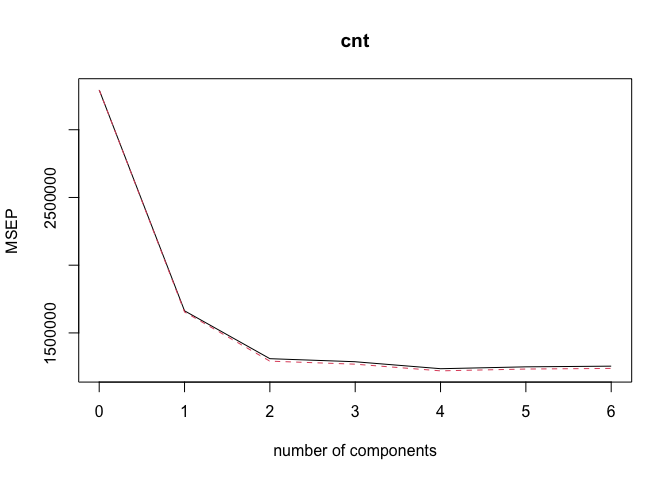

ST558Project2
================
Alex Selwaeh and Zichang Xiang
7/1/2021

## Introduction Section

The purpose of this project is to create predictive models and automate
R Markdown reports. The data we will use is the number of Bike-sharing
users aggregated on daily basis from the Capital Bikeshare system in
2011 and 2012. In this data set, there are 16 variables that are related
to bike rental counts. The variables we will use include season, year
(yr), mnth, holiday, weekday, workingday, weathersit, hum, atemp, temp,
casual, registered, and count (cnt). To model response counts (cnt), we
will use linear regression models and ensemble tree methods (random
forest method and boosted tree method).

## Data

``` r
#load packages
library(randomForest)
library(corrplot)
library(ggplot2)
library(cowplot)
library(modelr)
library(readr)
library(dplyr)
library(knitr)
library(caret)
library(tidyr)
library(purrr)
library(leaps)
library(MASS)
library(gbm)
```

``` r
#read in data
dayData <- read_csv("day.csv")
dayData
```

    ## # A tibble: 731 x 16
    ##    instant dteday     season    yr  mnth holiday weekday workingday weathersit  temp atemp   hum windspeed
    ##      <dbl> <date>      <dbl> <dbl> <dbl>   <dbl>   <dbl>      <dbl>      <dbl> <dbl> <dbl> <dbl>     <dbl>
    ##  1       1 2011-01-01      1     0     1       0       6          0          2 0.344 0.364 0.806    0.160 
    ##  2       2 2011-01-02      1     0     1       0       0          0          2 0.363 0.354 0.696    0.249 
    ##  3       3 2011-01-03      1     0     1       0       1          1          1 0.196 0.189 0.437    0.248 
    ##  4       4 2011-01-04      1     0     1       0       2          1          1 0.2   0.212 0.590    0.160 
    ##  5       5 2011-01-05      1     0     1       0       3          1          1 0.227 0.229 0.437    0.187 
    ##  6       6 2011-01-06      1     0     1       0       4          1          1 0.204 0.233 0.518    0.0896
    ##  7       7 2011-01-07      1     0     1       0       5          1          2 0.197 0.209 0.499    0.169 
    ##  8       8 2011-01-08      1     0     1       0       6          0          2 0.165 0.162 0.536    0.267 
    ##  9       9 2011-01-09      1     0     1       0       0          0          1 0.138 0.116 0.434    0.362 
    ## 10      10 2011-01-10      1     0     1       0       1          1          1 0.151 0.151 0.483    0.223 
    ## # … with 721 more rows, and 3 more variables: casual <dbl>, registered <dbl>, cnt <dbl>

``` r
#check for missing values
anyNA(dayData)
```

    ## [1] FALSE

``` r
#create for loop to subset data for each weekday
status <- vector()

for (i in seq_len(nrow(dayData))){
  if(dayData$weekday[i] == 1){
    status[i] <- "Monday"
  } else if (dayData$weekday[i] == 2){
    status[i] <- "Tuesday"
  } else if (dayData$weekday[i] == 3){
    status[i] <- "Wednesday"
  } else if (dayData$weekday[i] == 4){
    status[i] <- "Thursday"
  } else if (dayData$weekday[i] == 5){
    status[i] <- "Friday"
  } else if (dayData$weekday[i] == 6){
    status[i] <- "Saturday"
  } else {
    status[i] <- "Sunday"
  }
}

dayData$status <- status

#data for the day specified in params
paramsData <- dayData %>% filter(status == params$dow)

#Create columns to represent the categorical columns as mentioned in READ.ME
paramsData <- paramsData %>%
  # Add columns to represent the categorical columns as mentioned in READ.ME.
  mutate(SeasonType = ifelse(season == 1, "spring", 
                             ifelse(season == 2, "summer",
                                    ifelse(season == 3, "fall", "winter"))),
         yearType = ifelse(yr == 0, "2011", "2012"), 
         workingdayType = ifelse(workingday == 1, "Working Day", "Non WorkingDay"),
         weathersitType = ifelse(weathersit == 1, "Clear", 
                                 ifelse(weathersit == 2, "Mist", 
                                        ifelse(weathersit == 3, "Light Snow", "HeavyRain"))))

#convert month from numerical to categorical charcter  
paramsData$mnth1 <- as.character(paramsData$mnth)
```

``` r
#split data set into training and test sets
set.seed(1)
train <- sample(1:nrow(paramsData), size = nrow(paramsData)*0.7)
test <- dplyr::setdiff(1:nrow(paramsData), train)

train <- paramsData[train, ]
test <- paramsData[test, ]

#view the data sets
train
```

    ## # A tibble: 73 x 22
    ##    instant dteday     season    yr  mnth holiday weekday workingday weathersit  temp atemp   hum windspeed
    ##      <dbl> <date>      <dbl> <dbl> <dbl>   <dbl>   <dbl>      <dbl>      <dbl> <dbl> <dbl> <dbl>     <dbl>
    ##  1     191 2011-07-10      3     0     7       0       0          0          1 0.748 0.690 0.578    0.183 
    ##  2     268 2011-09-25      4     0     9       0       0          0          2 0.634 0.573 0.845    0.0504
    ##  3     415 2012-02-19      1     1     2       0       0          0          2 0.28  0.266 0.516    0.253 
    ##  4     646 2012-10-07      4     1    10       0       0          0          2 0.416 0.420 0.708    0.141 
    ##  5     142 2011-05-22      2     0     5       0       0          0          1 0.604 0.574 0.750    0.148 
    ##  6     625 2012-09-16      3     1     9       0       0          0          1 0.58  0.563 0.57     0.0902
    ##  7     653 2012-10-14      4     1    10       0       0          0          1 0.522 0.508 0.640    0.279 
    ##  8     450 2012-03-25      2     1     3       0       0          0          2 0.438 0.437 0.881    0.221 
    ##  9     429 2012-03-04      1     1     3       0       0          0          1 0.326 0.303 0.403    0.335 
    ## 10      37 2011-02-06      1     0     2       0       0          0          1 0.286 0.292 0.568    0.142 
    ## # … with 63 more rows, and 9 more variables: casual <dbl>, registered <dbl>, cnt <dbl>, status <chr>,
    ## #   SeasonType <chr>, yearType <chr>, workingdayType <chr>, weathersitType <chr>, mnth1 <chr>

``` r
test
```

    ## # A tibble: 32 x 22
    ##    instant dteday     season    yr  mnth holiday weekday workingday weathersit  temp atemp   hum windspeed
    ##      <dbl> <date>      <dbl> <dbl> <dbl>   <dbl>   <dbl>      <dbl>      <dbl> <dbl> <dbl> <dbl>     <dbl>
    ##  1       2 2011-01-02      1     0     1       0       0          0          2 0.363 0.354 0.696    0.249 
    ##  2      16 2011-01-16      1     0     1       0       0          0          1 0.232 0.234 0.484    0.188 
    ##  3      44 2011-02-13      1     0     2       0       0          0          1 0.317 0.324 0.457    0.261 
    ##  4      58 2011-02-27      1     0     2       0       0          0          1 0.343 0.351 0.68     0.125 
    ##  5      65 2011-03-06      1     0     3       0       0          0          2 0.377 0.366 0.948    0.343 
    ##  6     100 2011-04-10      2     0     4       0       0          0          2 0.427 0.427 0.858    0.147 
    ##  7     156 2011-06-05      2     0     6       0       0          0          2 0.648 0.617 0.652    0.139 
    ##  8     261 2011-09-18      3     0     9       0       0          0          1 0.507 0.491 0.695    0.178 
    ##  9     275 2011-10-02      4     0    10       0       0          0          2 0.357 0.345 0.792    0.222 
    ## 10     282 2011-10-09      4     0    10       0       0          0          1 0.541 0.524 0.728    0.0635
    ## # … with 22 more rows, and 9 more variables: casual <dbl>, registered <dbl>, cnt <dbl>, status <chr>,
    ## #   SeasonType <chr>, yearType <chr>, workingdayType <chr>, weathersitType <chr>, mnth1 <chr>

## Summarizations

### Summary Statistics

Summary statistics give us a quick look of our data. For our case, we
can find out the average number of bike rentals per season.

``` r
# Create a table of summary stats.
seasonSummary <- train %>% 
  # Select the seasone and cnt columns.
  dplyr::select(SeasonType, cnt) %>%
  # Group by season
  group_by(SeasonType) %>%
  # Get summary statistics for total users by season.
  summarize("Min." = min(cnt),
            "1st Quartile" = quantile(cnt, 0.25),
            "Median" = quantile(cnt, 0.5),
            "Mean" = mean(cnt),
            "3rd Quartile" = quantile(cnt, 0.75),
            "Max" = max(cnt),
            "Std. Dev." = sd(cnt)
            )

# Display a table of the summary stats.
kable(seasonSummary, 
      caption = paste("Summary Statistics for total users", "By Season"), 
      digits = 2)
```

| SeasonType | Min. | 1st Quartile | Median |    Mean | 3rd Quartile |  Max | Std. Dev. |
|:-----------|-----:|-------------:|-------:|--------:|-------------:|-----:|----------:|
| fall       | 3606 |      4334.00 | 4940.0 | 5279.19 |       5810.0 | 8227 |   1318.01 |
| spring     |  754 |      1529.00 | 1812.0 | 2239.76 |       2689.0 | 5892 |   1275.00 |
| summer     | 1027 |      3967.50 | 4660.0 | 4601.11 |       5605.0 | 7641 |   1594.46 |
| winter     | 2424 |      3188.75 | 3584.5 | 4203.19 |       5057.5 | 6852 |   1520.21 |

Summary Statistics for total users By Season

#### Contingency Tables

A continuity table shows the relationship between two categorical
variables. In our case, we can determine whether the season and weather
are related, and whether the season and workday are related.

``` r
#create contingency tables
kable(table(train$SeasonType, train$weathersitType))
```

|        | Clear | Light Snow | Mist |
|:-------|------:|-----------:|-----:|
| fall   |    16 |          0 |    5 |
| spring |    15 |          0 |    2 |
| summer |    10 |          1 |    8 |
| winter |    12 |          0 |    4 |

``` r
kable(table(train$SeasonType, train$workingdayType))
```

|        | Non WorkingDay |
|:-------|---------------:|
| fall   |             21 |
| spring |             17 |
| summer |             19 |
| winter |             16 |

### Plots

#### Correlation Plot

Correlation plot shows the strength of a relationship between two
variables. In our case, we can identify which variables are highly
correlated with one another, especially with the response, the number of
bikes rented.

``` r
#create correlation plot
corr <- cor(train[, -c(1,2,7,17:22)])
```

    ## Warning in cor(train[, -c(1, 2, 7, 17:22)]): the standard deviation is zero

``` r
head(round(corr, 2))
```

    ##            season    yr  mnth holiday workingday weathersit  temp atemp   hum windspeed casual registered
    ## season       1.00 -0.06  0.78      NA         NA       0.02  0.37  0.40  0.27     -0.31   0.26       0.47
    ## yr          -0.06  1.00 -0.02      NA         NA       0.14 -0.09 -0.09 -0.14      0.05   0.18       0.47
    ## mnth         0.78 -0.02  1.00      NA         NA      -0.08  0.19  0.21  0.25     -0.28   0.08       0.26
    ## holiday        NA    NA    NA       1         NA         NA    NA    NA    NA        NA     NA         NA
    ## workingday     NA    NA    NA      NA          1         NA    NA    NA    NA        NA     NA         NA
    ## weathersit   0.02  0.14 -0.08      NA         NA       1.00  0.08  0.08  0.58     -0.12   0.05      -0.01
    ##             cnt
    ## season     0.41
    ## yr         0.37
    ## mnth       0.20
    ## holiday      NA
    ## workingday   NA
    ## weathersit 0.01

``` r
corrplot::corrplot(corr, type = "upper", method = "pie")
```

<!-- -->

#### Histograms

Histograms are used to summarize distributions of variables. In our
case, we are trying to find out whether the change in each variable has
an impact on the number of bikes rented.

``` r
#referenced from https://drsimonj.svbtle.com/quick-plot-of-all-variables
#reshape the data set
reshape <- train %>% keep(is.numeric) %>% gather()

#plot the density plot
g <- ggplot(reshape, aes(x = value))
g + facet_wrap(~ key, scales = "free") + 
    geom_density()
```

<!-- -->

#### Boxplots

Boxplots show the shape of the distribution of each variable. By looking
at the boxplots below, we can see how each variable affects the number
of bikes rented.

``` r
#referenced from https://drsimonj.svbtle.com/quick-plot-of-all-variables
#reshape the data set
reshape <- train %>% keep(is.numeric) %>% gather()

#create boxplots for each variable
g <- ggplot(reshape, aes(x = value))
g + facet_wrap(~ key, scales = "free") + 
    geom_boxplot(aes(x = value))
```

<!-- -->

Boxplot with the number of users on the y-axis (wether casual,registered
or total users) and the season on the x-axis - We can inspect the trend
of users across seasons using these plots. Notice that the biggest
contribution towards total number of users comes from the registered
users which is expected. The most active seasons for that Sunday is the
fall season and the least active season is the spring.

``` r
#create boxplot plot11
plot11 <- ggplot(train, aes(SeasonType, cnt, color = cnt)) +
          geom_boxplot() + 
          # Jitter the points to add a little more info to the boxplot.
          geom_jitter() + 
          # Add labels to the axes.
          scale_x_discrete("Season") + 
          scale_y_continuous("Total Users") +
          ggtitle("Total Users by Season") + 
          theme(legend.position = "none")
plot11
```

    ## Warning in (function (kind = NULL, normal.kind = NULL, sample.kind = NULL) : non-uniform 'Rounding'
    ## sampler used

<!-- -->

``` r
#create boxplot plot12
plot12 <- ggplot(train, aes(SeasonType, casual, color = cnt)) +
          geom_boxplot() + 
          # Jitter the points to add a little more info to the boxplot.
          geom_jitter() + 
          # Add labels to the axes.
          scale_x_discrete("Season") + 
          scale_y_continuous("Casual Users") +
          ggtitle("Casual Users by Season") + 
          theme(legend.position = "none")
plot12
```

    ## Warning in (function (kind = NULL, normal.kind = NULL, sample.kind = NULL) : non-uniform 'Rounding'
    ## sampler used

<!-- -->

``` r
#create boxplot plot13
plot13 <- ggplot(train, aes(SeasonType, registered, color = cnt)) +
          geom_boxplot() + 
          # Jitter the points to add a little more info to the boxplot.
          geom_jitter() + 
          # Add labels to the axes.
          scale_x_discrete("Season") + 
          scale_y_continuous("Registered Users") +
          ggtitle("Registered Users by Season") + 
          theme(legend.position = "none")
plot13
```

    ## Warning in (function (kind = NULL, normal.kind = NULL, sample.kind = NULL) : non-uniform 'Rounding'
    ## sampler used

<!-- -->

``` r
#combine all three boxplots together
plot_grid(plot13, plot12, plot11, ncol = 3)
```

    ## Warning in (function (kind = NULL, normal.kind = NULL, sample.kind = NULL) : non-uniform 'Rounding'
    ## sampler used

    ## Warning in (function (kind = NULL, normal.kind = NULL, sample.kind = NULL) : non-uniform 'Rounding'
    ## sampler used

    ## Warning in (function (kind = NULL, normal.kind = NULL, sample.kind = NULL) : non-uniform 'Rounding'
    ## sampler used

<!-- -->

#### Scatter plots

Scatter plot with the total number of users on the y-axis and the
temperature, wind speed, humidity on the x-axis - We can inspect the
trend of total users across these variables and notice that humidity
almost has a slight negative effect on the total number of users. Also
it’s noticeable that the wind speed has a slight negative effect on the
total number of users .

``` r
#create scatter plot plot21
plot21 <- ggplot(train, aes(temp, cnt, color = cnt)) + 
          geom_point(size = 4, alpha = 0.75) + 
          scale_color_gradient(low = "blue", high = "red") + 
          theme(legend.position = "none") + 
          geom_smooth(method = lm, formula = y~x, color = "black") + 
          scale_x_continuous("Temprature") + 
          scale_y_continuous("Total Users") + 
          ggtitle("Temprature. vs. Total Users")
plot21
```

<!-- -->

``` r
#create scatterplot plot22
plot22 <- ggplot(train, aes(windspeed, cnt, color = cnt)) + 
          geom_point(size = 4, alpha = 0.75) + 
          scale_color_gradient(low = "blue", high = "red") + 
          theme(legend.position = "none") + 
          geom_smooth(method = lm, formula = y ~ x, color = "black") + 
          scale_x_continuous("Wind Speed") + 
          scale_y_continuous("Total Users") + 
          ggtitle("Wind Speed vs. Total Users")
plot22
```

<!-- -->

``` r
#create scatterplot plot23
plot23 <- ggplot(train, aes(hum, cnt, color = cnt)) + 
          geom_point(size = 4, alpha = 0.75) + 
          scale_color_gradient(low = "blue", high = "red") + 
          theme(legend.position = "none") + 
          geom_smooth(method = lm, formula = y ~ x, color = "black") + 
          scale_x_continuous("Humidity") + 
          scale_y_continuous("Total Users") + 
          ggtitle("Humidity vs. Total Users")
plot23
```

<!-- -->

``` r
#combine all three scatterplot together
plot_grid(plot21, plot22, plot23, ncol = 3)
```

<!-- -->

scatterplot with the number of users on the y-axis and the month on the
x-axis, We can inspect the trend of users across months using this plot.

``` r
#create scatterplot plot31
plot31 <- ggplot(paramsData, aes(x = mnth, y = casual)) + 
          geom_point() +
          geom_smooth(method = loess, formula = y ~ x) +
          geom_smooth(method = lm, formula = y ~ x, col = "Red")
plot31
```

<!-- -->

``` r
#create scatterplot plot32
plot32 <- ggplot(paramsData, aes(x = mnth, y = registered)) + 
          geom_point() +
          geom_smooth(method = loess, formula = y ~ x) +
          geom_smooth(method = lm, formula = y ~ x, col = "Red")
plot32
```

<!-- -->

``` r
#create scatterplot plot33
plot33 <- ggplot(paramsData, aes(x = mnth, y = cnt)) + 
          geom_point() +
          geom_smooth(method = loess, formula = y ~ x) +
          geom_smooth(method = lm, formula = y ~ x, col = "Red")
plot33
```

<!-- -->

``` r
#combine three scatterplots together
plot_grid(plot31, plot32, plot33, ncol = 3)
```

<!-- -->

## Modeling

Linear Regression analyzes the relationship(s) between a response
variable and one or more of the predictor variables and their
interactions. It can determine how strong or weak is the relationship
between these variables, it can identify which of the predictor
variables contribute the most to the response and it can help in
predicting future responses. Linear regression could be simple which
includes only one predictor variable in the fitted model, could be
multiple linear regression involving more than one predictor and there
is general linear models where the reponse and predictors could be
qualitative and not only quantitative. Linear regression model fits are
done with lm() function in R, lm() is a linear regression model that
uses a straight line to describe the relationship between variables. It
finds the line of best fit through the given data by searching for the
value of the coefficients which represent the linear regression model
and knows as beta\_0, beta\_1, beta\_2 and responsible for minimizing
the total error of the model (MSE for quantitative response analysis).

### Modeling of the first group member

``` r
#fit model fitlm1
fitlm1 <- train(cnt ~ atemp*season*yr, data = train, 
                method = "lm", 
                preProcess = c("center", "scale"),
                trControl = trainControl(method = "cv", number = 10))
fitlm1
```

    ## Linear Regression 
    ## 
    ## 73 samples
    ##  3 predictor
    ## 
    ## Pre-processing: centered (7), scaled (7) 
    ## Resampling: Cross-Validated (10 fold) 
    ## Summary of sample sizes: 66, 65, 66, 65, 66, 66, ... 
    ## Resampling results:
    ## 
    ##   RMSE      Rsquared  MAE     
    ##   1072.001  0.721705  818.3363
    ## 
    ## Tuning parameter 'intercept' was held constant at a value of TRUE

``` r
#fit model fitlm2
fitlm2 <- train(cnt ~ atemp + yr + season +windspeed+mnth+holiday+weathersit, data = train, 
                method = "lm", 
                preProcess = c("center", "scale"),
                trControl = trainControl(method = "cv", number = 10))
fitlm2
```

    ## Linear Regression 
    ## 
    ## 73 samples
    ##  7 predictor
    ## 
    ## Pre-processing: centered (7), scaled (7) 
    ## Resampling: Cross-Validated (10 fold) 
    ## Summary of sample sizes: 67, 65, 67, 66, 65, 66, ... 
    ## Resampling results:
    ## 
    ##   RMSE      Rsquared   MAE     
    ##   1063.266  0.7408558  806.8211
    ## 
    ## Tuning parameter 'intercept' was held constant at a value of TRUE

``` r
#fit model fitlm3
fitlm3 <- train(cnt ~ atemp + yr + season +windspeed+weathersit+mnth, data = train, 
                method = "lm", 
                preProcess = c("center", "scale"),
                trControl = trainControl(method = "cv", number = 10))
fitlm3
```

    ## Linear Regression 
    ## 
    ## 73 samples
    ##  6 predictor
    ## 
    ## Pre-processing: centered (6), scaled (6) 
    ## Resampling: Cross-Validated (10 fold) 
    ## Summary of sample sizes: 65, 67, 66, 66, 65, 65, ... 
    ## Resampling results:
    ## 
    ##   RMSE      Rsquared   MAE     
    ##   1033.176  0.7234722  808.8225
    ## 
    ## Tuning parameter 'intercept' was held constant at a value of TRUE

``` r
#fit model fitlm4
fitlm4 <- train(cnt ~ atemp + yr + I(yr^2), data = train, 
                method = "lm", 
                preProcess = c("center", "scale"),
                trControl = trainControl(method = "cv", number = 10))
fitlm4
```

    ## Linear Regression 
    ## 
    ## 73 samples
    ##  2 predictor
    ## 
    ## Pre-processing: centered (3), scaled (3) 
    ## Resampling: Cross-Validated (10 fold) 
    ## Summary of sample sizes: 65, 66, 66, 65, 66, 67, ... 
    ## Resampling results:
    ## 
    ##   RMSE      Rsquared  MAE     
    ##   1064.925  0.698731  860.0622
    ## 
    ## Tuning parameter 'intercept' was held constant at a value of TRUE

``` r
#predict results using test set
pred.fitlm1 <- predict(fitlm1, newdata = test)
rmse1<-postResample(pred.fitlm1, obs = test$cnt)


pred.fitlm2 <- predict(fitlm2, newdata = data.frame(test))
```

    ## Warning in predict.lm(modelFit, newdata): prediction from a rank-deficient fit may be misleading

``` r
rmse2<-postResample(pred.fitlm2, obs = test$cnt)

pred.fitlm3 <- predict(fitlm3, newdata = data.frame(test))
rmse3<-postResample(pred.fitlm3, obs = test$cnt)

pred.fitlm4 <- predict(fitlm4, newdata = data.frame(test))
```

    ## Warning in predict.lm(modelFit, newdata): prediction from a rank-deficient fit may be misleading

``` r
rmse4<-postResample(pred.fitlm4, obs = test$cnt)

#view the result
kable(data.frame(rmse1[1], rmse2[1], rmse3[1],rmse4[1]))
```

|      | rmse1.1. | rmse2.1. | rmse3.1. | rmse4.1. |
|:-----|---------:|---------:|---------:|---------:|
| RMSE | 986.8547 | 873.2854 | 873.2854 | 1098.844 |

Summary for the model fit with the lowest cross validation test
error(RMSE) : fitlm3

``` r
summary(fitlm3)
```

    ## 
    ## Call:
    ## lm(formula = .outcome ~ ., data = dat)
    ## 
    ## Residuals:
    ##      Min       1Q   Median       3Q      Max 
    ## -2933.55  -440.44    90.35   455.54  2465.03 
    ## 
    ## Coefficients:
    ##             Estimate Std. Error t value Pr(>|t|)    
    ## (Intercept)   4159.1      120.6  34.480  < 2e-16 ***
    ## atemp         1068.4      137.5   7.770 6.85e-11 ***
    ## yr             839.3      123.7   6.785 3.90e-09 ***
    ## season         598.6      210.5   2.844  0.00592 ** 
    ## windspeed     -253.0      131.9  -1.918  0.05943 .  
    ## weathersit    -255.2      125.7  -2.030  0.04643 *  
    ## mnth          -403.8      199.2  -2.027  0.04666 *  
    ## ---
    ## Signif. codes:  0 '***' 0.001 '**' 0.01 '*' 0.05 '.' 0.1 ' ' 1
    ## 
    ## Residual standard error: 1031 on 66 degrees of freedom
    ## Multiple R-squared:  0.7003, Adjusted R-squared:  0.673 
    ## F-statistic:  25.7 on 6 and 66 DF,  p-value: 1.61e-15

A different approach for selecting the best model for prediction
purposes is minimizing test MSE.

``` r
# select multiple random models in addition to the one we picked from the previous study being the first fit(glm1Fit)
glm1Fit <- lm(cnt ~ atemp + yr + season +windspeed+weathersit+mnth, data = train)
glm2Fit <- lm(cnt ~ atemp:yr, data = train)
glm3Fit <- lm(cnt ~ atemp + yr + season, data = train)
glm4Fit <- lm(cnt ~ atemp*yr*season, data = train)
glm5Fit <- lm(cnt ~ atemp+yr+I(yr^2), data = train)

model <- c(("glm1Fit"),("glm2Fit"),("glm3Fit"),("glm4Fit"),("glm5Fit"))

#calculate MSE for both the train and test sets
trainMSE <- c(rmse(glm1Fit, train), rmse(glm2Fit, train), rmse(glm3Fit, train), 
              rmse(glm4Fit, train), rmse(glm4Fit, train))
testMSE <- c(rmse(glm1Fit, test), rmse(glm2Fit, test), rmse(glm3Fit, test), 
             rmse(glm4Fit, test), rmse(glm5Fit, test))
```

    ## Warning in predict.lm(model, data): prediction from a rank-deficient fit may be misleading

``` r
MSEdf <- data.frame(model, trainMSE, testMSE)
MSEdf <- MSEdf %>% arrange(testMSE)
kable(data.frame(MSEdf),caption = "Table showing glm1Fit is the best fit")
```

| model   |  trainMSE |   testMSE |
|:--------|----------:|----------:|
| glm1Fit |  979.9336 |  873.2854 |
| glm3Fit | 1047.2073 |  986.3388 |
| glm4Fit |  993.8102 |  986.8547 |
| glm5Fit |  993.8102 | 1098.8439 |
| glm2Fit | 1465.6667 | 1408.6706 |

Table showing glm1Fit is the best fit

Knowing that we can’t fully trust test MSE values in order to decide on
a model, we will go a step further in developing AIC,BIC and Rsquare
Criterias. Using the function from module 9

``` r
compareFitStats <- function(newfit1, newfit2,newfit3,newfit4,newfit5){
    require(MuMIn)
    fitStats <- data.frame(fitStat = c("Adj R Square", "AIC", "AICc", "BIC"),
        col1 = round(c(summary(newfit1)$adj.r.squared, AIC(newfit1), 
                                    MuMIn::AICc(newfit1), BIC(newfit1)), 3),
            col2 = round(c(summary(newfit2)$adj.r.squared, AIC(newfit2), 
                                    MuMIn::AICc(newfit2), BIC(newfit2)), 3),
                col3 = round(c(summary(newfit3)$adj.r.squared, AIC(newfit3), 
                                    MuMIn::AICc(newfit3), BIC(newfit3)), 3),
                    col4 = round(c(summary(newfit4)$adj.r.squared, AIC(newfit4), 
                                    MuMIn::AICc(newfit4), BIC(newfit4)), 3),
                        col5 = round(c(summary(newfit5)$adj.r.squared, AIC(newfit5), 
                                    MuMIn::AICc(newfit5), BIC(newfit5)),3))
    #put names on returned df
    calls <- as.list(match.call())
    calls[[1]] <- NULL
    names(fitStats)[2:6] <- unlist(calls)
    fitStats
}

kable(data.frame(compareFitStats(glm1Fit,glm2Fit,glm3Fit,glm4Fit,glm5Fit)),caption = "Table showing Rsquared,AIC,AICc and BIC criteria")
```

| fitStat      |  glm1Fit |  glm2Fit |  glm3Fit |  glm4Fit |  glm5Fit |
|:-------------|---------:|---------:|---------:|---------:|---------:|
| Adj R Square |    0.673 |    0.320 |    0.643 |    0.659 |    0.619 |
| AIC          | 1228.738 | 1277.515 | 1232.432 | 1232.791 | 1236.140 |
| AICc         | 1230.988 | 1277.862 | 1233.327 | 1235.648 | 1236.728 |
| BIC          | 1247.061 | 1284.386 | 1243.884 | 1253.405 | 1245.302 |

Table showing Rsquared,AIC,AICc and BIC criteria

Again, the calculated criterias shows that glm1Fit (which is the same as
fitlm3 model) which represents the 6 predictors , is the best model fit
selected.

An extra step to prove that our choice of glm1Fit as the best fit, here
I decided to use the method explained in section 6.5.3 of the book:
Choosing Among Models Using the Validation Set Approach (test Dataset)
and Cross-Validation.

``` r
# we apply regsubsets() to the training set in order to perform best subset selection.
library(leaps)
regfit.best = regsubsets (cnt ~ temp + yr + season + windspeed + mnth + holiday + weathersit + atemp,
                        data = train)
```

    ## Warning in leaps.setup(x, y, wt = wt, nbest = nbest, nvmax = nvmax, force.in = force.in, : 1 linear
    ## dependencies found

    ## Reordering variables and trying again:

``` r
summary(regfit.best)
```

    ## Subset selection object
    ## Call: regsubsets.formula(cnt ~ temp + yr + season + windspeed + mnth + 
    ##     holiday + weathersit + atemp, data = train)
    ## 8 Variables  (and intercept)
    ##            Forced in Forced out
    ## temp           FALSE      FALSE
    ## yr             FALSE      FALSE
    ## season         FALSE      FALSE
    ## windspeed      FALSE      FALSE
    ## mnth           FALSE      FALSE
    ## weathersit     FALSE      FALSE
    ## atemp          FALSE      FALSE
    ## holiday        FALSE      FALSE
    ## 1 subsets of each size up to 7
    ## Selection Algorithm: exhaustive
    ##          temp yr  season windspeed mnth holiday weathersit atemp
    ## 1  ( 1 ) " "  " " " "    " "       " "  " "     " "        "*"  
    ## 2  ( 1 ) " "  "*" " "    " "       " "  " "     " "        "*"  
    ## 3  ( 1 ) " "  "*" "*"    " "       " "  " "     " "        "*"  
    ## 4  ( 1 ) "*"  "*" "*"    "*"       " "  " "     " "        " "  
    ## 5  ( 1 ) " "  "*" "*"    " "       "*"  " "     "*"        "*"  
    ## 6  ( 1 ) "*"  "*" "*"    "*"       "*"  " "     "*"        " "  
    ## 7  ( 1 ) "*"  "*" "*"    "*"       "*"  " "     "*"        "*"

``` r
test.mat = model.matrix(cnt ~ temp + yr + season + windspeed + mnth + holiday + weathersit + atemp,
                        data = test)

val.errors = rep(NA, 7)
for(i in 1:7)
{
    coefi = coef(regfit.best, id=i)
    pred = test.mat[,names(coefi)]%*%coefi
    val.errors[i] = mean((test$cnt - pred)^2)
}

val.errors
```

    ## [1] 4102032.8 2979821.9 2170209.0  906408.3  995104.9  928437.6  928437.6

``` r
which.min(val.errors)
```

    ## [1] 4

Displaying the Selected model with the calculted regression
coefficients.

``` r
coef(regfit.best ,6)
```

    ## (Intercept)        temp          yr      season   windspeed        mnth       atemp 
    ##   661.12395  3749.82692  1597.11536   526.89232 -3116.53279   -97.75215  1809.04305

Also another extra verification step by doing the Partial least squares
method.

``` r
library(pls)
set.seed(222)
 pls.fit=plsr(cnt~ atemp + yr + season +windspeed+mnth+weathersit, data=train, scale=TRUE ,
validation ="CV")  

summary (pls.fit)
```

    ## Data:    X dimension: 73 6 
    ##  Y dimension: 73 1
    ## Fit method: kernelpls
    ## Number of components considered: 6
    ## 
    ## VALIDATION: RMSEP
    ## Cross-validated using 10 random segments.
    ##        (Intercept)  1 comps  2 comps  3 comps  4 comps  5 comps  6 comps
    ## CV            1815     1290     1144     1135     1112     1118     1120
    ## adjCV         1815     1286     1136     1127     1105     1111     1113
    ## 
    ## TRAINING: % variance explained
    ##      1 comps  2 comps  3 comps  4 comps  5 comps  6 comps
    ## X      31.95    50.26    67.37    71.58    88.05   100.00
    ## cnt    54.16    68.61    69.48    70.02    70.03    70.03

``` r
validationplot(pls.fit ,val.type="MSEP")
```

<!-- -->

The lowest cross-validation error occurs when only M = 4.We now evaluate
the corresponding test MSE.

``` r
pls.pred=predict (pls.fit ,test,ncomp =4)
mean((pls.pred -test$cnt)^2)
```

    ## [1] 767065.7

``` r
MSE.val2 <- sqrt(mean((pls.pred -test$cnt)^2))
MSE.val2
```

    ## [1] 875.8229

We noticed that PLS resulted in a similar value to the previous methods
and approaches used.

#### Random Forest

Random forest is a tree-based method for regression or classification
which involves producing multiple trees known as decision trees to yield
a single adequate prediction. ISLR book mentions about decision trees
“When building these decision trees, each time a split in a tree is
considered, a random sample of m predictors is chosen as split
candidates from the full set of p predictors. The split is allowed to
use only one of those m predictors. A fresh sample of m predictors is
taken at each split.”

``` r
#fit a random tree model
rfTree <- train(cnt ~ atemp + yr + season +windspeed+weathersit+mnth, 
                data = train, 
                method = "rf",
                trControl = trainControl(method = "repeatedcv", number = 10, repeats = 5),
                preProcess = c("center", "scale"))
```

    ## Warning in (function (kind = NULL, normal.kind = NULL, sample.kind = NULL) : non-uniform 'Rounding'
    ## sampler used

``` r
rfTree
```

    ## Random Forest 
    ## 
    ## 73 samples
    ##  6 predictor
    ## 
    ## Pre-processing: centered (6), scaled (6) 
    ## Resampling: Cross-Validated (10 fold, repeated 5 times) 
    ## Summary of sample sizes: 65, 66, 65, 66, 66, 65, ... 
    ## Resampling results across tuning parameters:
    ## 
    ##   mtry  RMSE      Rsquared   MAE     
    ##   2     971.0639  0.7340220  747.5716
    ##   4     914.4144  0.7598918  706.8303
    ##   6     891.5226  0.7770891  687.7872
    ## 
    ## RMSE was used to select the optimal model using the smallest value.
    ## The final value used for the model was mtry = 6.

Perform prediction on our test data set

``` r
#predict using the test set
rfPred <- predict(rfTree, newdata = test)
rfresult <- postResample(rfPred, test$cnt)
rfresult
```

    ##        RMSE    Rsquared         MAE 
    ## 904.0677816   0.8022438 733.0200271

### Modeling of the second group member

To select a model, we use the `stepAIC()` function. In the `stepAIC()`
function, we first specify the model with only main effects and the data
set to be used. Then we specify the most complex model and the most
simple model as upper and lower respectively in the scope.

``` r
#creat new data sets trainNew and testNew
trainNew <- train[, c(3:5, 9:13, 16)]
trainNew
```

    ## # A tibble: 73 x 9
    ##    season    yr  mnth weathersit  temp atemp   hum windspeed   cnt
    ##     <dbl> <dbl> <dbl>      <dbl> <dbl> <dbl> <dbl>     <dbl> <dbl>
    ##  1      3     0     7          1 0.748 0.690 0.578    0.183   4881
    ##  2      4     0     9          2 0.634 0.573 0.845    0.0504  5010
    ##  3      1     1     2          2 0.28  0.266 0.516    0.253   2689
    ##  4      4     1    10          2 0.416 0.420 0.708    0.141   3510
    ##  5      2     0     5          1 0.604 0.574 0.750    0.148   4660
    ##  6      3     1     9          1 0.58  0.563 0.57     0.0902  7333
    ##  7      4     1    10          1 0.522 0.508 0.640    0.279   6639
    ##  8      2     1     3          2 0.438 0.437 0.881    0.221   4996
    ##  9      1     1     3          1 0.326 0.303 0.403    0.335   3423
    ## 10      1     0     2          1 0.286 0.292 0.568    0.142   1623
    ## # … with 63 more rows

``` r
testNew <- test[, c(3:5, 9:13, 16)]
testNew
```

    ## # A tibble: 32 x 9
    ##    season    yr  mnth weathersit  temp atemp   hum windspeed   cnt
    ##     <dbl> <dbl> <dbl>      <dbl> <dbl> <dbl> <dbl>     <dbl> <dbl>
    ##  1      1     0     1          2 0.363 0.354 0.696    0.249    801
    ##  2      1     0     1          1 0.232 0.234 0.484    0.188   1204
    ##  3      1     0     2          1 0.317 0.324 0.457    0.261   1589
    ##  4      1     0     2          1 0.343 0.351 0.68     0.125   2402
    ##  5      1     0     3          2 0.377 0.366 0.948    0.343    605
    ##  6      2     0     4          2 0.427 0.427 0.858    0.147   2895
    ##  7      2     0     6          2 0.648 0.617 0.652    0.139   4906
    ##  8      3     0     9          1 0.507 0.491 0.695    0.178   4274
    ##  9      4     0    10          2 0.357 0.345 0.792    0.222   2918
    ## 10      4     0    10          1 0.541 0.524 0.728    0.0635  5511
    ## # … with 22 more rows

``` r
#select model
model <- MASS::stepAIC(lm(cnt ~ ., data = trainNew), 
                  scope=list(upper = ~ .^2 + I(season)^2 + I(yr)^2 + I(mnth)^2 +
                               I(weathersit)^2 + I(temp)^2 + I(atemp)^2 + I(hum)^2 + I(windspeed)^2, 
                             lower = ~1), trace = FALSE)
```

The model selected is below, because it has the smallest AIC.

``` r
#view the selected model
model$call
```

    ## lm(formula = cnt ~ season + yr + mnth + weathersit + temp + atemp + 
    ##     windspeed + temp:atemp + season:weathersit + weathersit:windspeed + 
    ##     weathersit:atemp + yr:atemp + mnth:atemp + season:mnth + 
    ##     season:temp, data = trainNew)

The linear regression model is fitted using the `train()` function.
First, we must give the model and data set we use. Next, we provide the
method we use, which is “lm”. Then, we use the `preProcess()` function
to standardize the data. Finally, we specify the type of
cross-validation we wish to perform. In our case, we would like to
perform repeated cross-validation with 10 folds for 5 times.

``` r
#fit model
set.seed(1)
fit <- train(model$terms, 
             data = trainNew,
             method = "lm",
             preProcess = c("center", "scale"),
             trControl = trainControl(method = "repeatedcv", number = 10, repeats = 5)
             )
```

    ## Warning in (function (kind = NULL, normal.kind = NULL, sample.kind = NULL) : non-uniform 'Rounding'
    ## sampler used

``` r
#view the results
kable(fit$results)
```

| intercept |     RMSE | Rsquared |      MAE |   RMSESD | RsquaredSD |   MAESD |
|:----------|---------:|---------:|---------:|---------:|-----------:|--------:|
| TRUE      | 805.8195 | 0.813405 | 625.3078 | 352.7224 |  0.1662697 | 251.636 |

``` r
#check the fit
lmPred <- predict(fit, newdata = testNew)
lmFit <- postResample(lmPred, obs = testNew$cnt)

#calculate root MSE
lmRMSE <- lmFit[1]
kable(lmRMSE)
```

|      |        x |
|:-----|---------:|
| RMSE | 842.6366 |

We use the train() function to fit the boosted tree model in the similar
way we fit the linear regression model. First, we must give the model
and data set we use. Next, we provide the method we use, which is “gbm”.
Then, we use the `preProcess()` function to standardize the data.
Finally, we specify the type of cross-validation we wish to perform. In
our case, we would like to perform repeated cross-validation with 10
folds for 5 times.

``` r
#fit boosted tree model
set.seed(1)
boostFit <- train(model$terms, 
                  data = trainNew, 
                  method = "gbm", 
                  preProcess = c("center", "scale"),
                  trControl = trainControl(method = "repeatedcv", number = 10, repeats = 5))
```

    ## Warning in (function (kind = NULL, normal.kind = NULL, sample.kind = NULL) : non-uniform 'Rounding'
    ## sampler used

``` r
#view the results
boostFit$results
```

    ##   shrinkage interaction.depth n.minobsinnode n.trees     RMSE  Rsquared      MAE   RMSESD RsquaredSD
    ## 1       0.1                 1             10      50 856.4366 0.8012153 706.0023 289.4750  0.1634616
    ## 4       0.1                 2             10      50 847.7006 0.8062439 685.2769 273.6269  0.1505069
    ## 7       0.1                 3             10      50 824.9286 0.8147845 667.1037 269.9690  0.1459432
    ## 2       0.1                 1             10     100 838.8794 0.8029410 683.6249 301.0675  0.1699909
    ## 5       0.1                 2             10     100 830.6033 0.8052200 660.5118 308.0644  0.1665555
    ## 8       0.1                 3             10     100 827.0344 0.8125189 661.3938 299.6511  0.1606039
    ## 3       0.1                 1             10     150 833.2568 0.8055523 672.1644 308.4094  0.1711059
    ## 6       0.1                 2             10     150 839.7342 0.8040036 659.5636 313.8967  0.1699437
    ## 9       0.1                 3             10     150 839.9052 0.8081124 663.8955 304.4084  0.1646432
    ##      MAESD
    ## 1 237.9893
    ## 4 213.0694
    ## 7 208.6864
    ## 2 244.1482
    ## 5 230.8774
    ## 8 223.4725
    ## 3 249.8974
    ## 6 235.9434
    ## 9 226.4420

``` r
#view the best model
boostFit$bestTune
```

    ##   n.trees interaction.depth shrinkage n.minobsinnode
    ## 7      50                 3       0.1             10

``` r
#predict cnt and calculate RMSE
boostPred <- predict(boostFit, newdata = testNew)
result <- postResample(boostPred, testNew$cnt)
boostRMSE <- result[1]
kable(boostRMSE)
```

|      |        x |
|:-----|---------:|
| RMSE | 725.1301 |

### Comparison of all four models and Conclusion

By comparing the RMSE from all four models, we choose the winner below,
because it has the lowest RMSE.

``` r
#combine RMSE from four models
results <- data.frame(MSEdf[1,3], rfresult[1], boostRMSE,rfresult[1])
colnames(results) <- c("lmFit_1stMember", "lmFit_2ndMember", "Boost Tree","Random Forest")
#view the result
kable(results)
```

|      | lmFit\_1stMember | lmFit\_2ndMember | Boost Tree | Random Forest |
|:-----|-----------------:|-----------------:|-----------:|--------------:|
| RMSE |         873.2854 |         904.0678 |   725.1301 |      904.0678 |

``` r
#choose a winner
results <- results %>% gather() %>% arrange(value)
winner <- results[1, ]
kable(winner)
```

| key        |    value |
|:-----------|---------:|
| Boost Tree | 725.1301 |
