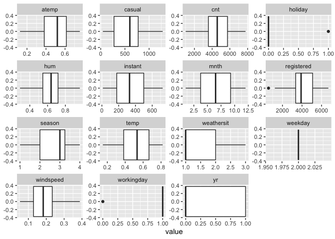
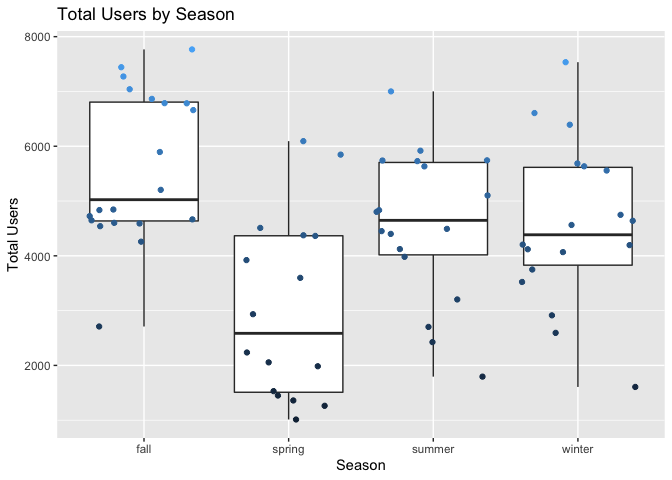

ST558 Project 2
================
Alex Selwaeh and Zichang Xiang
7/1/2021

## Introduction Section

The purpose of this project is to create predictive models and automate
R Markdown reports. The data we will use is the number of Bike-sharing
users aggregated on daily basis from the Capital Bikeshare system in
2011 and 2012. In this data set, there are 16 variables that are related
to bike rental counts. The variables we will use include season, year
(yr), mnth, holiday, weekday, workingday, weathersit, hum, atemp, temp,
casual, registered, and count (cnt). To model response counts (cnt), we
will use linear regression models and ensemble tree methods (random
forest method and boosted tree method).

## Data

``` r
#load packages
library(corrplot)
library(ggplot2)
library(cowplot)
library(modelr)
library(readr)
library(dplyr)
library(knitr)
library(caret)
library(tidyr)
library(purrr)
library(MASS)
library(gbm)
```

``` r
#read in data
dayData <- read_csv("day.csv")
dayData
```

    ## # A tibble: 731 x 16
    ##    instant dteday     season    yr  mnth holiday weekday workingday weathersit  temp atemp   hum windspeed
    ##      <dbl> <date>      <dbl> <dbl> <dbl>   <dbl>   <dbl>      <dbl>      <dbl> <dbl> <dbl> <dbl>     <dbl>
    ##  1       1 2011-01-01      1     0     1       0       6          0          2 0.344 0.364 0.806    0.160 
    ##  2       2 2011-01-02      1     0     1       0       0          0          2 0.363 0.354 0.696    0.249 
    ##  3       3 2011-01-03      1     0     1       0       1          1          1 0.196 0.189 0.437    0.248 
    ##  4       4 2011-01-04      1     0     1       0       2          1          1 0.2   0.212 0.590    0.160 
    ##  5       5 2011-01-05      1     0     1       0       3          1          1 0.227 0.229 0.437    0.187 
    ##  6       6 2011-01-06      1     0     1       0       4          1          1 0.204 0.233 0.518    0.0896
    ##  7       7 2011-01-07      1     0     1       0       5          1          2 0.197 0.209 0.499    0.169 
    ##  8       8 2011-01-08      1     0     1       0       6          0          2 0.165 0.162 0.536    0.267 
    ##  9       9 2011-01-09      1     0     1       0       0          0          1 0.138 0.116 0.434    0.362 
    ## 10      10 2011-01-10      1     0     1       0       1          1          1 0.151 0.151 0.483    0.223 
    ## # … with 721 more rows, and 3 more variables: casual <dbl>, registered <dbl>, cnt <dbl>

``` r
#check for missing values
anyNA(dayData)
```

    ## [1] FALSE

``` r
#create for loop to subset data for each weekday
status <- vector()

for (i in seq_len(nrow(dayData))){
  if(dayData$weekday[i] == 1){
    status[i] <- "Monday"
  } else if (dayData$weekday[i] == 2){
    status[i] <- "Tuesday"
  } else if (dayData$weekday[i] == 3){
    status[i] <- "Wednesday"
  } else if (dayData$weekday[i] == 4){
    status[i] <- "Thursday"
  } else if (dayData$weekday[i] == 5){
    status[i] <- "Friday"
  } else if (dayData$weekday[i] == 6){
    status[i] <- "Saturday"
  } else {
    status[i] <- "Sunday"
  }
}

dayData$status <- status

#data for Monday
paramsData <- dayData %>% filter(status == params$dow)

#Create columns to represent the categorical columns as mentioned in READ.ME
paramsData <- paramsData %>%
  # Add columns to represent the categorical columns as mentioned in READ.ME.
  mutate(SeasonType = ifelse(season == 1, "spring", 
                             ifelse(season == 2, "summer",
                                    ifelse(season == 3, "fall", "winter"))),
         yearType = ifelse(yr == 0, "2011", "2012"), 
         workingdayType = ifelse(workingday == 1, "Working Day", "Non WorkingDay"),
         weathersitType = ifelse(weathersit == 1, "Clear", 
                                 ifelse(weathersit == 2, "Mist", 
                                        ifelse(weathersit == 3, "Light Snow", "HeavyRain"))))

#convert month from numerical to categorical charcter  
paramsData$mnth1 <- as.character(paramsData$mnth)
```

``` r
#split data set into training and test sets
set.seed(1)
train <- sample(1:nrow(paramsData), size = nrow(paramsData)*0.7)
test <- dplyr::setdiff(1:nrow(paramsData), train)

train <- paramsData[train, ]
test <- paramsData[test, ]

#view the data sets
train
```

    ## # A tibble: 72 x 22
    ##    instant dteday     season    yr  mnth holiday weekday workingday weathersit  temp atemp   hum windspeed
    ##      <dbl> <date>      <dbl> <dbl> <dbl>   <dbl>   <dbl>      <dbl>      <dbl> <dbl> <dbl> <dbl>     <dbl>
    ##  1     473 2012-04-17      2     1     4       0       2          1          1 0.608 0.598 0.390    0.274 
    ##  2     270 2011-09-27      4     0     9       0       2          1          2 0.637 0.575 0.885    0.118 
    ##  3       4 2011-01-04      1     0     1       0       2          1          1 0.2   0.212 0.590    0.160 
    ##  4     235 2011-08-23      3     0     8       0       2          1          1 0.641 0.606 0.455    0.147 
    ##  5     606 2012-08-28      3     1     8       0       2          1          1 0.728 0.666 0.62     0.191 
    ##  6     298 2011-10-25      4     0    10       0       2          1          1 0.472 0.463 0.623    0.167 
    ##  7      95 2011-04-05      2     0     4       0       2          1          2 0.414 0.398 0.642    0.388 
    ##  8     571 2012-07-24      3     1     7       0       2          1          1 0.751 0.706 0.655    0.211 
    ##  9     410 2012-02-14      1     1     2       0       2          1          2 0.319 0.334 0.509    0.141 
    ## 10     354 2011-12-20      4     0    12       0       2          1          2 0.386 0.396 0.595    0.0616
    ## # … with 62 more rows, and 9 more variables: casual <dbl>, registered <dbl>, cnt <dbl>, status <chr>,
    ## #   SeasonType <chr>, yearType <chr>, workingdayType <chr>, weathersitType <chr>, mnth1 <chr>

``` r
test
```

    ## # A tibble: 32 x 22
    ##    instant dteday     season    yr  mnth holiday weekday workingday weathersit  temp atemp   hum windspeed
    ##      <dbl> <date>      <dbl> <dbl> <dbl>   <dbl>   <dbl>      <dbl>      <dbl> <dbl> <dbl> <dbl>     <dbl>
    ##  1      18 2011-01-18      1     0     1       0       2          1          2 0.217 0.232 0.862    0.147 
    ##  2      25 2011-01-25      1     0     1       0       2          1          2 0.223 0.235 0.617    0.130 
    ##  3      32 2011-02-01      1     0     2       0       2          1          2 0.192 0.235 0.830    0.0532
    ##  4      53 2011-02-22      1     0     2       0       2          1          1 0.182 0.186 0.578    0.196 
    ##  5      60 2011-03-01      1     0     3       0       2          1          1 0.267 0.264 0.535    0.216 
    ##  6      67 2011-03-08      1     0     3       0       2          1          1 0.292 0.302 0.421    0.121 
    ##  7      81 2011-03-22      2     0     3       0       2          1          1 0.442 0.441 0.625    0.226 
    ##  8     102 2011-04-12      2     0     4       0       2          1          2 0.502 0.493 0.739    0.275 
    ##  9     109 2011-04-19      2     0     4       0       2          1          2 0.506 0.489 0.666    0.158 
    ## 10     130 2011-05-10      2     0     5       0       2          1          1 0.532 0.523 0.489    0.116 
    ## # … with 22 more rows, and 9 more variables: casual <dbl>, registered <dbl>, cnt <dbl>, status <chr>,
    ## #   SeasonType <chr>, yearType <chr>, workingdayType <chr>, weathersitType <chr>, mnth1 <chr>

## Summarizations

### Summary Statistics

Summary statistics give us a quick look of our data. For our case, we
can find out the average number of bike rentals per season.

``` r
# Create a table of summary stats.
seasonSummary <- train %>% 
  # Select the seasone and cnt columns.
  dplyr::select(SeasonType, cnt) %>%
  # Group by season
  group_by(SeasonType) %>%
  # Get summary statistics for total users by season.
  summarize("Min." = min(cnt),
            "1st Quartile" = quantile(cnt, 0.25),
            "Median" = quantile(cnt, 0.5),
            "Mean" = mean(cnt),
            "3rd Quartile" = quantile(cnt, 0.75),
            "Max" = max(cnt),
            "Std. Dev." = sd(cnt)
            )

# Display a table of the summary stats.
kable(seasonSummary, 
      caption = paste("Summary Statistics for total users", "By Season"), 
      digits = 2)
```

| SeasonType | Min. | 1st Quartile | Median |    Mean | 3rd Quartile |  Max | Std. Dev. |
|:-----------|-----:|-------------:|-------:|--------:|-------------:|-----:|----------:|
| fall       | 2710 |      4632.75 | 5549.5 | 5672.39 |      6970.50 | 7767 |   1490.32 |
| spring     | 1013 |      1530.00 | 2056.0 | 2701.69 |      3922.00 | 6093 |   1612.55 |
| summer     | 1795 |      4451.00 | 5115.0 | 5123.95 |      5918.00 | 7001 |   1354.94 |
| winter     | 1096 |      4087.50 | 4509.5 | 4799.35 |      5589.25 | 7538 |   1637.01 |

Summary Statistics for total users By Season

#### Contingency Tables

A continuity table shows the relationship between two categorical
variables. In our case, we can determine whether the season and weather
are related, and whether the season and workday are related.

``` r
#create contingency tables
kable(table(train$SeasonType, train$weathersitType))
```

|        | Clear | Light Snow | Mist |
|:-------|------:|-----------:|-----:|
| fall   |    15 |          1 |    2 |
| spring |     8 |          0 |    5 |
| summer |    11 |          0 |   10 |
| winter |    11 |          1 |    8 |

``` r
kable(table(train$SeasonType, train$workingdayType))
```

|        | Non WorkingDay | Working Day |
|:-------|---------------:|------------:|
| fall   |              0 |          18 |
| spring |              1 |          12 |
| summer |              0 |          21 |
| winter |              0 |          20 |

### Plots

#### Correlation Plot

Correlation plot shows the strength of a relationship between two
variables. In our case, we can identify which variables are highly
correlated with one another, especially with the response, the number of
bikes rented.

``` r
#create correlation plot
corr <- cor(train[, -c(1,2,7,17:22)])
head(round(corr, 2))
```

    ##            season    yr  mnth holiday workingday weathersit  temp atemp   hum windspeed casual registered   cnt
    ## season       1.00 -0.09  0.83   -0.18       0.18       0.02  0.23  0.24  0.28     -0.25   0.16       0.36  0.33
    ## yr          -0.09  1.00 -0.08    0.12      -0.12      -0.18  0.00  0.00 -0.16      0.02   0.31       0.58  0.55
    ## mnth         0.83 -0.08  1.00    0.18      -0.18       0.16  0.13  0.14  0.40     -0.27   0.06       0.18  0.16
    ## holiday     -0.18  0.12  0.18    1.00      -1.00       0.13 -0.16 -0.16  0.08     -0.04  -0.06      -0.28 -0.25
    ## workingday   0.18 -0.12 -0.18   -1.00       1.00      -0.13  0.16  0.16 -0.08      0.04   0.06       0.28  0.25
    ## weathersit   0.02 -0.18  0.16    0.13      -0.13       1.00 -0.13 -0.13  0.59      0.14  -0.38      -0.37 -0.39

``` r
corrplot(corr, type = "upper", method = "pie")
```

<!-- -->

#### Histograms

Histograms are used to summarize distributions of variables. In our
case, we are trying to find out whether the change in each variable has
an impact on the number of bikes rented.

``` r
#referenced from https://drsimonj.svbtle.com/quick-plot-of-all-variables
#reshape the data set
reshape <- train %>% keep(is.numeric) %>% gather()

#plot the density plot
g <- ggplot(reshape, aes(x = value))
g + facet_wrap(~ key, scales = "free") + 
    geom_density()
```

<!-- -->

#### Boxplots

Boxplots show the shape of the distribution of each variable. By looking
at the boxplots below, we can see how each variable affects the number
of bikes rented.

``` r
#referenced from https://drsimonj.svbtle.com/quick-plot-of-all-variables
#reshape the data set
reshape <- train %>% keep(is.numeric) %>% gather()

#create boxplots for each variable
g <- ggplot(reshape, aes(x = value))
g + facet_wrap(~ key, scales = "free") + 
    geom_boxplot(aes(x = value))
```

<!-- -->

Boxplot with the number of users on the y-axis (wether casual,registered
or total users) and the season on the x-axis - We can inspect the trend
of users across seasons using these plots. Notice that the biggest
contribution towards total number of users comes from the registered
users which is expected. The most active seasons for that Tuesday is the
fall season and the least active season is the spring.

``` r
#create boxplot plot11
plot11 <- ggplot(train, aes(SeasonType, cnt, color = cnt)) +
          geom_boxplot() + 
          # Jitter the points to add a little more info to the boxplot.
          geom_jitter() + 
          # Add labels to the axes.
          scale_x_discrete("Season") + 
          scale_y_continuous("Total Users") +
          ggtitle("Total Users by Season") + 
          theme(legend.position = "none")
plot11
```

<!-- -->

``` r
#create boxplot plot12
plot12 <- ggplot(train, aes(SeasonType, casual, color = cnt)) +
          geom_boxplot() + 
          # Jitter the points to add a little more info to the boxplot.
          geom_jitter() + 
          # Add labels to the axes.
          scale_x_discrete("Season") + 
          scale_y_continuous("Casual Users") +
          ggtitle("Casual Users by Season") + 
          theme(legend.position = "none")
plot12
```

<!-- -->

``` r
#create boxplot plot13
plot13 <- ggplot(train, aes(SeasonType, registered, color = cnt)) +
          geom_boxplot() + 
          # Jitter the points to add a little more info to the boxplot.
          geom_jitter() + 
          # Add labels to the axes.
          scale_x_discrete("Season") + 
          scale_y_continuous("Registered Users") +
          ggtitle("Registered Users by Season") + 
          theme(legend.position = "none")
plot13
```

<!-- -->

``` r
#combine all three boxplots together
plot_grid(plot13, plot12, plot11, ncol = 3)
```

<!-- -->

#### Scatter plots

Scatter plot with the total number of users on the y-axis and the
temperature, wind speed, humidity on the x-axis - We can inspect the
trend of total users across these variables and notice that humidity
almost has a negligible effect on total number of users. Also it’s
noticeable that the wind speed has a negative effect on the total number
of users where as the wind speed increases, the number of users will
decrease.

``` r
#create scatter plot plot21
plot21 <- ggplot(train, aes(temp, cnt, color = cnt)) + 
          geom_point(size = 4, alpha = 0.75) + 
          scale_color_gradient(low = "blue", high = "red") + 
          theme(legend.position = "none") + 
          geom_smooth(method = lm, formula = y~x, color = "black") + 
          scale_x_continuous("Temprature") + 
          scale_y_continuous("Total Users") + 
          ggtitle("Temprature. vs. Total Users")
plot21
```

<!-- -->

``` r
#create scatterplot plot22
plot22 <- ggplot(train, aes(windspeed, cnt, color = cnt)) + 
          geom_point(size = 4, alpha = 0.75) + 
          scale_color_gradient(low = "blue", high = "red") + 
          theme(legend.position = "none") + 
          geom_smooth(method = lm, formula = y ~ x, color = "black") + 
          scale_x_continuous("Wind Speed") + 
          scale_y_continuous("Total Users") + 
          ggtitle("Wind Speed vs. Total Users")
plot22
```

<!-- -->

``` r
#create scatterplot plot23
plot23 <- ggplot(train, aes(hum, cnt, color = cnt)) + 
          geom_point(size = 4, alpha = 0.75) + 
          scale_color_gradient(low = "blue", high = "red") + 
          theme(legend.position = "none") + 
          geom_smooth(method = lm, formula = y ~ x, color = "black") + 
          scale_x_continuous("Humidity") + 
          scale_y_continuous("Total Users") + 
          ggtitle("Humidity vs. Total Users")
plot23
```

<!-- -->

``` r
#combine all three scatterplot together
plot_grid(plot21, plot22, plot23, ncol = 3)
```

<!-- -->

scatterplot with the number of users on the y-axis and the month on the
x-axis, We can inspect the trend of users across months using this plot.

``` r
#create scatterplot plot31
plot31 <- ggplot(paramsData, aes(x = mnth, y = casual)) + 
          geom_point() +
          geom_smooth(method = loess, formula = y ~ x) +
          geom_smooth(method = lm, formula = y ~ x, col = "Red")
plot31
```

<!-- -->

``` r
#create scatterplot plot32
plot32 <- ggplot(paramsData, aes(x = mnth, y = registered)) + 
          geom_point() +
          geom_smooth(method = loess, formula = y ~ x) +
          geom_smooth(method = lm, formula = y ~ x, col = "Red")
plot32
```

<!-- -->

``` r
#create scatterplot plot33
plot33 <- ggplot(paramsData, aes(x = mnth, y = cnt)) + 
          geom_point() +
          geom_smooth(method = loess, formula = y ~ x) +
          geom_smooth(method = lm, formula = y ~ x, col = "Red")
plot33
```

<!-- -->

``` r
#combine three scatterplots together
plot_grid(plot31, plot32, plot33, ncol = 3)
```

<!-- -->

## Modeling

### Modeling of the first group member

``` r
# select models
fit1 <- lm(cnt ~ windspeed + hum + atemp + temp + weathersit + workingday + holiday + mnth + yr + season, data = train)
fit1
```

    ## 
    ## Call:
    ## lm(formula = cnt ~ windspeed + hum + atemp + temp + weathersit + 
    ##     workingday + holiday + mnth + yr + season, data = train)
    ## 
    ## Coefficients:
    ## (Intercept)    windspeed          hum        atemp         temp   weathersit   workingday      holiday  
    ##   -1404.468    -1489.290    -2050.092    22945.462   -14763.479     -333.274     2517.594           NA  
    ##        mnth           yr       season  
    ##       3.533     1967.724      375.581

``` r
# use anova table to choose the significant variables and reduce the model selection
anova(fit1)
```

    ## Analysis of Variance Table
    ## 
    ## Response: cnt
    ##            Df   Sum Sq  Mean Sq  F value    Pr(>F)    
    ## windspeed   1 15155379 15155379  28.3761 1.473e-06 ***
    ## hum         1  4576106  4576106   8.5681  0.004778 ** 
    ## atemp       1 90115476 90115476 168.7274 < 2.2e-16 ***
    ## temp        1  3865073  3865073   7.2368  0.009166 ** 
    ## weathersit  1  6041603  6041603  11.3120  0.001324 ** 
    ## workingday  1  3251478  3251478   6.0879  0.016386 *  
    ## mnth        1  5346389  5346389  10.0103  0.002412 ** 
    ## yr          1 65833502 65833502 123.2631 2.248e-16 ***
    ## season      1  2119140  2119140   3.9678  0.050788 .  
    ## Residuals  62 33113528   534089                       
    ## ---
    ## Signif. codes:  0 '***' 0.001 '**' 0.01 '*' 0.05 '.' 0.1 ' ' 1

``` r
# anova reveals that season,yr,temp and atemp has a p-value of significance, therefore we will choose only these 4 variables in our analysis.
summary(fit1)
```

    ## 
    ## Call:
    ## lm(formula = cnt ~ windspeed + hum + atemp + temp + weathersit + 
    ##     workingday + holiday + mnth + yr + season, data = train)
    ## 
    ## Residuals:
    ##     Min      1Q  Median      3Q     Max 
    ## -3260.0  -346.9   127.6   374.1  1301.6 
    ## 
    ## Coefficients: (1 not defined because of singularities)
    ##               Estimate Std. Error t value Pr(>|t|)    
    ## (Intercept)  -1404.468   1087.585  -1.291  0.20137    
    ## windspeed    -1489.290   1267.685  -1.175  0.24456    
    ## hum          -2050.092    920.822  -2.226  0.02963 *  
    ## atemp        22945.462   7450.076   3.080  0.00308 ** 
    ## temp        -14763.479   6635.690  -2.225  0.02974 *  
    ## weathersit    -333.274    216.643  -1.538  0.12905    
    ## workingday    2517.594    956.706   2.632  0.01071 *  
    ## holiday             NA         NA      NA       NA    
    ## mnth             3.533     62.834   0.056  0.95535    
    ## yr            1967.724    177.884  11.062 2.62e-16 ***
    ## season         375.581    188.552   1.992  0.05079 .  
    ## ---
    ## Signif. codes:  0 '***' 0.001 '**' 0.01 '*' 0.05 '.' 0.1 ' ' 1
    ## 
    ## Residual standard error: 730.8 on 62 degrees of freedom
    ## Multiple R-squared:  0.8557, Adjusted R-squared:  0.8347 
    ## F-statistic: 40.84 on 9 and 62 DF,  p-value: < 2.2e-16

``` r
# start reducing fit1 by choosing the most significant variables based on p-value less than 10% considered highly significant
fit2 <- lm(cnt ~ season+yr+temp+atemp+windspeed+mnth , data = train)
fit2
```

    ## 
    ## Call:
    ## lm(formula = cnt ~ season + yr + temp + atemp + windspeed + mnth, 
    ##     data = train)
    ## 
    ## Coefficients:
    ## (Intercept)       season           yr         temp        atemp    windspeed         mnth  
    ##      -565.9        793.0       2037.2     -16807.2      25051.1      -1768.1       -168.1

``` r
anova(fit2)
```

    ## Analysis of Variance Table
    ## 
    ## Response: cnt
    ##           Df   Sum Sq  Mean Sq  F value    Pr(>F)    
    ## season     1 25472102 25472102  35.5754 1.114e-07 ***
    ## yr         1 78708388 78708388 109.9275 1.311e-15 ***
    ## temp       1 64688133 64688133  90.3462 6.447e-14 ***
    ## atemp      1  6809448  6809448   9.5104  0.002998 ** 
    ## windspeed  1   595000   595000   0.8310  0.365351    
    ## mnth       1  6604438  6604438   9.2240  0.003436 ** 
    ## Residuals 65 46540164   716003                       
    ## ---
    ## Signif. codes:  0 '***' 0.001 '**' 0.01 '*' 0.05 '.' 0.1 ' ' 1

``` r
summary(fit2)
```

    ## 
    ## Call:
    ## lm(formula = cnt ~ season + yr + temp + atemp + windspeed + mnth, 
    ##     data = train)
    ## 
    ## Residuals:
    ##     Min      1Q  Median      3Q     Max 
    ## -3905.8  -321.9    81.2   531.9  1412.6 
    ## 
    ## Coefficients:
    ##              Estimate Std. Error t value Pr(>|t|)    
    ## (Intercept)   -565.89     649.44  -0.871  0.38677    
    ## season         792.96     173.37   4.574 2.21e-05 ***
    ## yr            2037.21     200.36  10.168 4.58e-15 ***
    ## temp        -16807.24    7633.70  -2.202  0.03124 *  
    ## atemp        25051.10    8591.89   2.916  0.00487 ** 
    ## windspeed    -1768.14    1433.57  -1.233  0.22188    
    ## mnth          -168.06      55.34  -3.037  0.00344 ** 
    ## ---
    ## Signif. codes:  0 '***' 0.001 '**' 0.01 '*' 0.05 '.' 0.1 ' ' 1
    ## 
    ## Residual standard error: 846.2 on 65 degrees of freedom
    ## Multiple R-squared:  0.7971, Adjusted R-squared:  0.7784 
    ## F-statistic: 42.57 on 6 and 65 DF,  p-value: < 2.2e-16

``` r
# Since in fit2 the anova revealed that atemp is not as highly significant as the rest of the variables in fit2, therefore reduce more
#also note that temp and atemp are highly correlated predictors causing multicollinearity therefore it's safe to drop atemp
fit3 <- lm(cnt ~ season+yr+temp+windspeed+mnth , data = train)
fit3
```

    ## 
    ## Call:
    ## lm(formula = cnt ~ season + yr + temp + windspeed + mnth, data = train)
    ## 
    ## Coefficients:
    ## (Intercept)       season           yr         temp    windspeed         mnth  
    ##       472.4        801.0       2044.2       5376.8      -2927.1       -155.7

``` r
anova(fit3)
```

    ## Analysis of Variance Table
    ## 
    ## Response: cnt
    ##           Df   Sum Sq  Mean Sq F value    Pr(>F)    
    ## season     1 25472102 25472102 31.9448 3.665e-07 ***
    ## yr         1 78708388 78708388 98.7089 9.791e-15 ***
    ## temp       1 64688133 64688133 81.1260 4.226e-13 ***
    ## windspeed  1  2221130  2221130  2.7855  0.099856 .  
    ## mnth       1  5700928  5700928  7.1496  0.009441 ** 
    ## Residuals 66 52626993   797379                      
    ## ---
    ## Signif. codes:  0 '***' 0.001 '**' 0.01 '*' 0.05 '.' 0.1 ' ' 1

``` r
# the data shows that we are interested in the following variables
#temp,yr,season, windspeed,mnth and cnt as the response
```

``` r
#Explore the full chosen data correlations
corrData <- train %>% dplyr::select(cnt,season,yr,temp,windspeed,mnth)
GGally::ggpairs(corrData)
```

<!-- -->

``` r
#Correlation data table shows that wind speed and nth have the lowest correlation when compared with temperature, year and season. Therefore, we will reduce our variables to temp,yr,season.
#Now start exploring among these 5 variables for the best fit model
glm1Fit <- lm(cnt ~ season+yr+temp, data = train)
glm2Fit <- lm(cnt ~ temp:yr, data = train)
glm3Fit <- lm(cnt ~ temp:season, data = train)
glm4Fit <- lm(cnt ~ temp*yr*season, data = train)
glm5Fit <- lm(cnt ~ temp+yr+I(yr^2), data = train)

model <- c(("glm1Fit"),("glm2Fit"),("glm3Fit"),("glm4Fit"),("glm5Fit"))
  
trainMSE <- c(rmse(glm1Fit, train),
rmse(glm2Fit, train),
rmse(glm3Fit, train),
rmse(glm4Fit, train),
rmse(glm4Fit, train)
)
testMSE <- c(rmse(glm1Fit, test),
rmse(glm2Fit, test),
rmse(glm3Fit, test),
rmse(glm4Fit, test),
rmse(glm5Fit, test)
)
```

    ## Warning in predict.lm(model, data): prediction from a rank-deficient fit may be misleading

``` r
MSEdf <- data.frame(model, trainMSE, testMSE)
MSEdf <- MSEdf %>% arrange(testMSE)
MSEdf
```

    ##     model  trainMSE   testMSE
    ## 1 glm5Fit  890.5109  895.8507
    ## 2 glm1Fit  917.0382  944.2259
    ## 3 glm4Fit  890.5109  999.0788
    ## 4 glm2Fit 1282.6868 1358.5157
    ## 5 glm3Fit 1489.8846 1483.2812

``` r
# therefore, this is the chosen model glm4Fit
#glm4Fit <- lm(cnt ~ temp*yr*season, data = train)
#might explore more on top 3 fits which are glm4Fit,glm1it,glm5Fit
```

### Modeling of the second group member

To select a model, we use the `stepAIC()` function. In the `stepAIC()`
function, we first specify the model with only main effects and the data
set to be used. Then we specify the most complex model and the most
simple model as upper and lower respectively in the scope.

``` r
#creat new data sets trainNew and testNew
trainNew <- train[, c(3:5, 9:13, 16)]
trainNew
```

    ## # A tibble: 72 x 9
    ##    season    yr  mnth weathersit  temp atemp   hum windspeed   cnt
    ##     <dbl> <dbl> <dbl>      <dbl> <dbl> <dbl> <dbl>     <dbl> <dbl>
    ##  1      2     1     4          1 0.608 0.598 0.390    0.274   6691
    ##  2      4     0     9          2 0.637 0.575 0.885    0.118   4120
    ##  3      1     0     1          1 0.2   0.212 0.590    0.160   1562
    ##  4      3     0     8          1 0.641 0.606 0.455    0.147   5895
    ##  5      3     1     8          1 0.728 0.666 0.62     0.191   7040
    ##  6      4     0    10          1 0.472 0.463 0.623    0.167   4687
    ##  7      2     0     4          2 0.414 0.398 0.642    0.388   1795
    ##  8      3     1     7          1 0.751 0.706 0.655    0.211   7592
    ##  9      1     1     2          2 0.319 0.334 0.509    0.141   3922
    ## 10      4     0    12          2 0.386 0.396 0.595    0.0616  3750
    ## # … with 62 more rows

``` r
testNew <- test[, c(3:5, 9:13, 16)]
testNew
```

    ## # A tibble: 32 x 9
    ##    season    yr  mnth weathersit  temp atemp   hum windspeed   cnt
    ##     <dbl> <dbl> <dbl>      <dbl> <dbl> <dbl> <dbl>     <dbl> <dbl>
    ##  1      1     0     1          2 0.217 0.232 0.862    0.147    683
    ##  2      1     0     1          2 0.223 0.235 0.617    0.130   1985
    ##  3      1     0     2          2 0.192 0.235 0.830    0.0532  1360
    ##  4      1     0     2          1 0.182 0.186 0.578    0.196   1450
    ##  5      1     0     3          1 0.267 0.264 0.535    0.216   1851
    ##  6      1     0     3          1 0.292 0.302 0.421    0.121   2133
    ##  7      2     0     3          1 0.442 0.441 0.625    0.226   2703
    ##  8      2     0     4          2 0.502 0.493 0.739    0.275   2034
    ##  9      2     0     4          2 0.506 0.489 0.666    0.158   3204
    ## 10      2     0     5          1 0.532 0.523 0.489    0.116   4803
    ## # … with 22 more rows

``` r
#select model
model <- MASS::stepAIC(lm(cnt ~ ., data = trainNew), 
                  scope=list(upper = ~ .^2 + I(season)^2 + I(yr)^2 + I(mnth)^2 +
                               I(weathersit)^2 + I(temp)^2 + I(atemp)^2 + I(hum)^2 + I(windspeed)^2, 
                             lower = ~1))
```

    ## Start:  AIC=964.42
    ## cnt ~ season + yr + mnth + weathersit + temp + atemp + hum + 
    ##     windspeed
    ## 
    ##                        Df Sum of Sq      RSS     AIC
    ## + temp:atemp            1   7911117 28900933  949.00
    ## + weathersit:atemp      1   5692944 31119105  954.32
    ## + weathersit:temp       1   5465714 31346335  954.84
    ## + mnth:hum              1   3309946 33502103  959.63
    ## + season:hum            1   2590265 34221784  961.16
    ## + yr:atemp              1   2455243 34356807  961.45
    ## + temp:hum              1   2279648 34532402  961.81
    ## + atemp:hum             1   2155422 34656628  962.07
    ## + yr:temp               1   2132290 34679759  962.12
    ## + yr:weathersit         1   1966012 34846038  962.46
    ## + mnth:weathersit       1   1957564 34854485  962.48
    ## + yr:hum                1   1568639 35243410  963.28
    ## - windspeed             1    569839 37381888  963.52
    ## + yr:windspeed          1   1420323 35391727  963.58
    ## + season:weathersit     1   1060720 35751329  964.31
    ## <none>                              36812049  964.42
    ## - weathersit            1   1366208 38178257  965.04
    ## + season:yr             1    617534 36194515  965.20
    ## + weathersit:hum        1    549471 36262578  965.33
    ## + season:windspeed      1    427433 36384617  965.58
    ## - mnth                  1   1757238 38569287  965.77
    ## + temp:windspeed        1    207473 36604576  966.01
    ## + season:mnth           1    201301 36610749  966.02
    ## + atemp:windspeed       1    175713 36636337  966.07
    ## + season:temp           1    173486 36638563  966.08
    ## + mnth:atemp            1    125074 36686976  966.17
    ## + mnth:windspeed        1    125016 36687034  966.17
    ## + season:atemp          1    112654 36699395  966.20
    ## + mnth:temp             1     86319 36725731  966.25
    ## + weathersit:windspeed  1     72122 36739928  966.28
    ## + yr:mnth               1     25565 36786484  966.37
    ## + hum:windspeed         1     14646 36797404  966.39
    ## - hum                   1   2406265 39218314  966.98
    ## - temp                  1   2945707 39757756  967.96
    ## - atemp                 1   5536326 42348376  972.50
    ## - season                1  10160337 46972387  979.97
    ## - yr                    1  62291557 99103607 1033.72
    ## 
    ## Step:  AIC=949
    ## cnt ~ season + yr + mnth + weathersit + temp + atemp + hum + 
    ##     windspeed + temp:atemp
    ## 
    ##                        Df Sum of Sq      RSS     AIC
    ## + mnth:hum              1   4035072 24865860  940.17
    ## + season:hum            1   3253123 25647809  942.40
    ## + yr:atemp              1   2266543 26634390  945.12
    ## + yr:temp               1   2187695 26713237  945.33
    ## + mnth:weathersit       1   1854872 27046061  946.22
    ## + weathersit:atemp      1   1774988 27125945  946.43
    ## + season:yr             1   1747764 27153169  946.50
    ## + yr:weathersit         1   1671376 27229557  946.71
    ## + weathersit:temp       1   1546863 27354070  947.04
    ## + mnth:atemp            1   1540745 27360188  947.05
    ## + atemp:hum             1   1360136 27540797  947.52
    ## + mnth:temp             1   1311031 27589902  947.65
    ## + temp:hum              1   1246249 27654684  947.82
    ## + season:weathersit     1   1228915 27672018  947.87
    ## + weathersit:hum        1    881858 28019075  948.76
    ## + yr:hum                1    857770 28043162  948.83
    ## <none>                              28900933  949.00
    ## - windspeed             1    947216 29848148  949.32
    ## + yr:mnth               1    604410 28296522  949.47
    ## + season:atemp          1    493290 28407643  949.76
    ## + season:mnth           1    457440 28443492  949.85
    ## + season:temp           1    347216 28553717  950.13
    ## + yr:windspeed          1    121690 28779243  950.69
    ## + season:windspeed      1    105864 28795069  950.73
    ## + hum:windspeed         1     18292 28882641  950.95
    ## + temp:windspeed        1     18251 28882681  950.95
    ## + atemp:windspeed       1       234 28900699  951.00
    ## + mnth:windspeed        1        95 28900838  951.00
    ## + weathersit:windspeed  1        12 28900920  951.00
    ## - mnth                  1   1955784 30856717  951.71
    ## - hum                   1   2174545 31075477  952.22
    ## - weathersit            1   3649349 32550282  955.56
    ## - season                1   7311684 36212616  963.23
    ## - temp:atemp            1   7911117 36812049  964.42
    ## - yr                    1  52542076 81443009 1021.59
    ## 
    ## Step:  AIC=940.17
    ## cnt ~ season + yr + mnth + weathersit + temp + atemp + hum + 
    ##     windspeed + temp:atemp + mnth:hum
    ## 
    ##                        Df Sum of Sq      RSS     AIC
    ## + mnth:atemp            1   4032863 20832997  929.43
    ## + atemp:hum             1   3690778 21175082  930.60
    ## + yr:weathersit         1   3584140 21281720  930.96
    ## + mnth:temp             1   3504625 21361235  931.23
    ## + temp:hum              1   3364392 21501469  931.70
    ## + yr:hum                1   2466645 22399216  934.65
    ## + weathersit:atemp      1   2463565 22402296  934.66
    ## + season:atemp          1   2179146 22686715  935.56
    ## + weathersit:temp       1   2068539 22797322  935.92
    ## + yr:atemp              1   2056060 22809801  935.95
    ## + yr:temp               1   1952682 22913178  936.28
    ## + season:temp           1   1788853 23077007  936.79
    ## - windspeed             1    605769 25471629  939.90
    ## + season:mnth           1    696569 24169292  940.12
    ## <none>                              24865860  940.17
    ## + season:yr             1    608224 24257637  940.39
    ## + season:windspeed      1    450996 24414864  940.85
    ## + hum:windspeed         1    182554 24683306  941.64
    ## + atemp:windspeed       1    141545 24724315  941.76
    ## + mnth:weathersit       1    123257 24742603  941.81
    ## + weathersit:hum        1    113796 24752064  941.84
    ## + temp:windspeed        1     84070 24781790  941.92
    ## + mnth:windspeed        1     63055 24802805  941.99
    ## + weathersit:windspeed  1     45891 24819970  942.04
    ## + season:weathersit     1     34802 24831059  942.07
    ## + yr:windspeed          1     34234 24831626  942.07
    ## + season:hum            1     26675 24839185  942.09
    ## + yr:mnth               1     22586 24843275  942.10
    ## - weathersit            1   2670680 27536540  945.51
    ## - mnth:hum              1   4035072 28900933  949.00
    ## - season                1   6681872 31547732  955.30
    ## - temp:atemp            1   8636243 33502103  959.63
    ## - yr                    1  50424455 75290315 1017.93
    ## 
    ## Step:  AIC=929.43
    ## cnt ~ season + yr + mnth + weathersit + temp + atemp + hum + 
    ##     windspeed + temp:atemp + mnth:hum + mnth:atemp
    ## 
    ##                        Df Sum of Sq      RSS     AIC
    ## + atemp:hum             1   3171333 17661664  919.54
    ## + temp:hum              1   3037367 17795630  920.08
    ## + weathersit:atemp      1   2537122 18295875  922.08
    ## + yr:hum                1   2330266 18502731  922.89
    ## + weathersit:temp       1   2311120 18521878  922.96
    ## + yr:weathersit         1   1966674 18866324  924.29
    ## + yr:atemp              1   1149855 19683142  927.34
    ## + yr:temp               1   1099205 19733793  927.52
    ## - windspeed             1    147291 20980288  927.93
    ## + mnth:temp             1    982924 19850073  927.95
    ## <none>                              20832997  929.43
    ## + season:yr             1    427232 20405766  929.94
    ## + season:mnth           1    271292 20561705  930.48
    ## + season:temp           1    258669 20574329  930.53
    ## + hum:windspeed         1    207274 20625724  930.71
    ## + season:windspeed      1    187214 20645783  930.78
    ## + weathersit:hum        1    181197 20651800  930.80
    ## + season:atemp          1    120257 20712740  931.01
    ## + weathersit:windspeed  1     31704 20801293  931.32
    ## + atemp:windspeed       1     11066 20821932  931.39
    ## + season:hum            1     11036 20821961  931.39
    ## + mnth:weathersit       1      9410 20823587  931.40
    ## + mnth:windspeed        1      8303 20824695  931.40
    ## + yr:mnth               1      3357 20829640  931.42
    ## + season:weathersit     1      1880 20831117  931.42
    ## + temp:windspeed        1      1316 20831682  931.42
    ## + yr:windspeed          1       694 20832303  931.43
    ## - weathersit            1   2072316 22905313  934.26
    ## - season                1   2650045 23483042  936.05
    ## - mnth:atemp            1   4032863 24865860  940.17
    ## - mnth:hum              1   6527191 27360188  947.05
    ## - temp:atemp            1  11812637 32645634  959.77
    ## - yr                    1  53809762 74642760 1019.31
    ## 
    ## Step:  AIC=919.54
    ## cnt ~ season + yr + mnth + weathersit + temp + atemp + hum + 
    ##     windspeed + temp:atemp + mnth:hum + mnth:atemp + atemp:hum
    ## 
    ##                        Df Sum of Sq      RSS     AIC
    ## + yr:hum                1   3742225 13919439  904.39
    ## + yr:weathersit         1   2035846 15625818  912.72
    ## + yr:atemp              1    945287 16716378  917.58
    ## + yr:temp               1    893238 16768427  917.80
    ## - windspeed             1    193902 17855566  918.32
    ## + season:yr             1    760935 16900729  918.37
    ## + weathersit:atemp      1    623136 17038528  918.95
    ## + weathersit:temp       1    510218 17151446  919.43
    ## <none>                              17661664  919.54
    ## + weathersit:hum        1    479253 17182411  919.56
    ## + season:mnth           1    156771 17504893  920.90
    ## + mnth:temp             1     80255 17581410  921.21
    ## + mnth:windspeed        1     80208 17581457  921.21
    ## + temp:hum              1     65290 17596375  921.27
    ## + season:temp           1     29802 17631862  921.42
    ## + season:atemp          1     21687 17639977  921.45
    ## + temp:windspeed        1     19794 17641870  921.46
    ## + atemp:windspeed       1     17082 17644582  921.47
    ## + yr:mnth               1     12046 17649618  921.49
    ## + weathersit:windspeed  1      8858 17652806  921.50
    ## + hum:windspeed         1      7650 17654015  921.51
    ## + season:weathersit     1      7501 17654164  921.51
    ## + mnth:weathersit       1      2103 17659561  921.53
    ## + season:windspeed      1      2009 17659655  921.53
    ## + season:hum            1      1408 17660256  921.53
    ## + yr:windspeed          1       780 17660884  921.53
    ## - weathersit            1   1422103 19083767  923.11
    ## - season                1   1802169 19463833  924.53
    ## - atemp:hum             1   3171333 20832997  929.43
    ## - mnth:atemp            1   3513418 21175082  930.60
    ## - mnth:hum              1   8759946 26421610  946.54
    ## - temp:atemp            1  10339647 28001311  950.72
    ## - yr                    1  53618622 71280286 1017.99
    ## 
    ## Step:  AIC=904.39
    ## cnt ~ season + yr + mnth + weathersit + temp + atemp + hum + 
    ##     windspeed + temp:atemp + mnth:hum + mnth:atemp + atemp:hum + 
    ##     yr:hum
    ## 
    ##                        Df Sum of Sq      RSS    AIC
    ## + yr:atemp              1   2314811 11604629 893.30
    ## + yr:temp               1   2179127 11740312 894.13
    ## + season:yr             1   1685705 12233734 897.10
    ## + yr:mnth               1    639060 13280379 903.01
    ## - windspeed             1    206257 14125696 903.45
    ## <none>                              13919439 904.39
    ## + season:temp           1    373874 13545566 904.43
    ## + season:atemp          1    339611 13579828 904.61
    ## + weathersit:atemp      1    282210 13637229 904.92
    ## + mnth:windspeed        1    254792 13664647 905.06
    ## + temp:hum              1    246682 13672757 905.11
    ## + yr:weathersit         1    231294 13688146 905.19
    ## + weathersit:temp       1    218026 13701413 905.26
    ## + weathersit:hum        1    203999 13715440 905.33
    ## + season:mnth           1    166381 13753058 905.53
    ## + yr:windspeed          1    117706 13801733 905.78
    ## + hum:windspeed         1    112905 13806535 905.81
    ## + mnth:temp             1     85758 13833681 905.95
    ## + season:windspeed      1     37364 13882075 906.20
    ## + atemp:windspeed       1     32289 13887150 906.23
    ## + temp:windspeed        1     32280 13887159 906.23
    ## + season:hum            1     11682 13907757 906.33
    ## + season:weathersit     1     10164 13909275 906.34
    ## + mnth:weathersit       1      4885 13914554 906.37
    ## + weathersit:windspeed  1         2 13919437 906.39
    ## - season                1    972236 14891676 907.25
    ## - weathersit            1   2081208 16000647 912.43
    ## - mnth:atemp            1   3240539 17159978 917.46
    ## - yr:hum                1   3742225 17661664 919.54
    ## - atemp:hum             1   4583292 18502731 922.89
    ## - temp:atemp            1   8625007 22544447 937.11
    ## - mnth:hum              1  11683035 25602474 946.27
    ## 
    ## Step:  AIC=893.3
    ## cnt ~ season + yr + mnth + weathersit + temp + atemp + hum + 
    ##     windspeed + temp:atemp + mnth:hum + mnth:atemp + atemp:hum + 
    ##     yr:hum + yr:atemp
    ## 
    ##                        Df Sum of Sq      RSS    AIC
    ## + season:yr             1    867793 10736835 889.70
    ## - windspeed             1    130611 11735240 892.10
    ## + yr:mnth               1    422198 11182431 892.63
    ## + season:temp           1    415373 11189256 892.67
    ## + season:atemp          1    408978 11195651 892.71
    ## + mnth:windspeed        1    396099 11208529 892.80
    ## + weathersit:atemp      1    334865 11269764 893.19
    ## <none>                              11604629 893.30
    ## + season:mnth           1    299240 11305389 893.42
    ## + weathersit:temp       1    285913 11318716 893.50
    ## + yr:temp               1    260612 11344017 893.66
    ## + temp:hum              1    234345 11370283 893.83
    ## + hum:windspeed         1    177514 11427114 894.19
    ## + season:hum            1    141655 11462974 894.41
    ## + season:windspeed      1    140541 11464088 894.42
    ## + weathersit:hum        1    105084 11499545 894.64
    ## + season:weathersit     1     75203 11529426 894.83
    ## + atemp:windspeed       1     56632 11547997 894.95
    ## + temp:windspeed        1     51312 11553317 894.98
    ## + mnth:temp             1     21120 11583508 895.17
    ## + yr:windspeed          1      4171 11600458 895.27
    ## + mnth:weathersit       1      1904 11602725 895.29
    ## + weathersit:windspeed  1       173 11604455 895.30
    ## + yr:weathersit         1        71 11604557 895.30
    ## - season                1   1193522 12798150 898.35
    ## - weathersit            1   1988711 13593340 902.69
    ## - mnth:atemp            1   2123278 13727906 903.40
    ## - yr:atemp              1   2314811 13919439 904.39
    ## - atemp:hum             1   4563286 16167915 915.17
    ## - yr:hum                1   5111749 16716378 917.58
    ## - temp:atemp            1   7507594 19112222 927.22
    ## - mnth:hum              1  11420862 23025491 940.63
    ## 
    ## Step:  AIC=889.7
    ## cnt ~ season + yr + mnth + weathersit + temp + atemp + hum + 
    ##     windspeed + temp:atemp + mnth:hum + mnth:atemp + atemp:hum + 
    ##     yr:hum + yr:atemp + season:yr
    ## 
    ##                        Df Sum of Sq      RSS    AIC
    ## + weathersit:atemp      1    578137 10158698 887.72
    ## + weathersit:temp       1    477154 10259681 888.43
    ## + season:mnth           1    468194 10268641 888.49
    ## + season:temp           1    427192 10309643 888.78
    ## + season:atemp          1    385002 10351833 889.07
    ## + temp:hum              1    320474 10416361 889.52
    ## <none>                              10736835 889.70
    ## + hum:windspeed         1    278503 10458332 889.81
    ## + season:weathersit     1    200159 10536676 890.35
    ## - windspeed             1    404439 11141275 890.36
    ## + season:hum            1    167249 10569587 890.57
    ## + mnth:windspeed        1    141022 10595814 890.75
    ## + mnth:temp             1    110841 10625994 890.95
    ## + weathersit:hum        1     76426 10660409 891.19
    ## + yr:temp               1     49264 10687571 891.37
    ## + mnth:weathersit       1     46288 10690547 891.39
    ## + atemp:windspeed       1     44231 10692604 891.40
    ## + yr:windspeed          1     40708 10696127 891.43
    ## + yr:weathersit         1     33236 10703599 891.48
    ## + temp:windspeed        1     30257 10706578 891.50
    ## + season:windspeed      1     23215 10713620 891.55
    ## + yr:mnth               1     22151 10714684 891.55
    ## + weathersit:windspeed  1     15354 10721481 891.60
    ## - season:yr             1    867793 11604629 893.30
    ## - yr:atemp              1   1496899 12233734 897.10
    ## - weathersit            1   1902598 12639433 899.45
    ## - mnth:atemp            1   2044744 12781579 900.25
    ## - atemp:hum             1   5117655 15854491 915.77
    ## - yr:hum                1   5610320 16347156 917.97
    ## - temp:atemp            1   8078448 18815283 928.09
    ## - mnth:hum              1   9953296 20690131 934.93
    ## 
    ## Step:  AIC=887.72
    ## cnt ~ season + yr + mnth + weathersit + temp + atemp + hum + 
    ##     windspeed + temp:atemp + mnth:hum + mnth:atemp + atemp:hum + 
    ##     yr:hum + yr:atemp + season:yr + weathersit:atemp
    ## 
    ##                        Df Sum of Sq      RSS    AIC
    ## + season:mnth           1    559009  9599689 885.64
    ## + season:atemp          1    407427  9751271 886.77
    ## + weathersit:temp       1    383187  9775511 886.95
    ## + season:temp           1    377870  9780828 886.99
    ## + mnth:windspeed        1    316639  9842059 887.44
    ## <none>                              10158698 887.72
    ## + temp:hum              1    275312  9883386 887.74
    ## + hum:windspeed         1    251008  9907690 887.92
    ## + season:weathersit     1    227281  9931417 888.09
    ## + season:hum            1    203711  9954987 888.26
    ## + season:windspeed      1    161061  9997637 888.57
    ## - windspeed             1    429023 10587721 888.69
    ## + yr:windspeed          1     78836 10079862 889.16
    ## + mnth:weathersit       1     53138 10105560 889.34
    ## + atemp:windspeed       1     26846 10131852 889.53
    ## + yr:temp               1     25706 10132992 889.53
    ## + yr:weathersit         1     23828 10134870 889.55
    ## + weathersit:windspeed  1     20340 10138358 889.57
    ## + temp:windspeed        1     15095 10143603 889.61
    ## + yr:mnth               1      9692 10149006 889.65
    ## - weathersit:atemp      1    578137 10736835 889.70
    ## + mnth:temp             1       949 10157748 889.71
    ## + weathersit:hum        1         4 10158694 889.72
    ## - season:yr             1   1111066 11269764 893.19
    ## - yr:atemp              1   1463080 11621778 895.40
    ## - mnth:atemp            1   2150562 12309260 899.54
    ## - atemp:hum             1   2433527 12592225 901.18
    ## - yr:hum                1   5204296 15362994 915.50
    ## - temp:atemp            1   5649603 15808301 917.56
    ## - mnth:hum              1   9226287 19384985 932.24
    ## 
    ## Step:  AIC=885.64
    ## cnt ~ season + yr + mnth + weathersit + temp + atemp + hum + 
    ##     windspeed + temp:atemp + mnth:hum + mnth:atemp + atemp:hum + 
    ##     yr:hum + yr:atemp + season:yr + weathersit:atemp + season:mnth
    ## 
    ##                        Df Sum of Sq      RSS    AIC
    ## + weathersit:temp       1    265383  9334306 885.62
    ## <none>                               9599689 885.64
    ## + hum:windspeed         1    247841  9351848 885.76
    ## + mnth:windspeed        1    225320  9374369 885.93
    ## + temp:hum              1    175076  9424613 886.32
    ## + season:atemp          1    137582  9462107 886.60
    ## + season:windspeed      1    124483  9475206 886.70
    ## - windspeed             1    423105 10022794 886.75
    ## + season:temp           1    113898  9485791 886.78
    ## + yr:weathersit         1     55524  9544165 887.22
    ## + yr:windspeed          1     48910  9550779 887.27
    ## + season:weathersit     1     45459  9554230 887.30
    ## + yr:temp               1     32338  9567351 887.40
    ## + season:hum            1     23334  9576355 887.47
    ## + atemp:windspeed       1     22844  9576845 887.47
    ## + weathersit:windspeed  1     21153  9578536 887.48
    ## + temp:windspeed        1     13973  9585716 887.54
    ## + mnth:weathersit       1     11253  9588436 887.56
    ## + weathersit:hum        1      4727  9594962 887.61
    ## + mnth:temp             1      1967  9597722 887.63
    ## + yr:mnth               1         1  9599688 887.64
    ## - season:mnth           1    559009 10158698 887.72
    ## - weathersit:atemp      1    668952 10268641 888.49
    ## - season:yr             1   1335602 10935291 893.02
    ## - yr:atemp              1   1550382 11150071 894.42
    ## - mnth:atemp            1   1732954 11332643 895.59
    ## - atemp:hum             1   2237470 11837159 898.73
    ## - yr:hum                1   5335717 14935405 915.47
    ## - temp:atemp            1   5692481 15292170 917.17
    ## - mnth:hum              1   9054991 18654680 931.48
    ## 
    ## Step:  AIC=885.62
    ## cnt ~ season + yr + mnth + weathersit + temp + atemp + hum + 
    ##     windspeed + temp:atemp + mnth:hum + mnth:atemp + atemp:hum + 
    ##     yr:hum + yr:atemp + season:yr + weathersit:atemp + season:mnth + 
    ##     weathersit:temp
    ## 
    ##                        Df Sum of Sq      RSS    AIC
    ## + mnth:windspeed        1    427389  8906917 884.25
    ## + hum:windspeed         1    351878  8982428 884.86
    ## <none>                               9334306 885.62
    ## + season:windspeed      1    254047  9080259 885.64
    ## - weathersit:temp       1    265383  9599689 885.64
    ## - weathersit:atemp      1    357730  9692037 886.33
    ## + yr:windspeed          1    129871  9204435 886.61
    ## + season:atemp          1    102871  9231435 886.83
    ## + yr:weathersit         1     92241  9242065 886.91
    ## - windspeed             1    437665  9771971 886.92
    ## - season:mnth           1    441205  9775511 886.95
    ## + mnth:temp             1     74823  9259483 887.04
    ## + yr:temp               1     70436  9263870 887.08
    ## + season:temp           1     63548  9270758 887.13
    ## + season:hum            1     45945  9288361 887.27
    ## + season:weathersit     1     23038  9311268 887.45
    ## + atemp:windspeed       1     12140  9322166 887.53
    ## + temp:hum              1     10622  9323684 887.54
    ## + weathersit:windspeed  1      8003  9326303 887.56
    ## + temp:windspeed        1      7436  9326871 887.57
    ## + yr:mnth               1      4137  9330169 887.59
    ## + weathersit:hum        1      2274  9332032 887.61
    ## + mnth:weathersit       1      1257  9333050 887.61
    ## - yr:atemp              1   1270420 10604726 892.81
    ## - mnth:atemp            1   1308930 10643236 893.07
    ## - season:yr             1   1519657 10853963 894.48
    ## - atemp:hum             1   2177449 11511755 898.72
    ## - yr:hum                1   5166521 14500827 915.34
    ## - temp:atemp            1   5928419 15262725 919.03
    ## - mnth:hum              1   9123226 18457532 932.71
    ## 
    ## Step:  AIC=884.25
    ## cnt ~ season + yr + mnth + weathersit + temp + atemp + hum + 
    ##     windspeed + temp:atemp + mnth:hum + mnth:atemp + atemp:hum + 
    ##     yr:hum + yr:atemp + season:yr + weathersit:atemp + season:mnth + 
    ##     weathersit:temp + mnth:windspeed
    ## 
    ##                        Df Sum of Sq      RSS    AIC
    ## + hum:windspeed         1    796669  8110248 879.50
    ## + season:windspeed      1    269018  8637899 884.04
    ## <none>                               8906917 884.25
    ## - season:mnth           1    295393  9202310 884.60
    ## + season:hum            1    161110  8745807 884.93
    ## + yr:windspeed          1    142059  8764858 885.09
    ## + weathersit:windspeed  1     80588  8826329 885.59
    ## - mnth:windspeed        1    427389  9334306 885.62
    ## + atemp:windspeed       1     64249  8842667 885.73
    ## + yr:temp               1     57069  8849847 885.79
    ## + season:atemp          1     52778  8854139 885.82
    ## + yr:weathersit         1     52724  8854193 885.82
    ## + season:temp           1     48857  8858060 885.85
    ## + temp:windspeed        1     42907  8864010 885.90
    ## - weathersit:temp       1    467452  9374369 885.93
    ## + mnth:temp             1     21117  8885800 886.08
    ## + weathersit:hum        1     15960  8890956 886.12
    ## + season:weathersit     1      5770  8901147 886.20
    ## + mnth:weathersit       1      4834  8902083 886.21
    ## + yr:mnth               1      3415  8903502 886.22
    ## + temp:hum              1      1299  8905618 886.24
    ## - weathersit:atemp      1    596354  9503271 886.91
    ## - season:yr             1   1112165 10019082 890.72
    ## - mnth:atemp            1   1329226 10236143 892.26
    ## - yr:atemp              1   1412007 10318924 892.84
    ## - atemp:hum             1   2267420 11174337 898.58
    ## - yr:hum                1   5306295 14213212 915.90
    ## - temp:atemp            1   5965417 14872334 919.16
    ## - mnth:hum              1   9273007 18179924 933.62
    ## 
    ## Step:  AIC=879.5
    ## cnt ~ season + yr + mnth + weathersit + temp + atemp + hum + 
    ##     windspeed + temp:atemp + mnth:hum + mnth:atemp + atemp:hum + 
    ##     yr:hum + yr:atemp + season:yr + weathersit:atemp + season:mnth + 
    ##     weathersit:temp + mnth:windspeed + hum:windspeed
    ## 
    ##                        Df Sum of Sq      RSS    AIC
    ## + season:windspeed      1    387424  7722824 877.98
    ## - season:mnth           1    206463  8316711 879.31
    ## <none>                               8110248 879.50
    ## + season:hum            1    150623  7959625 880.15
    ## + season:atemp          1    149701  7960547 880.16
    ## + season:temp           1    146167  7964081 880.19
    ## + weathersit:windspeed  1     48778  8061470 881.07
    ## + mnth:temp             1     39881  8070367 881.15
    ## + yr:temp               1     35537  8074711 881.19
    ## + yr:mnth               1     13544  8096704 881.38
    ## + yr:weathersit         1     12785  8097463 881.39
    ## + mnth:weathersit       1      6586  8103662 881.44
    ## + weathersit:hum        1      5895  8104353 881.45
    ## + yr:windspeed          1      3425  8106823 881.47
    ## + temp:windspeed        1      1803  8108445 881.49
    ## + season:weathersit     1       921  8109327 881.49
    ## + atemp:windspeed       1       680  8109568 881.50
    ## + temp:hum              1        53  8110195 881.50
    ## - hum:windspeed         1    796669  8906917 884.25
    ## - weathersit:temp       1    819397  8929645 884.43
    ## - mnth:windspeed        1    872180  8982428 884.86
    ## - weathersit:atemp      1    982620  9092868 885.74
    ## - season:yr             1   1208946  9319194 887.51
    ## - mnth:atemp            1   1263855  9374103 887.93
    ## - yr:atemp              1   1481119  9591367 889.58
    ## - atemp:hum             1   1928145 10038393 892.86
    ## - yr:hum                1   5876896 13987144 916.74
    ## - temp:atemp            1   6272118 14382366 918.75
    ## - mnth:hum              1  10057135 18167383 935.57
    ## 
    ## Step:  AIC=877.98
    ## cnt ~ season + yr + mnth + weathersit + temp + atemp + hum + 
    ##     windspeed + temp:atemp + mnth:hum + mnth:atemp + atemp:hum + 
    ##     yr:hum + yr:atemp + season:yr + weathersit:atemp + season:mnth + 
    ##     weathersit:temp + mnth:windspeed + hum:windspeed + season:windspeed
    ## 
    ##                        Df Sum of Sq      RSS    AIC
    ## - season:mnth           1     84586  7807410 876.76
    ## + season:temp           1    216620  7506204 877.93
    ## <none>                               7722824 877.98
    ## + season:atemp          1    196969  7525855 878.12
    ## + mnth:temp             1    120070  7602754 878.85
    ## + yr:temp               1     59193  7663631 879.42
    ## - season:windspeed      1    387424  8110248 879.50
    ## + yr:mnth               1     48358  7674466 879.53
    ## + season:hum            1     42216  7680608 879.58
    ## + weathersit:windspeed  1     41181  7681643 879.59
    ## + weathersit:hum        1     10895  7711929 879.88
    ## + yr:windspeed          1      4652  7718172 879.93
    ## + yr:weathersit         1      3531  7719293 879.94
    ## + mnth:weathersit       1      3135  7719689 879.95
    ## + temp:hum              1      2712  7720112 879.95
    ## + atemp:windspeed       1      1417  7721407 879.96
    ## + season:weathersit     1      1351  7721473 879.97
    ## + temp:windspeed        1       687  7722137 879.97
    ## - mnth:windspeed        1    714369  8437193 882.35
    ## - season:yr             1    862396  8585220 883.60
    ## - hum:windspeed         1    915075  8637899 884.04
    ## - weathersit:temp       1    957027  8679851 884.39
    ## - mnth:atemp            1   1029887  8752711 884.99
    ## - weathersit:atemp      1   1090790  8813614 885.49
    ## - yr:atemp              1   1242770  8965594 886.72
    ## - atemp:hum             1   2058144  9780968 892.99
    ## - yr:hum                1   5587578 13310402 915.17
    ## - temp:atemp            1   6590442 14313266 920.40
    ## - mnth:hum              1  10444367 18167191 937.57
    ## 
    ## Step:  AIC=876.76
    ## cnt ~ season + yr + mnth + weathersit + temp + atemp + hum + 
    ##     windspeed + temp:atemp + mnth:hum + mnth:atemp + atemp:hum + 
    ##     yr:hum + yr:atemp + season:yr + weathersit:atemp + weathersit:temp + 
    ##     mnth:windspeed + hum:windspeed + season:windspeed
    ## 
    ##                        Df Sum of Sq      RSS    AIC
    ## + season:temp           1    296084  7511326 875.98
    ## + season:atemp          1    272514  7534897 876.20
    ## <none>                               7807410 876.76
    ## + mnth:temp             1    163995  7643415 877.23
    ## + season:hum            1     95080  7712330 877.88
    ## + season:mnth           1     84586  7722824 877.98
    ## + yr:temp               1     60117  7747293 878.21
    ## + weathersit:windspeed  1     43371  7764039 878.36
    ## + yr:mnth               1     40233  7767177 878.39
    ## + season:weathersit     1     16842  7790568 878.61
    ## + yr:windspeed          1      9074  7798336 878.68
    ## + temp:hum              1      5117  7802293 878.71
    ## + weathersit:hum        1      5022  7802388 878.72
    ## + atemp:windspeed       1      1921  7805489 878.74
    ## + temp:windspeed        1       580  7806830 878.76
    ## + yr:weathersit         1       357  7807053 878.76
    ## + mnth:weathersit       1       356  7807054 878.76
    ## - season:windspeed      1    509301  8316711 879.31
    ## - season:yr             1    790475  8597885 881.71
    ## - mnth:windspeed        1    933746  8741156 882.90
    ## - hum:windspeed         1    997846  8805256 883.42
    ## - mnth:atemp            1   1086048  8893458 884.14
    ## - weathersit:temp       1   1153153  8960563 884.68
    ## - yr:atemp              1   1196627  9004038 885.03
    ## - weathersit:atemp      1   1285989  9093399 885.74
    ## - atemp:hum             1   2145132  9952542 892.24
    ## - yr:hum                1   5540091 13347501 913.37
    ## - temp:atemp            1   6685067 14492477 919.30
    ## - mnth:hum              1  10780846 18588256 937.22
    ## 
    ## Step:  AIC=875.98
    ## cnt ~ season + yr + mnth + weathersit + temp + atemp + hum + 
    ##     windspeed + temp:atemp + mnth:hum + mnth:atemp + atemp:hum + 
    ##     yr:hum + yr:atemp + season:yr + weathersit:atemp + weathersit:temp + 
    ##     mnth:windspeed + hum:windspeed + season:windspeed + season:temp
    ## 
    ##                        Df Sum of Sq      RSS    AIC
    ## <none>                               7511326 875.98
    ## + yr:temp               1    152776  7358550 876.50
    ## - season:temp           1    296084  7807410 876.76
    ## + yr:mnth               1    124575  7386751 876.77
    ## + mnth:temp             1     84963  7426363 877.16
    ## + season:hum            1     46088  7465237 877.54
    ## + weathersit:windspeed  1     12853  7498473 877.86
    ## + season:atemp          1     11671  7499655 877.87
    ## + season:mnth           1      5122  7506204 877.93
    ## + temp:windspeed        1      2501  7508825 877.95
    ## + temp:hum              1      2330  7508996 877.96
    ## + yr:windspeed          1      1620  7509706 877.96
    ## + season:weathersit     1       243  7511083 877.98
    ## + weathersit:hum        1       191  7511135 877.98
    ## + yr:weathersit         1       150  7511176 877.98
    ## + atemp:windspeed       1        42  7511284 877.98
    ## + mnth:weathersit       1         6  7511320 877.98
    ## - season:windspeed      1    522712  8034038 878.82
    ## - season:yr             1    772469  8283795 881.03
    ## - weathersit:temp       1    891957  8403283 882.06
    ## - mnth:windspeed        1    934311  8445637 882.42
    ## - weathersit:atemp      1    998330  8509656 882.96
    ## - mnth:atemp            1   1080869  8592195 883.66
    ## - hum:windspeed         1   1121043  8632369 883.99
    ## - yr:atemp              1   1252280  8763606 885.08
    ## - atemp:hum             1   1952803  9464129 890.62
    ## - yr:hum                1   5832851 13344177 915.35
    ## - temp:atemp            1   5856768 13368094 915.48
    ## - mnth:hum              1  10507060 18018386 936.98

The model selected is below, because it has the smallest AIC.

``` r
#view the selected model
model$terms
```

    ## cnt ~ season + yr + mnth + weathersit + temp + atemp + hum + 
    ##     windspeed + temp:atemp + mnth:hum + mnth:atemp + atemp:hum + 
    ##     yr:hum + yr:atemp + season:yr + weathersit:atemp + weathersit:temp + 
    ##     mnth:windspeed + hum:windspeed + season:windspeed + season:temp
    ## attr(,"variables")
    ## list(cnt, season, yr, mnth, weathersit, temp, atemp, hum, windspeed)
    ## attr(,"factors")
    ##            season yr mnth weathersit temp atemp hum windspeed temp:atemp mnth:hum mnth:atemp atemp:hum yr:hum
    ## cnt             0  0    0          0    0     0   0         0          0        0          0         0      0
    ## season          1  0    0          0    0     0   0         0          0        0          0         0      0
    ## yr              0  1    0          0    0     0   0         0          0        0          0         0      1
    ## mnth            0  0    1          0    0     0   0         0          0        1          1         0      0
    ## weathersit      0  0    0          1    0     0   0         0          0        0          0         0      0
    ## temp            0  0    0          0    1     0   0         0          1        0          0         0      0
    ## atemp           0  0    0          0    0     1   0         0          1        0          1         1      0
    ## hum             0  0    0          0    0     0   1         0          0        1          0         1      1
    ## windspeed       0  0    0          0    0     0   0         1          0        0          0         0      0
    ##            yr:atemp season:yr weathersit:atemp weathersit:temp mnth:windspeed hum:windspeed season:windspeed
    ## cnt               0         0                0               0              0             0                0
    ## season            0         1                0               0              0             0                1
    ## yr                1         1                0               0              0             0                0
    ## mnth              0         0                0               0              1             0                0
    ## weathersit        0         0                1               1              0             0                0
    ## temp              0         0                0               1              0             0                0
    ## atemp             1         0                1               0              0             0                0
    ## hum               0         0                0               0              0             1                0
    ## windspeed         0         0                0               0              1             1                1
    ##            season:temp
    ## cnt                  0
    ## season               1
    ## yr                   0
    ## mnth                 0
    ## weathersit           0
    ## temp                 1
    ## atemp                0
    ## hum                  0
    ## windspeed            0
    ## attr(,"term.labels")
    ##  [1] "season"           "yr"               "mnth"             "weathersit"       "temp"            
    ##  [6] "atemp"            "hum"              "windspeed"        "temp:atemp"       "mnth:hum"        
    ## [11] "mnth:atemp"       "atemp:hum"        "yr:hum"           "yr:atemp"         "season:yr"       
    ## [16] "weathersit:atemp" "weathersit:temp"  "mnth:windspeed"   "hum:windspeed"    "season:windspeed"
    ## [21] "season:temp"     
    ## attr(,"order")
    ##  [1] 1 1 1 1 1 1 1 1 2 2 2 2 2 2 2 2 2 2 2 2 2
    ## attr(,"intercept")
    ## [1] 1
    ## attr(,"response")
    ## [1] 1
    ## attr(,".Environment")
    ## <environment: R_GlobalEnv>
    ## attr(,"predvars")
    ## list(cnt, season, yr, mnth, weathersit, temp, atemp, hum, windspeed)
    ## attr(,"dataClasses")
    ##        cnt     season         yr       mnth weathersit       temp      atemp        hum  windspeed 
    ##  "numeric"  "numeric"  "numeric"  "numeric"  "numeric"  "numeric"  "numeric"  "numeric"  "numeric"

The linear regression model is fitted using the `train()` function.
First, we must give the model and data set we use. Next, we provide the
method we use, which is “lm”. Then, we use the `preProcess()` function
to standardize the data. Finally, we specify the type of
cross-validation we wish to perform. In our case, we would like to
perform repeated cross-validation with 10 folds for 5 times.

``` r
#fit model
set.seed(1)
fit <- train(model$terms, 
             data = trainNew,
             method = "lm",
             preProcess = c("center", "scale"),
             trControl = trainControl(method = "repeatedcv", number = 10, repeats = 5)
             )

#view the results
kable(fit$results)
```

| intercept |     RMSE |  Rsquared |      MAE |   RMSESD | RsquaredSD |    MAESD |
|:----------|---------:|----------:|---------:|---------:|-----------:|---------:|
| TRUE      | 488.3252 | 0.9381009 | 396.9076 | 148.4443 |  0.0402465 | 127.3736 |

``` r
#check the fit
lmPred <- predict(fit, newdata = testNew)
lmFit <- postResample(lmPred, obs = testNew$cnt)

#calculate root MSE
lmRMSE <- kable(lmFit[1])
lmRMSE
```

|      |        x |
|:-----|---------:|
| RMSE | 824.4606 |

We use the train() function to fit the boosted tree model in the same
way we fit the linear regression model, except our method changes to
“gbm”.

``` r
#fit boosted tree model
set.seed(1)
boostFit <- train(model$terms, 
                  data = trainNew, 
                  method = "gbm", 
                  preProcess = c("center", "scale"),
                  trControl = trainControl(method = "repeatedcv", number = 10, repeats = 5))
```

``` r
#view the results
boostFit$results
```

    ##   shrinkage interaction.depth n.minobsinnode n.trees     RMSE  Rsquared      MAE   RMSESD RsquaredSD    MAESD
    ## 1       0.1                 1             10      50 797.7134 0.8270234 638.3767 229.3854  0.1072397 172.0498
    ## 4       0.1                 2             10      50 774.0370 0.8350288 614.9087 227.2320  0.1053000 165.1776
    ## 7       0.1                 3             10      50 776.0885 0.8320695 608.4968 225.4885  0.1051022 157.9921
    ## 2       0.1                 1             10     100 759.6292 0.8365725 614.4787 221.0472  0.1028240 170.3493
    ## 5       0.1                 2             10     100 745.7158 0.8418180 600.1911 220.6589  0.1047261 159.8473
    ## 8       0.1                 3             10     100 745.8199 0.8415434 594.7337 219.4807  0.0990173 151.3238
    ## 3       0.1                 1             10     150 754.5280 0.8375884 608.2736 222.8531  0.1046503 171.6101
    ## 6       0.1                 2             10     150 743.7976 0.8415106 595.3833 227.7073  0.1092597 157.3819
    ## 9       0.1                 3             10     150 746.9630 0.8414162 591.1259 228.5654  0.1027580 158.5703

``` r
#view the best model
boostFit$bestTune
```

    ##   n.trees interaction.depth shrinkage n.minobsinnode
    ## 6     150                 2       0.1             10

``` r
#predict cnt and calculate RMSE
boostPred <- predict(boostFit, newdata = testNew)
result <- postResample(boostPred, testNew$cnt)
boostRMSE <- result[1]
boostRMSE
```

    ##     RMSE 
    ## 799.4094

### Comparison of all four models

``` r
#combine RMSE from four models
results <- data.frame(MSEdf[1,3], lmFit[1], boostRMSE)
#create colnames for each models
colnames(results) <- c("lmFit_1stMember", "lmFit_2ndMember", "Boost Tree")
#view the results
kable(results)
```

|      | lmFit\_1stMember | lmFit\_2ndMember | Boost Tree |
|:-----|-----------------:|-----------------:|-----------:|
| RMSE |         895.8507 |         824.4606 |   799.4094 |
